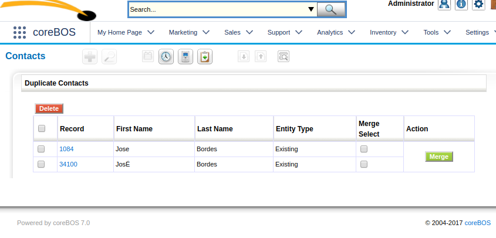

A constant explosion of features, functionality, and enhancements. Although I am living this journey in the front seat, looking back, I am still astonished to see how many changes can fit in one month!

===

 ! Reports

 - Correct SQL on inventory lines
 - Direct export for all reports
 - Permit admin user to delete, rename and move all reports
 - Standardize product and accounts module
 - Special characters (again)
 - Support for date and time fields on excel export

 

 ! Create potential on contact/account relation with a campaign.

With a few global variables and business rule field mappings, you can now automatically create opportunity records when you relate an account or contact to a campaign. Have a look at this video to get an idea of how this works.

[plugin:youtube](https://youtu.be/BgIb8J3pxuI)

 ! Workflow

 - Support for selecting business rule in workflows
 - New Task to assign contacts to the user of their related account

 

 ! Business Maps

 - [Record access control](http://corebos.org/documentation/doku.php?noprocess=1&id=en:adminmanual:businessmappings:record_access_control)
 - [Record set mapping](http://corebos.org/documentation/doku.php?noprocess=1&id=en:adminmanual:businessmappings:record_set)
 - Support for workflow expression in field mappings

 

 ! Special characters deduplication

When deduplicating, we now treat special characters like accents and similar as the same letter, so now Jose Bordes and José Bordes will come up as a duplicate.

 ! Calendar

 - Set follow up time, based on user time zone settings
 - Synchronize recurring events on google

 

 ! Global search save selected modules

We add the **Application_Global_Search_SelectedModules** global variable which indicates the default set of modules that are selected by default when you launch a global search and then we add some code so this variable gets filled in automatically each time you save your set of modules, effectively constructing an easy, transparent and persistent configuración option.

 ! Session Control

We enhance the session control in coreBOS to permit a few important functionalities. The most important are:

 - Permitting more than one coreBOS install open at the same time in the same browser
 - Transaction based writing so PHP doesn't block operations in different tabs.

 

 ! Install

 - Create from database dump: faster and has up to date updates, always UTF8
 - No more demo data. Use the database in the [coreBOS tests project](https://github.com/tsolucio/coreBOSTests) if you need demo data

 

 ! Separate edit and create privileges

The first steps of another ongoing project that will permit the administrator to configure users with separate create and edit permissions on a module.

 ! Inline capture field edit

 ! Some others:

 - Update HTML Purifier
 - Decimals ongoing project
 - Fix ticket import comments. Avoid repeating the last imported ticket comment on tickets with no comment
 - Half-year recurring invoice
 - Display type 4 adjustments
 - findtrailing spaces helper script
 - coreBOS link delete final event
 - Avoid loading inexistent logo files
 - Fix error in layout editor while deactivating uitype 53
 - Eliminate warnings, notice, MySQL strict and code cleanup (this one is a constant every month, even today).
 - Translation. Notice warnings, eliminate unused code, cleanup

**Thanks for reading.**

