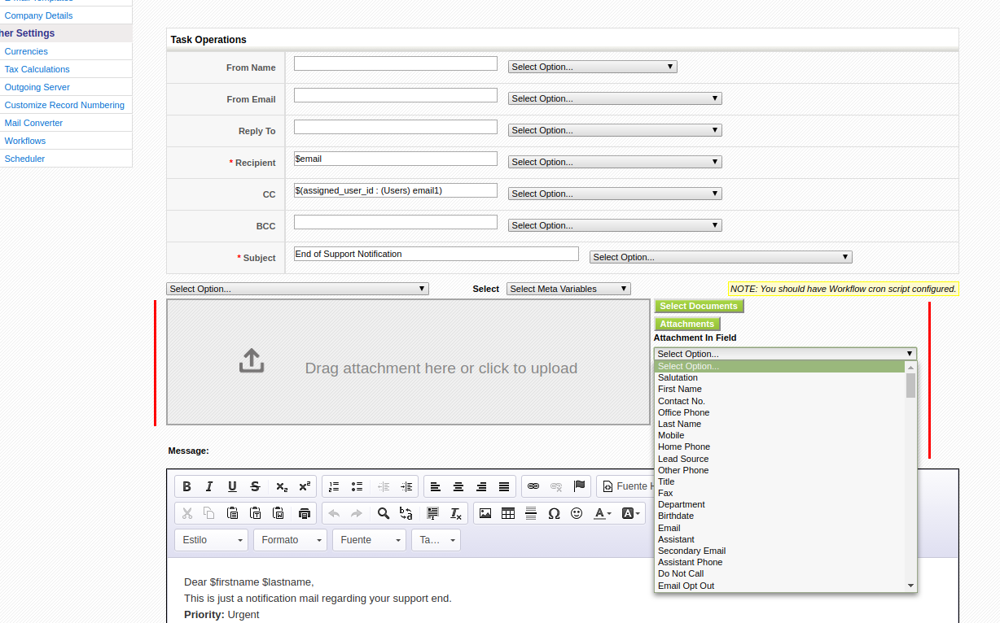

This is a slow month, where coreBOS doesn't get many changes but we still get a nice set of fixes and two very interesting enhancements like workflow email attachments.

===

 ! Support for edit and view in popup window

By adding the **Module_Popup_Edit** parameter to the URL you can view and edit a record in a popup window. Look at the calendar create popup for an example.

 ! Workflow

We can now send files as attachments in email workflow task, either as files that are uploaded, as documents that exist in the application or indicated by a link in some field.

 ! coreBOS Message Queue and Settings

 - coreBOS Message Queue can now deliver messages after a given date/time
 - coreBOS Message Queue now supports direct Task Manager launch for debugging
 - coreBOS Settings now returns default value if the given key is not found instead of null, so we can support null values

 

 ! Other changes:

 - MySQL strict on Assets: fix product field to accept null values
 - MassEdit support for picklist dependency and help info
 - Support for taxes on mass edit in Services
 - Avoid infinite loop trying to open invalid directory
 - Eliminate warnings, notice, MySQL strict and code cleanup (this one is a constant every month, even today)
 - Translations. Italian and nl_nl missing translations

**Thanks for reading.**

