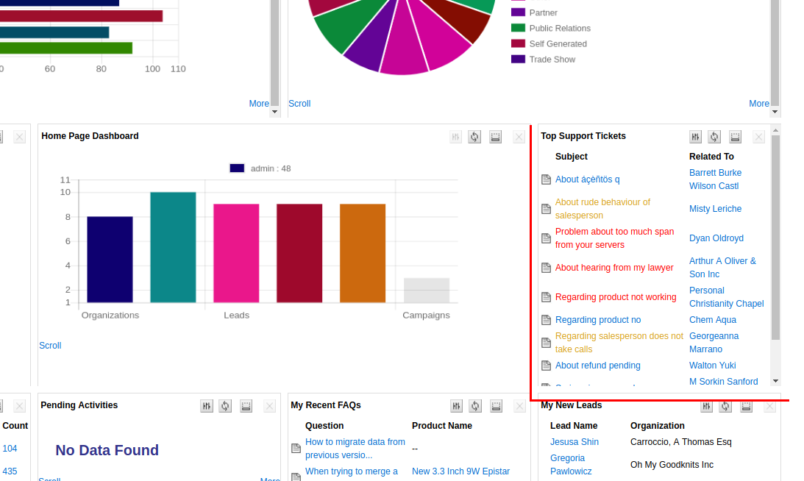
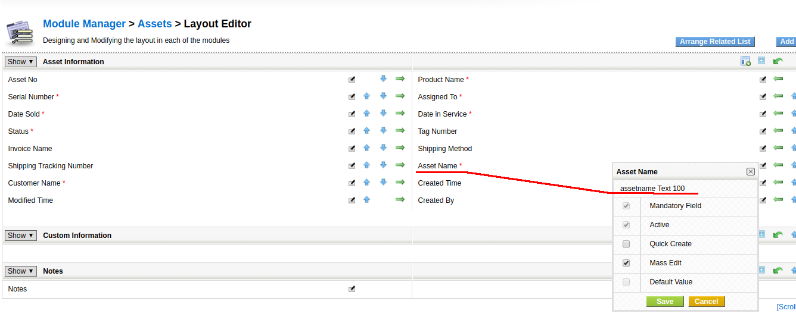
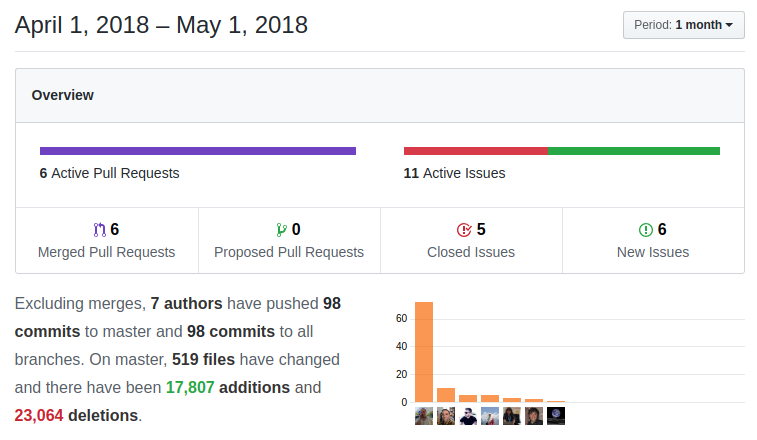

A slow month at coreBOS as we dedicate too much time to formatting in search of a handful of errors and minor optimizations while we make some very practical enhancements in the inventory modules and some nice features in general.

===

! coreBOS Standard Code Formatting, Security, Optimizations and Clean Up

Eliminate warnings, fix bugs, optimize and apply coreBOS standard code formatting all through the application: CustomerPortal, PO, EMails, Import, Install, Invoice, Support Tickets, ModTracker, PBXManager, Products, Profile, Query Generator, Quotes, Reports, Services, Settings, SMS, Tooltip, Users, utility libraries, vtlib, Webforms, Workflow, WSApp

<br/>

 ! Developer
 - support helpinfo property in coreBOS updater mass create fields
 - support for generic standard message on listview
 - simplify PHPMailer autoloader for support of PHP 7.2
 - Month and week Day translations and conversion from short to long language name
```
$monthName = cbtranslation::getMonthName(date('n')-1, $language);
$dayName = cbtranslation::getDayOfWeekName(date('N') % 7, $language);
```
 - uitype10 support for webservice ID values
 - permit HTML in [BunnyJS](https://github.com/Mevrael/bunny) templates
 - table and column name are optional in [ListColumns business mapping](http://corebos.org/documentation/doku.php?noprocess=1&id=en:adminmanual:businessmappings:list_columns).
 - add processed fieldvalue to report formatting function so it can be returned directly.
 - eliminate unused function getcriteria_options in ListView

<br/>

 ! Features
 
We are really centered on cleaning up the code but we still fit in some nice features.

 - color code tickets by severity on Home page widget



 - inventory modules get a lot of changes (see below)
 - Show field size for every field in the layout editor



 - add [Spanish ID number validations](http://corebos.org/documentation/doku.php?noprocess=1&id=en:adminmanual:businessmappings:validations#custom_validations)
 - deactivate report export if the user does not have export permissions on primary module
 - edit profile with ajax and reduce variables to eliminate PHP max_input_vars directive restriction
 - new operators **"does not start with"** and **"does not end with"** for filters and workflows

<br/>

 ! Inventory modules features

The inventory modules get some nice enhancements this month which is rather surprising for being modules that are ready for a massive change soon.

 - shipping and handling taxes row will not appear if there are no shipping and handling taxes configured
 - we can use the Inventory_Show_ShippingHandlingCharges Global Variable to hide this row
 - tax retention category to separate taxes in two groups and sum them separately
 - InventoryDetails now has support for dynamic tax fields. Before this change only the default three taxes were considered in calculations, now all existing taxes are supported.
 - we squash a few bugs related to moving and deleting product lines and duplicating and converting with master-detail business map
 - we add a [block with a set of auto-calculated **Financial Fields**](http://corebos.org/documentation/doku.php?noprocess=1&id=en:inventorymodules#financial_block_and_fields) for easier reporting and PDF/odt generation

<br/>

 ! Others

 - LDAP - Fix function name, typos, added street/city, added password gen. [Thanks John](https://github.com/reetp)
 - delete obsolete Webmails module which wasn't being used anymore due to being substituted by mail manager
 - Calendar: do not translate related record name (optimization)
 - Calendar: incorrect user variable in close action
 - Calendar: resize event was losing allDay property
 - Calendar: use the directly related contact in the invite email
 - Emails: cleanup MSOutlook directives from email on edit because they conflicted with smarty templates
 - Calendar: add one day to "all day" event due to [design of fullcalendar](https://stackoverflow.com/questions/27604359/fullcalendar-event-spanning-all-day-are-one-day-too-short?rq=1)
 - standardize Google OAuth authorizations
 - fixes and optimizations in Google Contacts
 - HelpDesk: "related to" field export was broken when we migrated that field to uitype10
 - fix Popup quickcreate show created record was failing on modules with one than more field (like contacts)
 - fix Query Generator: use the correct array for table join filtering
 - apply a temporary patch on the Valitron library for Xampp Windows installation. We have opened a [new issue for this library](https://github.com/vlucas/valitron/issues/247)
 - recover report sorting and grouping values on edit in customize report screen
 - as usual, we keep translating and fixing internalization issues: CustomView, portal emails picklist values, pt_br and some others



**<span style="font-size:large">Thanks for reading.</span>**

