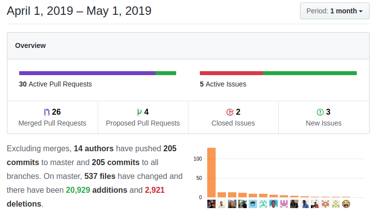

Another month packed with features and developer enhancements among which the start of the new LDS design, easier docker support, and the incredible Decision Table are significant examples. Enjoy!

===

 ! coreBOS UI
As we have said in the past, we are (slowly) moving the UI to [LDS standards](https://www.lightningdesignsystem.com/). Inside this projects' effort [Fatjola](https://github.com/fatjola) and [Luke](https://gist.github.com/Luke1982) do a great job of redesigning the header which we incorporate into the mainstream application. Thanks!

 - move Announcement marquee to the button bar in order to optimize space
 - move subheader into the header to recover vertical space
 - move small spinner to the right so it is more visible in the new layout
 - move 'top' below menu so it still works (more or less) after the fixed menu change
 - show settings menu only to admin users and set the user name to bold
 - user settings label for settings button and menu
 - apply some LDS to the toolbar just to get announcement correct
 - eliminate Calculator from application
 - apply column layout for **Integrations** access menu and box the elements to make them stand out more
 - module icon definition: now each module has some icon properties that are used in the header and "last viewed" section among others
 - add a **getModuleIcon** information function in utils

<span></span>

 ! Mobile 

The mobile client gets some fixes and enhancements this month. Thanks [Omar](https://github.com/omarllorens)

- add new mobile UI action ExecuteFunctions to call it from javascript. We add some functions from coreBOS base functionality
- add support to uitype 50: date time field
- now when you select a product or service in the time control module, we hide the unnecessary fields for each type
- fix error in name to units in time control
- Fields with uiytpe (10, 101, 117, 26, 357, 51, 52, 53, 57, 66, 68, 73, 76, 77, 78, 80) were always shown even if deactivated in the profile
- filter fields with no permission when creating
- Fix detectModuleName, we have to get always the module name if we have a recordid, if not we can have problems on related lists with more than one module related
- inputs id must be with internal field name not translated label
- do not show empty blocks on edit view
- PHP 7.3 support by specific assignment and use the correct object for translation

<span></span>

 ! Features/Implementor

 - support for **currentuserID** meta variable in **Condition Expression Business Map**
 - **Aggregate Widget Filter Widget** we add a new widget for the home page that permits you to get an aggregation of a field in a filter. You can [find some documentation here](http://corebos.com/documentation/doku.php?id=temporaryhold:aggwidget&noprocess=1).
  - aggregate on text fields
  - warnings and optimizations
 - **Decision Table** Business Map. [Read all about it here](../DecisionTable)
  - add maptype and class
  - add support for Decison Table in [coreBOS Rule](http://corebos.com/documentation/doku.php?id=en:devel:corebos_rules&noprocess=1)
  - Evaluating map
  - add the case on testMap
  - acummulating rules and check hitPolicy for aggregation
  - Handling hitpolicy and orderby
  - Processing output for each rule
  - Returning correct crmObject and removing convertMap2Array method
  - Code formatting
 - add support for **CC** condition in [Mail Converter](http://corebos.com/documentation/doku.php?id=en:adminmanual:mailconverter&noprocess=1)
 - we release our coreBOSCRM SendGrid integration. I will try to blog about how it works soon but you can look up vídeos in our [youtube channel](https://www.youtube.com/channel/UCqH0YuMrOI9HSEObq3xqXLQ) to start
 - define default module sort order using global variables **Application_ListView_Default_OrderField** and **Application_ListView_Default_OrderDirection**
 - [Show Message Widget](http://corebos.com/documentation/doku.php?noprocess=1&id=en:devel:add_special_block#another_exampleshow_message)
 - **Set Many to Many** work flow action, that permits us to define workflows to relate records between modules who share a many to many relationship
 - **Application_Popup_Address_Selection** Global Variable that permits us to deactivate the Account/Contact address selection on capture
 - [add customizeable restraints to Product/Service Inventory autocomplete](https://gist.github.com/Luke1982/d886a67eb661db777d93e7e645076ecc) Spectacular and useful enhancement [from Luke!](https://gist.github.com/Luke1982)
 - **PBXManager**
  - add and save PBX UUID on call record
  - add PBX aftersave events to plugin custom code on call record creation
  - **PBX_callerNumberSeparator** Global Variable to permit separting the incoming number in more than one
  - permit indicating which PBX event field you want to use for searching via the **PBX_callerNumberField** Global Variable
  - change **PBXManager_SearchOnlyOnTheseFields** to **PBX_SearchOnTheseFields** to indicate a set of alternative application fields to search on

<span></span>

 ! Developer

 - Docker support
  - accept environment variables for database and config variables
  - save backup variable with [coreBOS settings](http://corebos.com/documentation/doku.php?id=en:devel:corebos_settings&noprocess=1) instead of file
  - save audit trail variable with [coreBOS settings](http://corebos.com/documentation/doku.php?id=en:devel:corebos_settings&noprocess=1) instead of file
  - permit configuring where to save user privileges using the **cbodUserPrivilegesStorage** variable
 - deactivate activity reminder variable to make debug log less noisy: **ActivityReminder_Deactivated**. Currently it is only in the browser, we need to add a global variable in the application to deactivate it permanentely
 - implement **fetch based** call in ExecuteFunctions, which turns out to be identical in speed to the one we have so I leave it commented for future reference
 - QueryGenerator range operators where operator can be '[]', '[[', ']]', ']['
```
QueryGenerator->addConditions(column, '[]', array(initial,end));
```
 - add cut size parameter to **textlength_check** function
 - add force refresh cache to **get_group_array** for unit tests
 - add retrieval permissions check and getAllViews method to web service View Management method
 - add coreBOS Rule web service endpoint
 - add new events for workflow tasks. [Thanks Lorida](https://github.com/loridacito)
  - corebos.afterdelete.workflow
  - corebos.aftersave.workflow
  - corebos.beforedelete.workflow
  - corebos.beforesave.workflow
  - add events to updade fields, mass delete, and mass edit tasks

<span></span>

 ! coreBOS Standard Code Formatting, Security, Optimizations and Clean Up

 - constant formatting and warning battle: Autocomplete, CRMEntity, Sendgrid, Emails, EventHandler, Workflow, GenDoc, Merge Labels, general.js, Header, aggregate widget, Home, Import, ListView, Contacts, MailScanner, Mobile, QueryGenerator, Reports, Users, Utils, cbQuestion
 - avoid warning in multipicklist
 - eliminate warning deleting inexistent files in web service create method
 - fix method name spelling in Backup code
 - add license to BusinessAcions
 - eliminate unused method in Calendar
 - move Users method to a better location and apply code formatting
 - add new modules, User directory and new scripts to CI
 - exclude sendgrid libraries from CI process
 - PHP 7.3: eliminate incorrect continue in Validations to avoid PHP 7.3 warning
 - PHP 7.x migrate sizeof to count
 - security execution bit in updater

<span></span>

 ! Others
 - Don't do multicurrency autocomplete in Purchase Orders
 - Eliminate search label from users grid boxes for better multi-language support
 - add SendGrid free email template images
 - support for selecting emails on related lists
 - move hard coded email in customer portal code into MsgTemplate module
 - fetchEmailTemplateInfo now supports language templates
 - use creator as the last modifier when a record has not been modified
 - add missing user parameter to BusinessActions web service call
 - HTML decode company information
 - fix bug where Public filter was being approved on duplicate
 - correctly return error state for ExecuteFunctions ajax calls
 - fixed get global variable user role condition
 - show stock and quantity in user format in Inventory Modules
 - correctly avoid separator and submenus in the Settings menu
 - make 'import_Field' public since PackageUpdate references it in Module Update
 - support detail view OOMerge generation from GenDoc widget
 - use ISO format for Payment history log date
 - Potentials sales stage history number formatting
 - incorrect variable for the user name in asterisk repeated extension error message
 - attachments on scheduled reports
 - add Non-Admin Access Query in Inventory modules product/service autocomplete search
 - support for Workflow templating on modules with no assigned user ID like FAQ
 - eliminate calculator code
 - update install Database
 - **GenDoc**
  - add organizationname to map Company Name in GenDoc
  - translate user fields
  - RTF copy of OOMerge test template
 - **multipicklist**
  - correctly rename and delete elements. Thanks Alan Lord
  - support MassEdit
 - **User Privileges Elimination** This month [Albert](https://github.com/albertxhani) implements a change to move the user_privileges files to the database liberating us from the dependency of this directory which helps in containerization and also cleans up a lot the code creating centralized clases for the management of the user permission system. Thanks!!
  - update createuserfiles HelperScripts to work with the new class system
  - correctly set subordinate array and correct variable name
  - label translation
  - set module sharing to private if sharing privileges are not defined
  - check if there are permissions for both file and db pattern
  - get userPrivileges from User Model instead of UserPrivileges object
  - more sharing privileges for modules
  - sharingPrivileges not being generated
  - use of UserPrivileges class on remaining files
  - flushPrivileges to flushAllPrivileges
 - **Continuous translation effort:**
  - Application: pages label
  - Application: pt_br (Users, MsgTemplate, Payments, among others) Thanks Slemernet
  - BusinessActions: incorrect label
  - cbMap: Decision Table
  - GlobalVariable: Application_Popup_Address_Selection
  - Home: aggregate widget
  - LastViewed: translated hardcoded strings
  - Reports: es
  - Sendgrid/Whatsapp: settings
  - Users: grid header and contents
  - Workflow: Many to Many Relation Task



**<span style="font-size:large">Thanks for reading.</span>**
