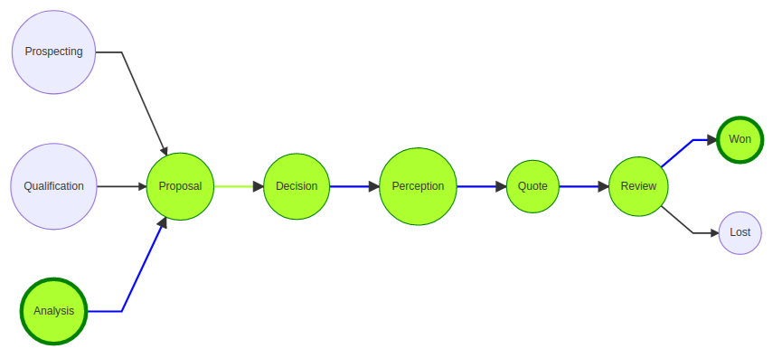
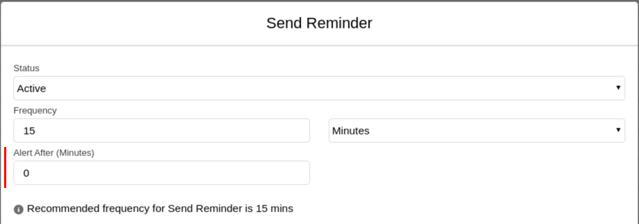
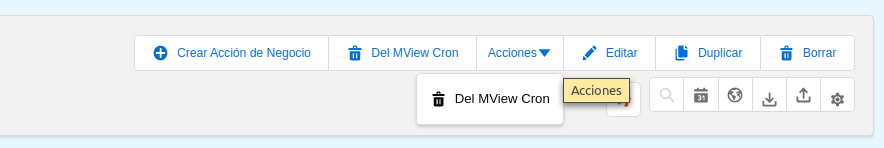
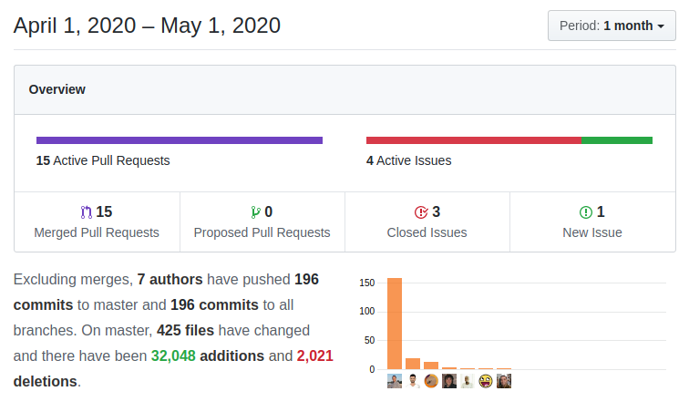

April was a more normal month with the typical constant flow of fixes and enhancements that we normally see along with the last touches of the new features that landed in the previous months. Read on to see what a "normal" month looks like ;-)

===

 ! Business Question enhancements

Business Questions are on their way to becoming a very important part of the application and get a lot of attention this month.

- Business Question builder
  - field-table relation and field name column relation variables for Builder
  - question builder results: data table and answer
  - save question from the builder
  - change tui-grid to an un-min version with latest changes
  - update fields on module change and add a message to SQL editor
  - add a label for query context in builder
  - add support for getSetting and functions with quotes
  - order and group by
  - change setype to correct name: getEntity
  - context module picklist, fill in on load and change
  - delete field rows
  - delete fields in reverse order to not alter order as we delete the array
  - initial load from a question record
  - save non FQN for sort and groupby
  - set correct fields for order and group by
  - result data table pagination
  - support context variable in the builder data table
  - support empty initial load
  - support for direct SQL Query in getAnswer
  - update query on limit change
  - use backend paging on results and convert page size to a number
  - debugging builder
- [Business Question Materialized View](https://corebos.com/documentation/doku.php?noprocess=1&id=en:adminmanual:businessquestions#materialized_views)
  - scheduled task to update materialized view based on related module change
  - add CRM entity alias and main table alias fields into advanced usage block
  - move other advanced fields into advanced usage block
  - modify materialized view functionality
- [Business Question Mermaid Graph Process Flow](https://corebos.com/documentation/doku.php?noprocess=1&id=en:adminmanual:businessquestions#mermaid_graphs)
  - process flow execution graph
  - pass context to answer question
  - load mermaid graph without document load event for cases when we load via ajax



- Others
  - support for actor modules (Currency, Group, DocumentFolders)
  - correctly clear spaces in column separators
  - correctly format SQL select and data columns naming
  - eliminate warning when property label does not exist
  - getAnswer with direct SQL
  - getAnswer with no saved record: passing in context
  - getSQL with no saved record: passing in context.

<span></span>

 ! Features and Implementor/Developer enhancements

- **Calendar_goDirectToDetailView** global variable to open event detail view directly on click instead of the action popup screen
- add alert time field per scheduled task for cron watcher to notify differently per task. -1 deactivates the alert completely.



- Page Header subtitle contents depends on value of **Application_DetailView_PageHeader_Message** global variable

[plugin:youtube](https://youtu.be/Pzx1VqVXKMU)

- support ModComments block in edit view with the EDITVIEWWIDGET
- support (limited) Duplication in Documents module
- support other field reference syntax in In and NotIn Business Map Validations {{{other_field}}}
``` XML
<map>
  <originmodule>
    <originname>cbCalendar</originname>
  </originmodule>
  <fields>
    <field>
      <fieldname>activitytype</fieldname>
      <validations>
        <validation>
          <rule>notIn</rule>
          <restrictions>
          <restriction>Call</restriction>
          <restriction>{{cf_999}}</restriction>
          </restrictions>
        </validation>
      </validations>
    </field>
  </fields>
</map>
```
- Import enhancements
  - Save import default values in mapping. Now when you save an import field mapping we save also the selected default values and load them when you select the map.
  - Import from the command line with the [Import Business Map](https://corebos.com/documentation/doku.php?noprocess=1&id=en:adminmanual:businessmappings:import)
- checkFieldUsage changes
  - convert to function in its own file so we can use it from anywhere in the application
  - change  function to return if found or not and where
  - add checks for calendar module view and status fields
  - search for email templates in MsgTemplates module
  - search in Picklist Dependency, Business Question, Business Map, Tooltip, Calendar, Webforms
  - add module conditions to queries to reduce the number of false positives
  - document function
- using the checkFieldUsage function we add field name update and delete checks to preserve application integrity. We also add a field label check.

| Before        | After           |
| ------------- |:-------------:|
|  |  |

- Execute Functions: getMergedDescription and isPermitted
- add support for EDITVIEWWIDGET business action
- Edit and Detail View business action buttons and menu buttons



- temporarily deactivate Zendesk. It was a POC which was not used in the end and requires some additional features to work
- **getMergedDescriptionForURL** function which merges a URL Template with the fields from a record respecting the specific structure of a URL and it's parameters
- **getFieldTablesForModule** Business Map helper method that can be used in Business Maps
- convert field and column names to lower case when creating fields and importing modules to reduce module install errors
- **coreBOS UI Components** Dropdown action menu which we use to implement the Edit and Detail View business action menu buttons
- **Tests:** keep getting some love and care as we fix things and add coverage.

<span></span>

 ! Web Service

- **GetRelatedModulesOneToMany** method. Returns a list of modules that have a capture field to the indicated module.
- **getRelatedRecordsThroughModule** method. Returns second level related records through a bridge module.
- showqueryfromwsdoquery
  - add a semicolon to query if not given
  - better test query without eliminating order by clause
- Actor entities
  - apply profile permissions to web service actor entities
  - correct variable name in hasAssignPrivilege
  - get module from query, launch ws2sql against handler
  - remove the semicolon from query after getting it back from WS
  - refactor query results to its own function so we can call it separately
- set picklist default values on create. **Important** now empty picklist fields with a default value defined in the application will be set when creating
- eliminate warning on picklist fields with no values
- inform of error on empty ID in update and retrieve
- delete unused variable
- define missing global variable

<span></span>

 ! Workflow

- add Date Range and Status to workflow. Now we can make a workflow active only during certain date periods and also completely deactivate it. All workflows are set active by default.
- add min/max functions to workflow expression language
- support for crc32 hash method in workflow hash expression
- Get/Set/Del Settings methods for workflow expressions
- support for getSetting for URL and Auth token in Run Web Service workflow task
- use getMergedDescriptionForURL to evaluate the URL as it is constructed and apply LDS to the Push Notification workflow task
- add missing NOT expression operator to list of available operations
- correctly define count function in list of available operations
- filter emails for calendar based scheduled workflows
- open evaluation record select popup screen on field focus in Expression Editor. Like all other capture fields
- correct JSON call in update and create of the old version of web service client library

<span></span>

 ! coreBOS Standard Code Formatting, Security, and Optimizations

- coreBOS Standard code Formatting: Emails, Import, MailConverter, ModTracker, Users, Workflow, Utils, Settings:Privileges
- eliminate old Calendar support
- eliminate warnings in calendar, when processing dollar as date for queries, in Settings:Privileges
- update ADODB to 5.20.17
- optimization eliminate unused class in Database abstraction layer: change calls for constants
- optimization simplify conditions in Emails
- optimization eliminate unnecessary SQL call for total number of pages in List View
- optimization getTableNameForField: change like for equality
- optimization move constant function call outside of loop in Webservice
- security: make config.inc.php read-only
- disconnect a user when they are made inactive
- documentation fix comments in Privileges and Utils functions
- documentation set UpdateInfo function header to phpDocumentor format and eliminate variable for hardcoded string

<span></span>

 ! Others

- move CSS to head, outside body
- sync and cleanup Documents DetailView to support new business actions
- sync and cleanup all custom EditView scripts, including Documents
- apply LDS to Clock, HelpInfo, Updater and Capture field icons
- change HTML style to LDS CSS in Application Message
- only block screen on detail view Business Actions workflow launch if error checks have passed
- deactivate calendar events reminder check if module access is not permitted
- fix capture field buttons which were not working after page header change and form restructure. Apply LDS
- apply color scheme to bar charts
- Emails
  - avoid SQL error if parentid contains incorrect reference (comes from mail converter)
  - calculate the parentid field in a more secure way to compensate for old deleted records
  - eliminate redundant footer buttons
  - empty the from_mail on reply
- hide create button for all integrations
- add module Receipt Cards condition to retrieve Cost price on products and for filter in Autocomplete
- MailConverter
  - convert new lines to BR for cron output in browser
  - get correct fieldid for idlists reference and fix incorrect ones the best we can
- recover MassEdit1x1 and SaveRepeat functionality lost when applying new page header
- convert private methods to public in Module Update
- make Our Sites URL larger
- make Email password field larger
- drop unused column in User
- improve view of ModTracker entries
- use Application_ListView_Max_Text_Length to truncate Page Header title
- fix error by retrieving database row before using it in PBXManager event manager
- fir Popup quick save which was missing javascript hooks
- QueryGenerator
  - fix condition for empty reference fields
  - filter when reference field is related with two or more modules
  - filter blank date fields
- show Detail View buttons on the related list view
- correct variable name in the global search
- add try-catch on map evaluation and strict empty string comparison on Show Message DetailViewWidget result
- correct SQL for inserting values and set a default value in database to prevent error when update Outgoing server only
- date time field validations incorrect field array index
- constant translation effort:
  - Ranieri from Slemernet keeps the pt_br translation up to date and finds some places where we still aren't translating.
    - CronTask, Settings
  - Components: ldsmodal and ldsprompt support for i18n
  - Business Question: add help info on SQL query for materialized views
  - Business Question: delete field button
  - Business Question: materialized view scheduled workflow handler fields
  - copy followup label to cbCalendar for translation support in workflows
  - Contacts: it_it
  - CronTask: translate watcher email if no language is set
  - Import: delete duplicate label in nl_nl
  - Messages: ID field and minor syntax error
  - correctly translate module name in Global Search assistive text
  - PageHeader: translate save and cancel using getTranslatedString to permit override per module
  - Web service: Currency, Group, DocumentFolder entities
  - Web service: translate module ID field label and add label_raw in Actor modules
  - Web service: set the current language by escalating different options

<span></span>



**<span style="font-size:large">Thanks for reading.</span>**
