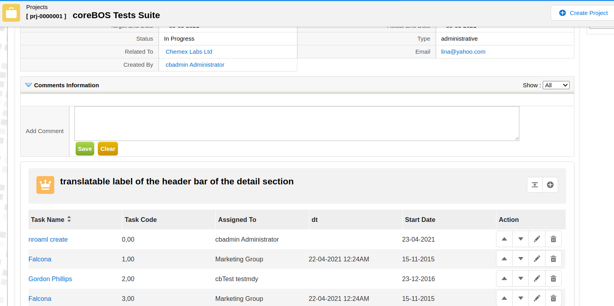
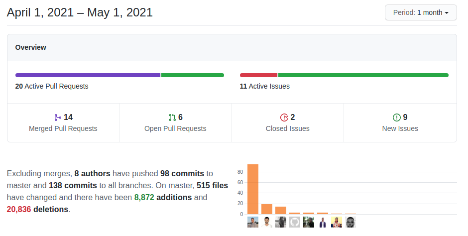

**Master-Detail month!** This month sees a set of master-detail related enhancements along with the typical set of changes.

===

 ! Features and Implementor/Developer enhancements

- add [getMapsByType method](https://github.com/tsolucio/corebos/blob/master/modules/cbMap/cbMap.php#L224) to Business Map. The function retrieves all existing maps of a certain type, optionally filtered by module.
- add field "default value" to field information cache
- use field cache "default value" to create [getFieldsWithDefaultValue](https://github.com/tsolucio/corebos/blob/master/include/utils/CommonUtils.php#L402) function
- set **default values** for fields that are not given in quick create, filter fields forms, and web service create
- [inform of CSRF timeout](https://discussions.corebos.org/showthread.php?tid=2147) when calendar ping detects it
- permit filtering "fields to show/edit" in Detail/Edit View using a business map and the FILTERFIELDSMAP parameter (this functionality is used in the new Master-Detail native support)
- stripped down DetailView with **Module_Popup_Edit** parameter. hide more buttons on Edit view also. Looks nice in a DIV! This is also part of the Master-Detail functionality but can be used anywhere.
- make DeveloperBlock name public so it can be shown in layout editor: **NOTE: this is a breaking change** If you have any Developer Blocks, the $widgetName property MUST be changed. Have a look at how we did it [in this commit](https://github.com/tsolucio/corebos/commit/23bf419f4a05374bf7c0f3b0246010cb3b873b63)
- [Edit View autocomplete functionality](https://corebos.com/documentation/doku.php?noprocess=1&id=en:adminmanual:businessmappings:fieldinfo:autocomplete) for uitype 1 text fields
- add coreBOS [time](https://github.com/tsolucio/corebos/commit/20e2920e548ad7b425dce695064ac2b9126fb79b) and [picklist](https://github.com/tsolucio/corebos/commit/16822e9d807a2d6ea68629c42e55ddc7fb916263) fields to field meta-information class
- [array grouping uitypes](https://github.com/tsolucio/corebos/blob/master/include/fields/metainformation.php#L102-L103) in fields meta-information
- support for hiding Inventory Lines section in inventory modules with the global variable **Inventory_DoNotUseLines**. Sometimes we need to use the concept of quote, sales order, or invoice but we don't want to manage the product lines. Now that is possible by setting this global variable.
- send deleted field with inventory product lines when validating
- save RelatedLists records in the order of selection
- execute javascript loaded into LDS modal div
- **Quick Create**
  - separate field information retrieval so we can call it with other fields
  - support for programmatically defining which fields to show in Quick Create form using the **$QCFIELDS_QUERY** variable
  - support more field types and apply application global variables
- **Master-Detail Editor Project**
  - We have had the Master-Detail business map for some time now but it was only being used as an external application builder. Now we have a first basic version of this functionality directly supported inside coreBOS. I will dedicate our next blog post to explaining how that works.
  - 
- **DetailView Layout Map**
  - [Read about it in our previous post](../detailviewlayout)
- **Web Service Enhancements**
  - add function for [changing access key](https://corebos.com/documentation/doku.php?noprocess=1&id=en:devel:corebosws:methodreference#crud_users)
  - return new access key on password change
  - create and update inventory modules with no product lines
  - get correct ID for group entities in MassRetrieve
  - initialize global variable to support multiple calls to MassCreate
  - search for empty related fields in upsert without warning
- **Workflow Enhancements**
  - correctly save record from inside upsert task
  - update task
    - check for duplicate fields
    - check if related fields are duplicated
    - apply LDS
    - load folder names correctly in workflow engine
  - Evaluate
    - send "empty" evaluate message when it is a PHP empty value
    - URL decode expression to support special HTML characters

 ! coreBOS Standard Code Formatting, Security, Optimizations, and Tests

- coreBOS Standard Formatting
  - formatting new javascript files, Application, Backup, Inventory, Workflow, Services, Business Question, Documents (quick create), Quick Create, Custom View, Web Service: format, change quotes and eliminate spaces and warnings
- eliminate obsolete call to parenttab
- eliminate recalculation of obsolete tabdata file
- eliminate deprecated parameter from DOM reload
- delete unused to-do file in Business Map
- Continuous Integration: add new javascript files and update rules
- Documentation:
  - function headers, and comments
  - non-stop wiki enhancements
- Optimizations
  - avoid function call if not necessary, use direct results, eliminate warning and comment
  - use array_search instead of loop in MasterDetail Map
  - eliminate obsolete EventEditView action
  - avoid two inserts on non-denormalized modules and one on denormalized modules by checking variables in PHP
  - restructure EditView code to avoid calculating the same conditions three times and eliminate unused variable to save memory
  - only execute dynamically loaded javascript if not a source file
  - move product multi-image specific code to product module to avoid loading and executing it on all other modules
  - use **ename field** everywhere possible. change entityname reference. Some weeks ago we introduced in the Users module an auto-calculated field named "ename". This field represents the entity name (concatenation of First and Last name) of the user. Now we have changed all the dynamic calculations that were being made in all the SQL of the application to simply use this field, saving a LOT of time doing the concatenation once instead of repeatedly on every access.
- Security
  - use direct result and eliminate SQL injection in Inventory
  - add javascript HTML purifier library: **DOMPurify** to avoid XSS in our every day more present javascript code
  - eliminate XSS in email address and subject
  - update ToastGrid library to 4.17.0
  - update DOMPurify library to 2.2.8
  - move Zendesk library to vendor directory and update to the latest version
- Unit Tests: keeps getting more and more assertions

 ! Others

- avoid trying to open calendar activity panel if it is not present
- eliminate inexistent parameter in calendar window.open
- Business Question
  - get answer with querySQLResults to reduce duplicate code
  - use module name to get web service object
  - pass record ID to permission check
- update ModTracker column module_name to make it bigger, support long module names
- in the CSRF page, go back to the previous page instead of reloading the current one as reloading just loops on the error
- detect Documents filestatus on empty mode which is equivalent to create mode
- load default email template in inventory module send email
- relate mail to parent record when address is empty/erased and remove erased address from saved to
- permit editing Custom View **ALL filter** by default (as explained in the documentation)
- convert MailManager search email to LDS modal
- set **multii18n** to its default value when creating custom picklists
- avoid creating empty picklist values during import
- correctly generate SQL for reference fields CONCAT option in QueryGenerator
- get all IDs if "select all" records on current page RelatedList
- correct payment_duration primary key name in Sales Order
- update invoice_recurring_info instead of inserting as that table contents is managed in the handler. avoids a couple of warnings
- Translations
  - pt_br: Application and  Potentials
  - it_it: Application and some modules (thanks Elisa)
  - eliminate duplicate keys in Business Map
  - translation strings for DetailViewLayout Map functionality
  - add a missing mandatory label in Webform

**Thanks for following.**
