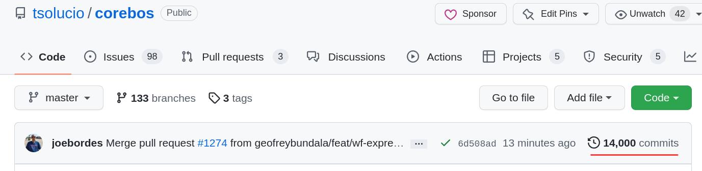
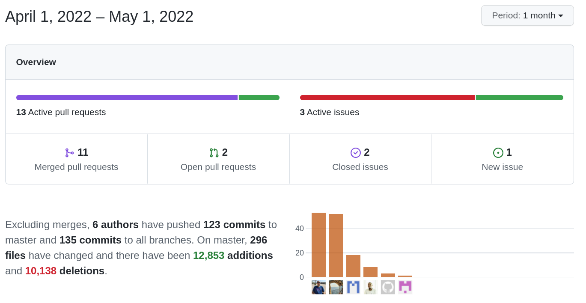

New features... nonstop. What amazes me is that I don't know much about some of them at all... coreBOS is growing on its own :-) for which I have to thank the incredible team of people we have working on the project.

===

 ! Love you 14000

This month sees the project reach **14000 commits**. Compared to a lot of projects out there it may not be a lot, but compared to a lot of projects out there it is incredible. A warm and sincere thank you to all the people who believe in this project and make it possible. A special callout to Andrea and Tea for believing in it even more than me, Denald who was just **1 commit** away from me this month (!) and is doing incredible things, Xhilda for her contributions everywhere (being all over the place with me) and overall passion and dedication defending the project and Adisa and Franci for pushing its' limits every day. A big hug.

[Love you 3000](https://youtu.be/zpE3zB43xbM)
[Love you 3000](https://youtu.be/7kSWkgf_kXk)

 ! Features and Implementor/Developer enhancements

- **Mass Create Grid:** a grid/table view for quick insertion of data: copy/paste rows of information, inline cell edit (spreadsheet like), reference field support, and other features. This comes with a new map definition and the team even implemented an editor for it (!). Great work!  kudus!
  - find the correct id for modules with more than one reference field
  - hide ckeditor and use new event keydown to append rows
  - only admin can see MassCreateGrid view
  - send correct fieldname for reference fields in masscreate
  - use bmapname to find the correct map for update
  - add a new row in click down button
  - add mass upsert record mode
  - get fields from map or select them in popup to show in grid
  - save the map after you modify it from the popup
  - save uitype 10 in MassUpsertGrid view
  - Add Business Actions types for MassCreateGrid
  - show links in MassCreateGrid mode from Business Action
  - view setup
  - show if the field is mandatory in ListColumns
  - create a map for MassCreateGrid if not exists
  - Create the map for MassCreateGrid from the Generate Map action
- **WebDAV:** we continue to enhance the document WebDAV functionality
  - support Documents tree view
  - do not ask login if the user is logged in
  - change directory sooner to correctly include config-dev
  - create folders with the same name for different parents
  - delete and rename folders from filestash
- **Multireference field (uitype 1025)** we get back to this field and give it another round of love and care
  - fix warnings for uitype 1025
  - add LDS pills component
  - show uitype 1025 field in tuigrid listview
- **Pivot**
  - get reference and owner field values
  - support quotes and numbers in aggregation fields
  - support quotes in field labels
- **Mautic Integration**
  - validating inputs and webhook request with secret
  - assigning default values on accounts/contacts-mautic sync
  - removing duplicated if block
  - validating workflowContact Business maps
- **PriceList** [add m:m relation module between pricebooks and products/services](../PriceList/)
- **Login History:** eliminate bunnyjs table in favor of tuigrid
- support workflow and users in uitype 10 fields
- add **Prior to Today** filter support
- relate documents with default folder if the new **Document_DefaultFolder** global variable is set
- support getting menu name from parameters using special **get_name_from_menuname_parameter** menu name in **ApplicationMenu map**
- enhance Business Question detailviewwidget to support tuigrid view: **Amazing:** related lists or just any query anywhere in the application!
- change DetailViewWidget ID and add input with the value to use so we can create code that references the block the widget is in
- add a new method getModuleFieldsInfo to get the field for a given module
- support calling **web service call map** to return results and not save information. [Can be called from a business action now](../RunWSWFTaskAnywhere/)
- Web Service
  - support comma separate question IDs for multiple question support
  - expose key-value store: getSetting, setSetting, and delSetting
- Workflow
  - support for task context (with Workflow ID). This is important as now queued tasks will "know" part of the state of the application when it is executed with a delay
  - Email task gets new filters and context variables: corebos.filter.workflowEmail.Recipients, SendThisSubject and SendThisBody. These last two permit us to send any email using the Email Task so we can easily put any email in the queue to be sent
  - support more context for Upsert Task
  - pass certificate file and type in Webservice Workflow map
  - show google popup authentification if a session exists

 ! coreBOS Standard Code Formatting, Security, Optimizations, and Tests

- coreBOS Standard Formatting: eliminate warnings, eliminate useless code, variables and comments, format code
- correct regular expression for JS/CSS and add DocumentFolders to check in Continuous Integration
- Documentation:
  - function headers, and comments
  - non-stop wiki enhancements (working a lot on this)
- Optimizations
  - get User Full Name and format recordid in AuditTrail
  - eliminate unused file name exceptions in index.php
  - use direct result and eliminate unused variables in TagCloud
  - simpler header in GenDoc Settings
- Security
  - protect .git directory contents
  - Mautic execution bit
  - protect SAML certificate directory CWE-403
  - better non-process rules and eliminate unnecessary file in storage directory
- Updates
  - DOMPurify
  - Toast tuigrid
- **Unit Tests:** keeps getting more and more assertions

 ! Others

- get CRMID in the getFieldsof workflow expression function
- fix action search in Audit Trail
- Business Actions columns are ambiguous when the module is denormalized
- set the correct database object for ClickHouse web service
- HTML encoding in Comments detail view
- hide Documents folders if there are no files related in the search action
- support for unlink event in base modules
- null string is shown in the document tree view after library upgrade
- initialize Autocomplete fields in massedit mode
- do not update ModComments email if the related record is assigned to a group to avoid error
- autoscroll report boxes
- add check to Service Contracts calculateProgress to not do that if event handler is deactivated in module manager
- block inline detail view edit for fields with a trigger dependency active. This default behavior can be deactivated with the **blocktriggerfields** directive we added to the field dependency map
  - Field Dependency return list of blocked trigger fields
  - return picklist dependencies and blockedtriggerfields always
- setoptions mismatch in field dependencies
- update Field Dependency XSD definition
- add validation map for DocumentFolders
- Translations
  - **update Italian language files**  complete support for Italian. Thanks to everyone who participated!
  - Global Variable to es_es
  - ListView
  - TagCloud
  - Tika
  - Workflow getISODate expression function
  - update pt_br.lang.php
  - validate Business Map title
  - prior to today CustomView filter
  - Fields
  - Document_DefaultFolder ES
  - Mass Create Grid
  - Master Detail ES
  - TagCloud

**Thanks for reading.**
