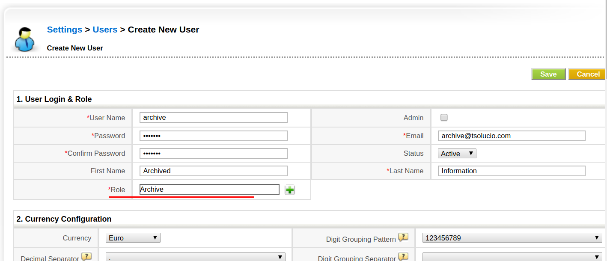
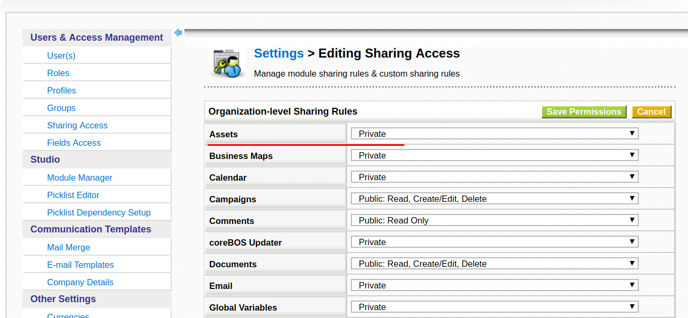
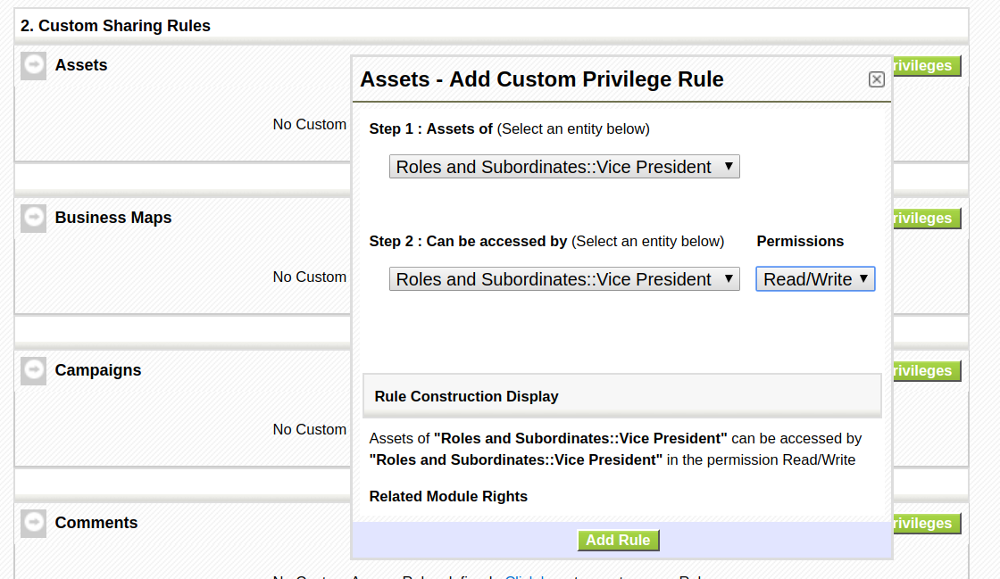
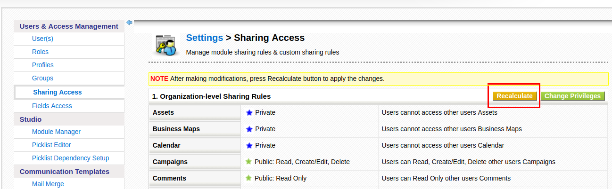
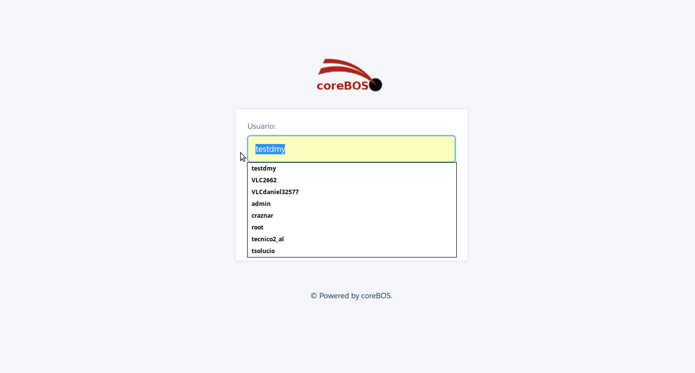
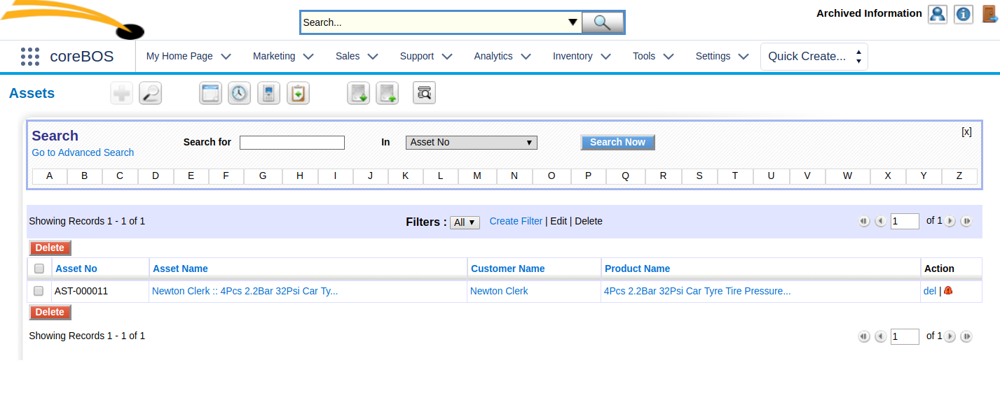

It is rather common to want to hide some records from the operational view of the company but not delete the information. With GDPR already here and one of its obligations being exactly that use case, this pattern will come in handy.

===

! The Archive Record Pattern

From time to time we get the request to be able to archive or hide away records but not completely delete them in case we need to recover the information in the future. This scenario will become even more common as the **General Data Protection Regulation** guarantees people the right to be forgotten. As we have the obligation to comply with this right, we also have to comply with other legal obligations that will force us to retain the information during some time. While we wait for that time span to expire we must hide the record from sight so it isn't used anymore. That is where the **Archive Records Pattern** comes into play.

**The Archive Record Pattern** will permit us to move information so that only a small set of users can access it. The idea itself is very simple:

  - create a special user who will hold the archived records (could be the administration user)
  - make the **module** we want to archive records on **private**
  - add an exception to the privacy so all users share the information except for the records assigned to the special user

With that set up any record we assign to the special archive user will not be accessible by any other user except him and administrators

Obviously, if the module you want to have supporting the archive pattern is already private than all you have to do is create the special user and assign the records there.

! Let's see a quick example with Assets

!!! create the special archive user

In the example below I created a user called "Archive" and I also created a specific role for this user which has a limited profile that will not permit him to create nor edit, just view. Restricting the profile of this role like that isn't strictly necessary but could be used as proof of integrity in case of an inspection. What is important is that this role will permit us to establish the exceptions correctly. I have set the role at the same level as the Vice President, directly related to the maximum authority in the company.

!!! make Assets private

!!! add the exception rule

This next exception basically shares all record for all roles as if they were public except for the Archive role. You can adapt accordingly to your specific use case.

!!! recalculate the privileges

Every time you make any changes to the privileges system you **MUST** recalculate.

!!! assign the record to be archived to the archive user

Watch the next animated gif to see how it works.

this would be what the "Archive" user would see:

 
**I trust this will help you make your coreBOS more useful!**

