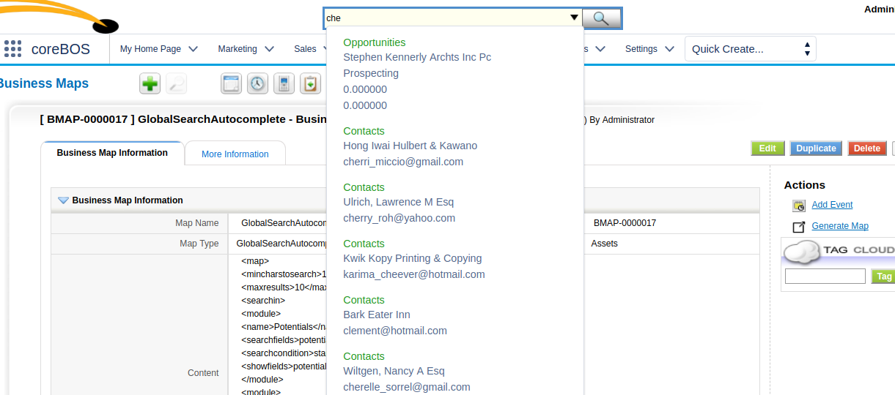

The next few months are all about optimizing and stabilizing coreBOS. While we continue to add configuration options and some features, our main goal is to iron out all the issues and make the application run faster and more secure. **This is ready for prime time!**

===

 ! Code optimizations and fixes

 - replaced trim(strtolower(..)) with strtolower(trim(..)), code formatting
 - simplified if-return-return constructs
 - replaced gettype(..)==string with is_string(..)
 - fixed usage of foreach array as its key/value
 - fixed shadowing of foreach key
 - replaced a use of array_search with the more performant 'in_array' in Webservice
 - incorrect binary operations
 - replaced usage of 'array_push' with the []= array operator
 - replaced dirname(FILE) with DIR
 - substituted string functions to improve performance
 - database optimizations
 - substituted foreach for native php command
 - substituted string functions to improve performance
 - organize and format code in index.php to reduce operations and optimize directory listings by not sorting
 - correct and optimize getCurrentModule
 - simplified for loop in Import
 - merged consecutive unset calls
 - eliminate obsolete and unused library dUnzip2/dZip: use native php zip
 - reduced duplicate function calls in loop in Query Generator
 - replaced in_array usage on string with more performant string comparisons in getReturnPath
 - replace not is_array..array construct for more performant array cast
 - eliminate return parameter which is already present locally in CustomView
 - avoid processing 0 value in javascript execute function call getNumberDisplayValue and CurrencyField
 - update to latest version of Valitron library
 - eliminate unused variable in CRMEntity
 - eliminate unused code to change password which was for before we had the change password button and unused method validation_check which is not very useful and should be in vtlib packages if needed not as a Users method
 - ListView/Report use SQL_CALC_FOUND_ROWS to get total number of rows

 

 ! Use source_id for record link creation

When source_id is set and not empty, use it, otherwise, use return_id. Now you can alter a module's save file (and add $_REQUEST['source_id']) so a link is created but the CRM still returns to the newly created record.

This functionality, added by [Luke](https://github.com/Luke1982), will allow us to unset return_id in individual modules (to be able to return to the newly created record) and still save the relation.

 ! Global variables

 - Report_MaxRelated_Modules
 - Application_Global_Search_Active
 - Workflow_GeoDistance_Email and Workflow_GeoDistance_ServerIP
 - Calendar_Slot_Event_Overlap
 - Users_Select_Inactive
 - translate definitions file es_es and review syntax errors in definitions file en_us
 - Export_RelatedField_GetValueFrom and Export_RelatedField_NameForSearch to customize the related field export format

 

 ! Global Search Autocomplete

This functionality, which uses the [Global Search Autocomplete Business Map](http://corebos.org/documentation/doku.php?noprocess=1&id=en:adminmanual:businessmappings:globalsearch), will permit us to launch a reduced and dynamic global search by typing some letters in the search field. The modules and fields to search in and the fields to show in the results are defined by the business map and it looks something like this:

 ! Image Field Enhancements

 - support for image fields in Mass Duplicate functionality: they are duplicated
 - Duplicate Record support for duplicating image fields
 - avoid deleting shared images. now we only delete the image if it is only on one record
 - delete image name from the field when the image is deleted
 - mass import script in HelperScripts for Products multi-image field
 - support image fields in web service Revise
 - do not delete the image on edit

 

 ! Security

 - add install class DBHealthCheck to BetterSafe script
 - Storage file create/upload issue with unsanitized GET parameter in CRMID strategy
 - move migration specific functions to Migration extension so they can be deleted after install
 - update BetterSafe script with latest eliminations
 - XSS in announcement
 - change file permissions so they are not executable

 

 ! Workflow

 - aggregation function: operate on related records
 - modulo operation for expression engine
 - coalesce expression function
 - access directly related module fields in expression editor for update and create tasks, among others
 - avoid javascript error when creating update field task
 - Workflow_GeoDistance_Email global variable, necessary to get latitude and longitude from OpenStreetMap
 - send document attachment if selected field is a document capture field (uitype10) in workflow email task

 

 ! Business Maps

 - support for CDATA entries in business maps
 - correctly load map when name is given and support contextid as normal CRMID in [coreBOS Rule](http://blog.corebos.org:8080/en/blog/corebosrules)
 - support for context variables, evaluation against deleted records and look for name through global variable in [coreBOS Rule](http://blog.corebos.org:8080/en/blog/corebosrules)
 - permit ConditionExpression evaluation against deleted entities
 - ConditionExpression return false when invalid context is given
 - tablename and columnname in [Listcolumns Map](http://corebos.org/documentation/doku.php?noprocess=1&id=en:adminmanual:businessmappings:list_columns) is now optional

 

 ! Others

 - support for mass edit on solution and customer portal fields
 - generic support for multicurrency modules, like inventory modules
 - generic support for emails on any module with an email field
 - use the selected business map in Workflow Duplicate task
 - support for giving a direct business map ID or a name in MassDuplicate
 - Duplicate Record automatically fills in field isduplicatedfromrecordid if it is set to displaytype 3 or 4
 - use standard delete_related_module in Projects, so the module works like all the others and doesn't leave inconsistent records in the system
 - getImageFields Webservice method
 - problems in migration steps from vtigerCRM 5.2 to coreBOS
 - Webservice Product Image uploader. Thanks John!
 - avoid launching autocomplete search when a map is not defined in global search autocomplete
 - group search conditions together to get correct SQL when searching on more than one field in global search autocomplete
 - return correct SQL when string operator condition is applied to number in Query Generator
 - accept group assignments from workflow system on Create/Edit record
 - uitype multireference appearance in Reports
 - correctly translate Payment module update log when creating from another module/workflow
 - add the missing related module for direct email relation; when manually introducing an email related to a record in the system in Mail Manager
 - eliminate obsolete extension Field Formulas
 - move Log4PHP library to include directory
 - eliminate obsolete and unused libraries Zend, Prototype, php_writeexcel, and Image
 - eliminate Campaigns special status picklist in web service related query and the warnings it was causing. Thanks John
 - correctly return NULL values on sql_escape_string to get correct where condition in the database abstraction layer
 - avoid warnings when showing initial creation values in ModTracker
 - eliminate uitype 104. Use uitype 13 for email fields
 - eliminate unused variable application_unique_key in Header
 - support for special characters in outgoing email password and validate FROM EMAIL
 - adapt PBXManager events to cbCalendar module and translate a hardcoded string
 - convert contact comment author to link in HelpDesk
 - convert Email activity type to task when creating from GUI as email creation is not supported that way
 - menu enhancements: center top drop-down, infinite submenu support, add nubbin--top, create menu entries respecting the selected parent
 - fixOrphaned functionality in Menu, to recover access to the menu editor in the rare case this could happen. must be executed with a manual URL
 - get correct comment owner for tickets where some comments are from contacts in Mobile
 - use product/service cost on Purchase Order
 - support for PackingSlip and IssueCards as Inventory Modules
 - manifest support for onlyonmodule directive for custom links
 - when edit a report, the selectcolumns with special characters were loaded wrong and breaking the report when it's saved
 - emit error informing that a custom field could not be created due to database error instead of failing silently in Layout Editor
 - incorrect date time processing for mdy and dmy with years in 19xx due to incorrect regexp
 - added an option to read ALL unread messages (from the beginning of time :-)) in Mail Converter
 - eliminate warnings, notice, MySQL strict and code cleanup (this one is a constant every month, even today)
 - translations

**Thanks for reading.**

