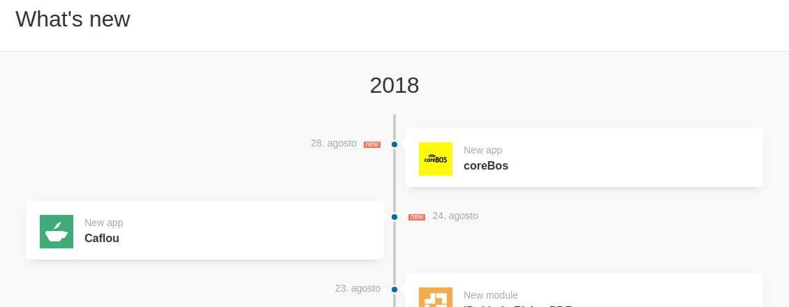
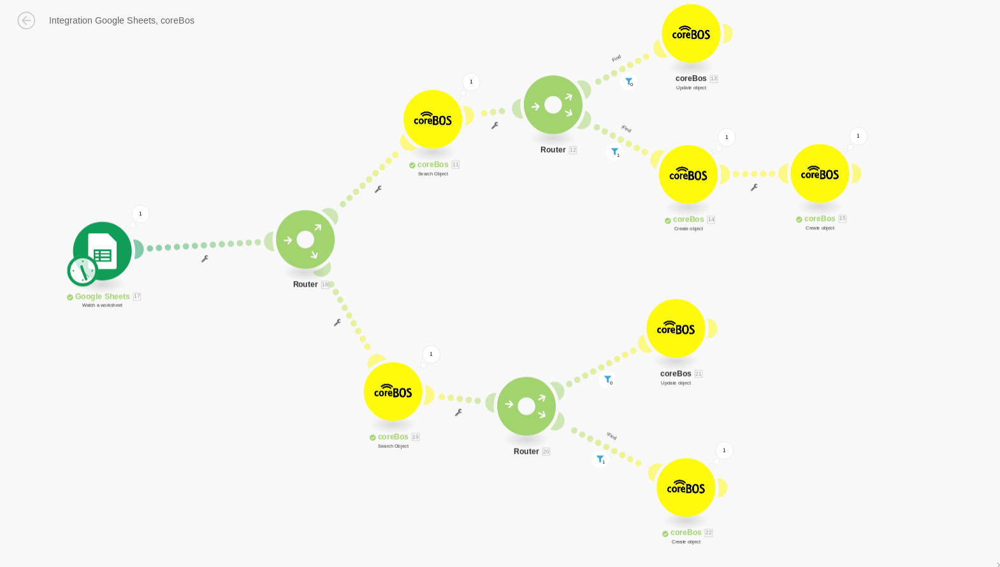
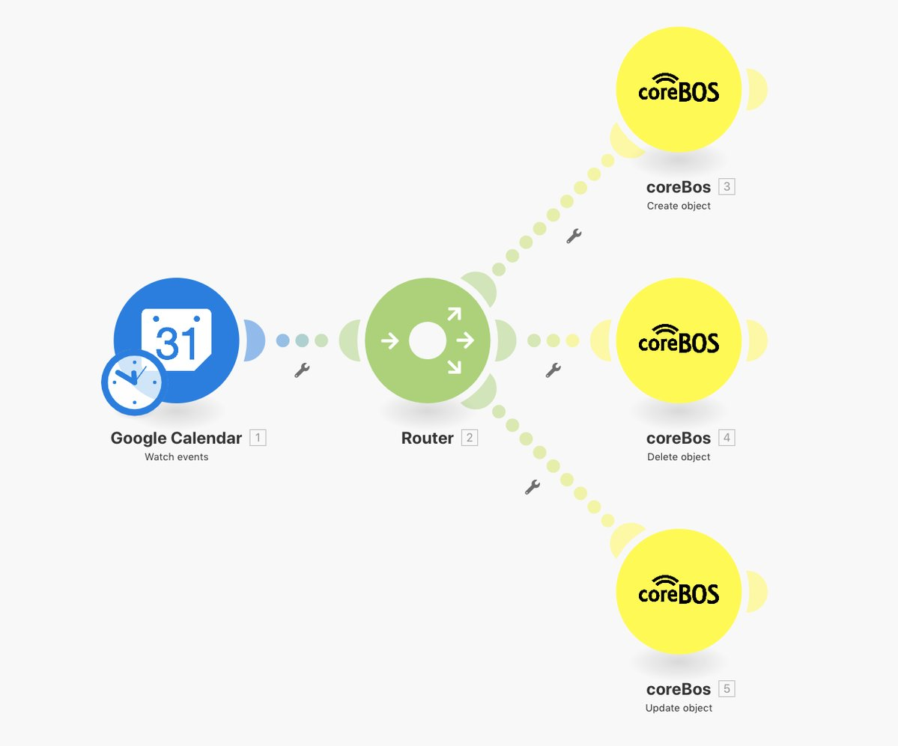
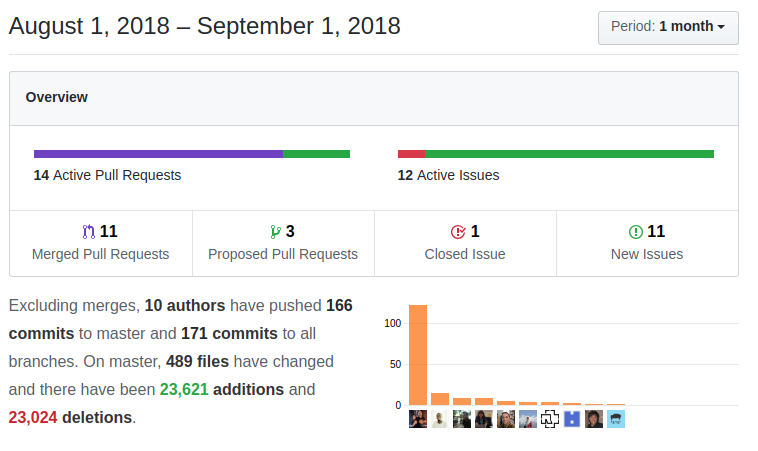

We close our hot summer season with even more new features and enhancements then we started! It has been an intense and very active summer!  Enjoy!

===

 ! Integromat

This month we launch an official integration between **coreBOS** and [Integromat](https://www.integromat.com)!!

Effectively integrating hundreds of applications with coreBOS through their service. On a personal note, I have to say that I have been using Integromat for some time now and I found it to be a trustworthy, stable and feature-rich application very worthy of our recommendations.

Open your possibilities for integration [registering with this Affiliate link to help the coreBOS project](https://www.integromat.com/?pc=corebos)

 ! coreBOS Standard Code Formatting, Security, and Optimizations

We **FINISH** the Standard Code Formatting project this month!! It has been 8 months of intense work that has transformed the code base in many ways. The main goal has been fully accomplished by catching many small errors and optimizing the application for performance and memory usage while making it more secure. Even SensioLabs has noticed our work as you can see in the next image.

Besides a small list of issues that have been detected during the project that required more in-depth attention and that we will be doing during the next months, we can start adding some of those long-awaited and necessary features. In other words, now we can continue with the **important things**.

 - Format a disperse set of files all over the application as we launch a complete code base formatting check: Basic/Advanced Search, Calendar4You, Calendar, MailManager, CommonUtils, CustomView, DetailView, Documents, vtlib, Helper Scripts, include, Inventory, Mobile, PriceBooks, cron, soap, Settings, Workflow, BusinessMap:RelatedPanes, Backup
 - Format all Javascript files. Including Workflow and Web Service Client libraries
 - Eliminate consecutive blank lines
 - Optimize javascript code moving it out of templates and into scripts: Documents, DetailView, TagCloud, Leads
 - Eliminate unused action names in index
 - Optimize get merge fields function
 - Optimize picklist value loop cutting time in half (!)
 - Optimize mass edit: move calculation out of loop, avoid translation on text, remove unnecessary array and avoid sending in an empty variable with big payload (idlist)
 - Avoid function call for previously calculated value in Detail View
 - Eliminate unnecessary code for folder presentation in Documents search popup
 - Eliminate obsolete code in List View
 - Eliminate unused file in Emails and obsolete JSON.js script
 - Eliminate unused [DokuWiki](https://www.dokuwiki.org/dokuwiki) integration
 - Synchronize, cleanup and optimize Edit View templates
 - Merge inventory detail view into standard detail view. Now we just have one template for all modules
 - Security: eliminate some unnecessary eval calls in javascript
 - [Continous Integration](https://en.wikipedia.org/wiki/Continuous_integration) ruleset that passes on the complete code base

 ! Features
 - Update and fully support [coreBOSPackingSlip](https://github.com/tsolucio/coreBOSPackingSlip) and [coreBOSReceiveProducts](https://github.com/tsolucio/coreBOSReceiveProducts)
 - Inventory lines have always been very special, both in the user interface and the backend causing all sorts of development and user headaches. This month we try to fix an error using non-US standard number formatting in these lines by automatically converting them to US standard. It is an odd solution but better than getting an error and losing your work.
 - [Luke](https://github.com/Luke1982) contributes one of those long asked for features: **Autocomplete product/service search** in inventory lines. **THANKS!!**
 - [Lorida](https://github.com/loridacito) squashes a very long standing bug that comes all the way back from vtiger crm origins and may very well still be there: **Picklist multi-lingual Search**. vtigerCRM/coreBOS store picklist values as they are defined but show them on screen translated to the users' selected language. This leads the user to expect that picklist searches, reports and filters should work in their selected language but they don't because the underlying database does not know anything about these on-screen translations. This has forced us for years to tell our users to search in English (mostly) which was not nice. With this enhancement, users can now launch all sorts of conditional searches in their selected language and expect to get the correct results. A very important feature.

 ! New Features and Development
 - Speed [comparison FetchRow vs fetch_array](https://github.com/tsolucio/corebos/blob/master/build/HelperScripts/chkadbfetch.php)
 - Now the application will not launch workflow tasks that are running
 - Support for RTE fields in Mass Edit
 - Automatically rename filter on duplicate with a repeated name
 - Support for time on format_date Workflow expression
 - Option to launch workflows on related module update: [could cause infinite loops](https://discussions.corebos.org/showthread.php?tid=1174)
 - Add **label_raw** to **describe** Web Service method to support translating and apply correct translations to label
 - Add business map selection for filtering functionality on the Mass Duplication Workflow Task
 - **getTranslatedStings ExecuteFunction** endpoint: i18nmodule and tkeys keys separated by semicolons. This permits operations from javascript to call coreBOS and ask for translations
 - Import changeset functionality in coreBOS Updater will now load the imported changeset automatically
 - Support for Web Service ID in getMergedDescription
 - New sanitize method in DataTransform: **sanitizeCurrencyFieldsForDB**
 - **coreBOS Console:** cronjob: create command, for the creation of schedule cron jobs
 - coreBOS Updater: Create **removeAllMenuEntries** to remove items from menu
 - Web Service GetRelatedRecords: correctly return IDs and productid, return product line type and return service if product module is deactivated
 - Get correct products and set contact info in quotes when converting from a Potential record

 ! Mobile
 - Add **Duplicate Record** action
 - All modules now have native access to their related list of modules

 ! Others
 - style Settings to align all text descriptions
 - standardize application spinner and convert to LDS
 - revert user stack if no action is taken in create entity workflow task
 - delete workflow tasks from the pending queue when it's task is deleted
 - set default values for Sales Order in convert inventory records workflow task
 - increment size of Workflow Test field
 - read-only fields were not being sent to be saved in Profiles
 - scheduled report type value not set correctly in Reports
 - fix Copy link for DateTime (uitype 50) fields
 - Skebby SMS log messages
 - make AddFinancialFields changeset totally reentrant so it can be executed as many time as necessary to accomplish its goal on installs with a large number of records
 - always add *last modified by* column to list view in RecycleBin to see who deleted the record
 - close button on Mass Edit progress popup screen
 - fix copy-paste error in PDFMaker output Global Variables in GetPDFData web service method
 - automatically assign the Global Variable record being saved to a user in the role if a role is selected
 - fix events cache setting correct key/value index
 - Documents: check integrity should not deactivate record on external document and fix upload error on edit and not able to write file
 - balance Detail View field blocks when only one field on the last row
 - avoid ticket comment overflow as we do in ModComments
 - use sanitizeCurrencyFieldsForDB to correctly calculate cost depending on user decimal formatting in InventoryDetails module
 - add mandatory user parameter to Web Service getReferenceValue method
 - pt_br language file for translation module

**Thanks for reading.**
