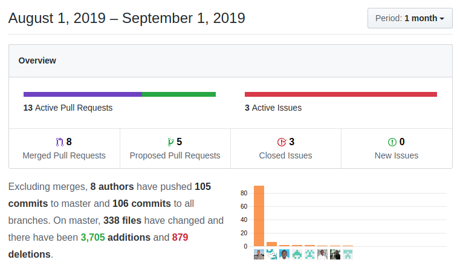

August is usually a slow month and this summer I have been looking in another direction, learning some interesting technology like [Apache Kafka](https://kafka.apache.org/), [graph databases](https://orientdb.com) and also dedicating some time to studying [oWASP](https://www.owasp.org) and security issues, but there have still been some interesting things going on as coreBOS relentlessly keeps evolving.

===

 ! Features/Implementor

 - set httpS protocol by default in GEODistance workflow calculations. **NOTE** this breaks backward compatibility if you have an IP set with the Workflow_GeoDistance_Nominatim_Server global variable you will have to add the HTTP protocol to it if you want to continue using it without httpS
 - new global variable **Attachment_ShowDownloadName** to show name and download link of the image/attachment in image fields
 - support for action sub headers via **ACTIONSUBHEADER** business action in DetailView action panel. Add a business action with a "Link URL" set to ACTIONSUBHEADER and the translated label will be added as a subheader in the action right panel. See Business Questions for a couple of examples.
 - support LDS icons in DetailView action links via `{library:xx,icon:yyy}` JSON string in icon field. See Business Questions for a couple of examples.
 - [mass document upload widget](../developerblock)
 - Google Measurement Protocol workflow
 - Push Notifications workflow
 - Gantt Chart type via **Project_Gantt_Type** global variable which supports: 1 for daily, 2 for weekly and 3 for monthly time span resolution
 - Show Users "Log In Status" and permit filtering on it in the user settings section
 - apply [Record Access Control](http://corebos.com/documentation/doku.php?id=en:adminmanual:businessmappings:record_access_control&noprocess=1) permissions when accessing records assigned to subordinate users and support for Create view
 - now that we are moving all nonstandard capture field types to the standard uitype 10, we modify the transferRelatedRecords function to have better support of related entities when deduplicating

 ! Developer
 - migrate uitype 80 (Sales Order capture in Invoice) to the standard uitype 10
 - put hidden message div ([Application Message](http://corebos.com/documentation/doku.php?id=en:devel:standardoutputmessage&noprocess=1)) on all views so we can use it via ajax if needed
 - support application/error message on Related and Users List
 - **getModuleLinkStatusInfo method** to list modules and if they have a certain link active or not. Used in Settings to activate/deactivate functionality on modules
 - add Database method to retrieve error: **getErrorMsg**
 - support direct Document record relation via parent_id parameter when creating (used in mass upload)
 - add **WorkflowEvent property** so workflow tasks can know which trigger launched them
 - **getUIType10DependentModules function** to get direct relations of a module
 - do not repeat Business Actions links of the same link type ONLY for scripts and CSS, it was being applied to all others
 - ignore mess detector PHP 7 warnings in **checkfile**
 - move **Debug_RelatedList_Query** to where it is more effective and captured by all related lists
 - add support for validation functions in detail view inline edit and simplify the finish process in PRESAVE event
 - send current action to PRESAVE JS function

 ! Business Questions: Actions and Materialized View

The [business question module](http://corebos.com/documentation/doku.php?id=en:adminmanual:businessquestions&noprocess=1) receives a whole set of actions. We can now test the SQL, create a [Conditinon Query Business map](http://corebos.com/documentation/doku.php?id=en:adminmanual:businessmappings:condition_query&noprocess=1), create a view and create a Materialized View. Then we have a set of actions to install cron scripts and/or workflow tasks to keep the materialized view(s) up to date.

Additionally, the business question module now supports **native SQL** queries and has an SQL Query block which dynamically shows us the generated SQL.

 - add new **getSQL** method which returns the SQL for the record
 - support for native SQL, actions: test, convert to map, view and materialized view, workflow and cron to keep materialized view up to date

 ! Price Modification Module

[Price Modification Module](../pricecalculation) arrived last month!!

 - GetPrice and Discount event: corebos.filter.inventory.getprice
 - support decision map filter on Price Modification module

 ! coreBOS Standard Code Formatting, Security, Optimizations and Clean Up

 - eliminate warnings, variables, and quotes in Detail View, Home, Users, Utils, vtlib, Assets, CSRF control, Deduplication process, User Images
 - eliminate warnings on imap/smtp validations (long-standing one!)
 - control ajax parameters for action/method support and avoid warnings
 - PHP support: eliminate deprecated split in SMS classes
 - set default external document protocol to httpS in Documents with no protocol
 - set httpS protocol by default in GEODistance workflow calculations
 - set default Home URL to httpS if no URL protocol is given
 - update [HTMLPurifier](http://htmlpurifier.org/) to lastest version
 - update [PHPMailer](https://github.com/PHPMailer/PHPMailer) to last 5.x version. next update will obligate us to go to version 6
 - update [Valitron](https://github.com/vlucas/valitron) library to 1.4.7
 - globally disable XML External Entities (XXE) as we do not support them in the XML coreBOS uses
 - direct return of calculation in Accounts
 - eliminate isduplicate code which will not happen in Detail View
 - avoid the call to "get comments" and sending those comments in HelpDesk and FAQ detail view, because now we reload the whole page anyway
 - move custom function workflow JS code from template to script file so it gets cached
 - eliminate unused div in Header
 - avoid duplicate view generation on DetailView inline edit

 ! Others
 - documentation: change HelpDesk_Support_EMail_Reply definition to reflect its real functionality: adding a "reply to" email to all outgoing emails
 - documentation: enhance comments in some helper methods
 - update install database
 - higher z-index for LastVisited div
 - add padding to currency fields in list views
 - load Message Template module fields picklist on the edit of the record to avoid having to manually reload the picklist
 - add missing parameter pbxuuid in Asterisk extension
 - decode (uitype 69/28) file names with special characters for Attachment/Document
 - only render Autocomplete resultbox when global Autocomplete is active
 - avoid calling Validation Business Map with empty context and modifying input array which is used in the loop
 - add maxoccurs and minoccurs of element field in ListColumns business map
 - make public filters "pending approval" on edit/change
 - support **Application_ListView_Default_OrderDirection and Application_ListView_Default_OrderField** in Documents module
 - registering after save event handler with condition `(moduleName in ['Module1', 'Module2'])` breaks save-operation for other modules. Deadlock occurred for events
 - add auto-create config.inc.php in case it doesn't exist during installation
 - change detail view actions table to a vertical list (ul) following LDS specifications
 - show integer values with no decimals in Popup
 - incorrect isAdmin detection in Portal
 - eliminate duplicate TagCloud function and pass the correct parameter to the delete tag function
 - format Product/Service tax fields to the standard used in the rest of the forms so field dependency can work
 - The users' image field is special so we have to modify some code to avoid warnings
 - set correct action on Users save error
 - set Users email value for noninternal email setting
 - **Continuous translation effort:**
  - correct location of new labels in ro_ro and eliminate duplicate labels.
  - add Business Action missing Labels
  - translate new labels to es_*
  - Successed - > Succeeded
  - translate cron tasks descriptions
  - translate module names in Popup
  - translate hardcoded Users error message and change message to be more specific
  - error label in Utilities
  - missing Workflow labels in NL
  - translate Workflow custom functions

**Thanks for reading.**
