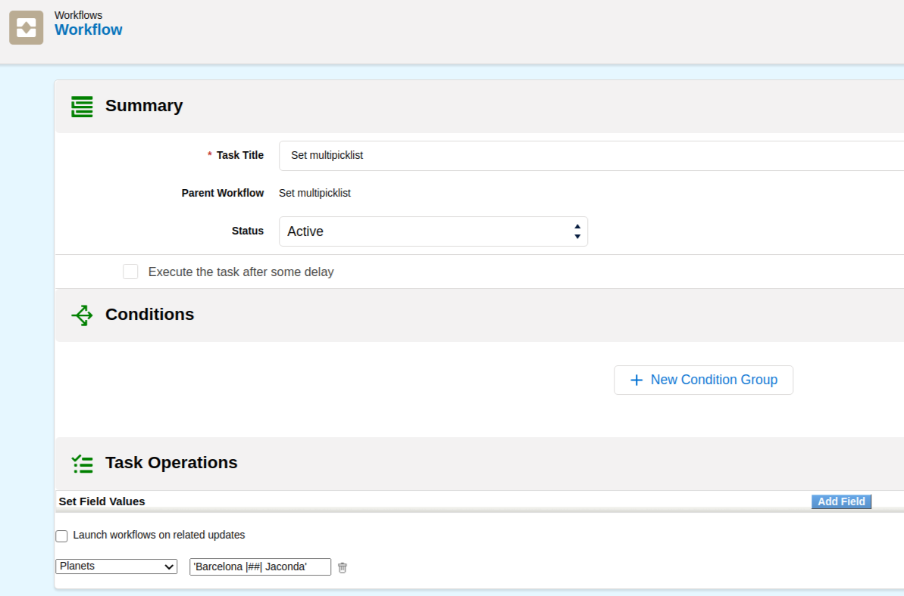
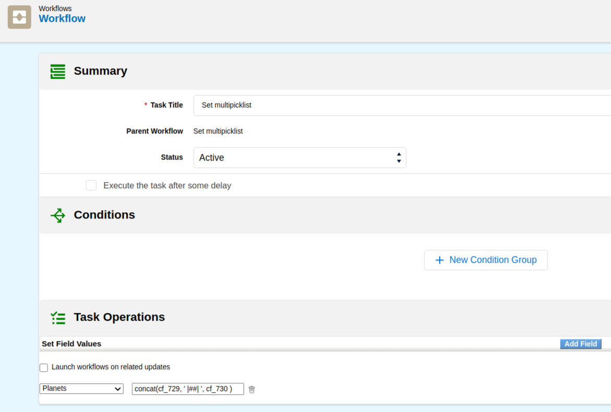
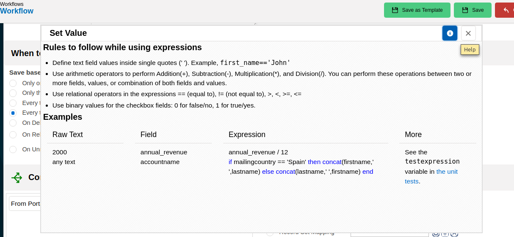
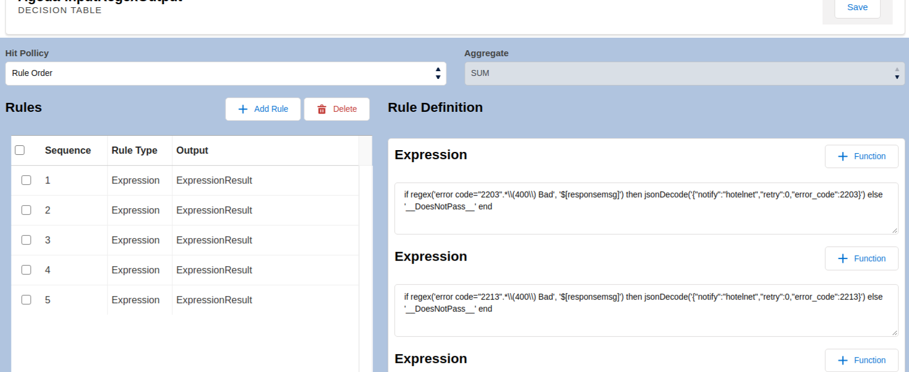
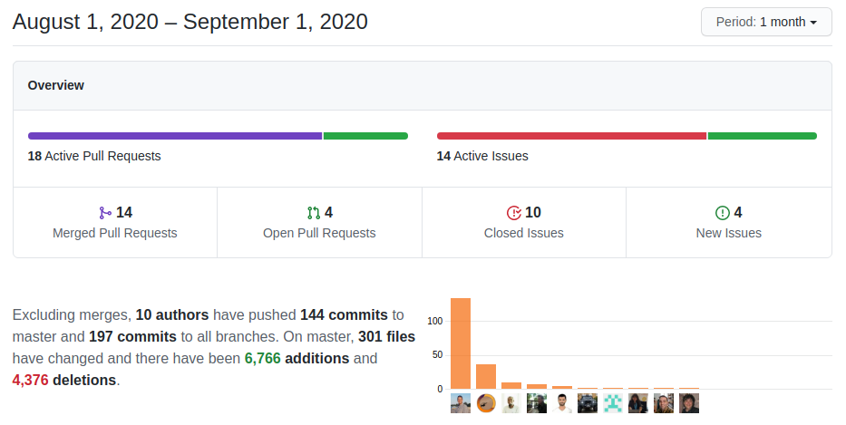

Another verticalization specialized in decision tables, a lot of web service enhancements and fixes as we create external applications and unit test the API, we start our work for PHP and MySQL 8 support and keep the beat strong!

===

 ! Features and Implementor/Developer enhancements

- Web service
  - add information to error message in Web service
  - add [MassCreate](https://corebos.com/documentation/doku.php?id=en:devel:corebosws:methodreference#crud_mass_operations&noprocess=1) web service method.
      - validating parameters and permission in MassCreate
      - add a check on permission to write and cleanup some variables
      - adding logical operator to lastReferenceId
      - checking cyclic references
      - removing .field on reference value
      - removing unnecessary spaces
      - sorting records based on referenceId
      - using a recursive function to process references
      - using REFERENCEINVALID Error code
      - validating index and records correctly
  - **Describe** now returns results of modules the connected user has permission to access when one or more do not have permission, instead of an exception
  - return image field full path information in Query of modules with an image field
  - [Road Runner](https://roadrunner.dev/) web service Login System Synchronization, permits us to automatically share a login session with various coreBOS running in parallel. Docker containers
  - prepare [contacts module for token-based login](https://corebos.com/documentation/doku.php?id=en:devel:corebosws:manual:portallogin&noprocess=1) with hashed passwords: **PortalLogin**
  - **doLoginPortal**, **doLoginSession**, and **doUpsert** for PHP library
- Validations
  - permit CONFIRM and FUNCTION with validation maps just like with custom file validations. So a validation map can return a custom string and get the application to execute a function or ask the user to confirm a message.
  - separate javascript validation step so we can launch with any set of values on any module: `executeServerValidation`
  - support reference fields in **notDuplicate** validation
- Import
  - add thread identifier to import temporary table to support parallel imports from CLI (business map import)
  - correct variable name and delete table before import with Business Map
  - deactivate CSRF check on import reload
- Workflow
  - expression function selector with help. all functionality. missing definitions and translations
  - support multi picklist in update field task

  - add support for returning a set of variables in a JSON format. this is useful when working with context variables that come from web service calls
  - add help information to the expression editor

- Reports
  - permit DateTime positioning in scheduled report names by using %s in the name. when sending scheduled reports it can come in handy to save the date that the report was generated in the name. You can accomplish this by putting '%s' in the name where you want the DateTime to be shown.
  - permit sending CSV via schedule email report
- allow retrieving product taxes as JSON string
- **Debug_Access_Restricted_File** global variable to show a call stack on "Sorry! Attempt to access restricted file." error message.
- send correct user object to corebos.login event
- prepare ProductAutocomplete for modern inventory block
- restart cronWatcherService if it is running for more than 10 minutes
- allow for users to be related through regular related lists. **interesting and useful**

 ! Decision Map. RAldine project.

This month sees the birth of a specialized coreBOS focused on Decision Table rules evaluation. As a standalone project to be used as a web service endpoint that makes the decisions that external projects need to know. We use coreBOS to define and construct the decision table and then the external application sends the parameters and retrieves the result.

- add audit event for tracking execution
- support evaluating expressions when we don't have a record context
- permit the execution of Decision Maps without record ID context
- permit web service rule execution using map name besides ID
- support context variable substitution in preprocess expression
- evaluate preprocess with screen values
- support IGNORE as a wildcard rule value
- support Decision Tables as valid expressions: __DoesNotPass__==false
- merge evaluate rule data with context when the context is empty and fill in record_id only when we have one
- GUI Generator
  - generator layout. ready to start functionality
  - code to save map, cleanup copied code, get field information
  - expression function selector

 ! coreBOS Standard Code Formatting, Security, Optimizations, and Tests

- MySQL version 8 support in Reports (change column names to lowercase)
- code changes after the first test on PHP 8
- PHP 7.4 support
  - eliminate 5.x code get_magic_quotes_runtime in phpMailer
  - change implode parameters in Report and Calendar
- coreBOS Standard Formatting: you would think this would have disappeared by now but it seems like this is a never-ending task!!
  - format CSRF library and add it to CI
  - convert MSDOS EOL to UNIX EOL in vtlib
  - Inventory Modules, PBXManager, Reports, Calendar, Workflow, ListView: format, change quotes, and eliminate warnings
- optimizations
  - sync inventory Edit View and standard module edit templates: eliminate obsolete uitypes code
  - eliminate obsolete non-supported List View Colors reference in Global Search
  - delete obsolete code and initialize variable in Quick Create and Settings
  - delete unused variable in Reports and Inventory Modules
  - change this->db for adb throughout the application to reduce memory consumption
  - change variable for direct result usage in attachments
  - eliminate smoothscroll javascript library that is not used anymore
  - eliminate unnecessary IF, unused variable, and move condition to avoid unnecessary check on error in the workflow system
- library updates:
  - Smarty to 3.1.36
  - HTMLPurifier to 4.13.0

 ! Others

- remove checkbox, change textbox and styling to LDS in Settings
- remove border on firefox search icon (LDS)
- eliminate warning in Accounts custom validation
- shipping address location map was loading the main one in Account/Contacts
- move open_contact_account_details to general JS so we can create contacts anywhere (QuickEdit)
- avoid PageHeader error on load in pages with no page header
- present validation errors in popup quick create
- make Popup screen bigger
- revert currency formatting in PriceBooks which is already done elsewhere
- incorrect variable for user name in asterisk inline validation
- Business Question builder error when no question has been created
- apply UX recommendations to change password screen
- show CSRF error message instead of generic error message on AJAX call fail
- avoid submit on enter in textareas
- add browser variables to email detailview, add missing head close and structure HTML
- set action to correctly get the default filter in QueryGenerator
- cleanup and standardize HTML in inventory lines
- update Invoice save_module function to accept custom fields images
- do not fill in billing and shipping address when converting Purchase Order from product
- Product Autocomplete
  - Prevent submitting on enter when the autocomplete is open and enter is used to select an option
  - Use converted price for multicurrency, not actual
- **IMPORTANT:** correct Net Total (bGD) calculation for individual tax grouping of financial fields
- Tax modifications:
  - avoid error if taxname not found when change status event is triggered
  - avoid saving field and eliminate warning if tax name cannot be found
  - translate labels, format code, and add TAXID to change status event
- add fromlink for account field on contact QuickCreate form
- add map based validations to Leads conversion step and apply LDS to error screen
- correctly read special characters in Mail Converter attachment name
- make sure Mail encoding has standard 10 characters: eliminate '-i' for better special characters support
- skip uitype 77 fields in QueryGenerator as it is not supported (yet)
- Reports
  - correct array structure for fields with no permission when trying to be accessed
  - eliminate path from scheduled reports attachments
  - set custom date ranges when editing report so they get saved
- WebService
  - temporarily deactivate Zendesk access
  - apply module access restrictions in the global search
  - ChangePassword: add user exist check, support for non web service ID and avoid die on error for unit tests
  - use CreateView permission for web service actions
  - check read permissions not update permissions in the Validate method
- Workflow
  - support web service IDs in MergeTemplateWith context variable so we can pass in users
  - avoid losing variable when explicitly set
  - change a static reference to object reference to comply with method definition (and call only once)
  - place back full template instead of field name when keepvariable is true
  - use database variable to get order and sort by
- constant translation effort:
  - pt_br in application and Business Maps
  - translate custom Validations messages
  - Global Variables CSRF messages

**Thanks for reading.**
