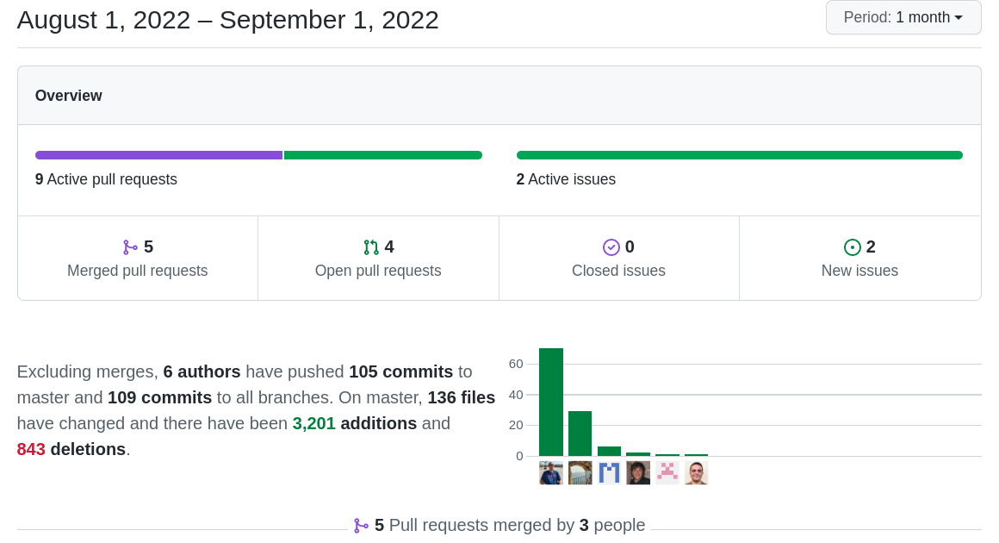

New views for future enhancements and support of business process, Business maps enhancements, Session change wrap up, workflow expressions, Security, optimizations,... coreBOS daily routine :-)

===

 ! Features and Implementor/Developer enhancements

- Install fixes
  - inform when we cannot connect to the database and trim spaces in the database name
  - no more ISO, only UTF8
  - respect site URL scheme
  - return an error when we cannot connect to the database
- ListView
  - hide variable warnings in tuiGrid mode
  - load checkbox translations once and show "No" value if the field value is NULL
  - performance optimization: do not execute queries in listview if we are not in tuiGrid mode
  - remove unused code and load correctly tuiGrid when filter is active
  - show the correct label for related modules fields in tuiGrid listview
- Session
  - hide warning for unit tests
  - LoginPortal changes
  - web service logout
- drop foreign keys: changeset to eliminate some foreign key restrictions to permit master-detail operations
- Business Map
  - export specific map object on generic `cbMap` object. this is an important enhancement, making it possible to always access the specific map object when instantiating the map by name using the new `mapObject` property. For example, if we have a mapping business map, which does not return the object we can get it through the map property after instantiating the Mapping.
  - add `getDestinationFields` function in Mapping file
  - **Popup query hooks** using ListColumns maps
    - support multiple conditions/fields for the same module
    - better where detection in SQL
  - trigger field dependencies on the first load of form. Be careful with this one, there was a comment and some code to explicitly not do this. I don't remember why we decided that but now that restriction is not present anymore. Reach out if you run into anything odd with this map.
  - add condition and forfield tag to popup block in ListColumns map
- add connection status message to the Cache configuration screen
- [ListView Actions: widgets on list view](../ListViewActions/)
- add recursive functionality in the related list widget
- SMSNotifier: add [**SMSUp** provider](https://www.smsup.es/)
- **New Views**
  - **Operation:** Similar to the Wizard view, this space is for business process implementation but is freestyle and open. The idea would be to have something similar to what we had with the marketing dashboard: a mass actions launcher where you could search, select and act
  - **Wizard:** (and map): an LDS-based progress page with steps to implement a business process
  - **Summary:** a view divided into three parts; a left panel that loads a DetailViewLayout Map, a central area with an actionable timeline of the record, and a third right panel with reduced related lists based on condition queries
- WebService
  - Describe summary information for admin users using their profile
  - support for multiple modules in one call to **getAssignedUserList** and **getViewsByModule**
- Workflow
  - **applymaptoarrayelements** expression function
  - **applyMaptoInventoryArrayElements** expression function
  - **base64 encode and decode** workflow expression functions

 ! coreBOS Standard Code Formatting, Security, Optimizations, and Tests

- coreBOS Standard Formatting: eliminate warnings, eliminate useless code, variables, and comments, format code. Install, Popup, Products, MassEdit, and Workflows
  - change variable name in coreBOS Rules
- Documentation:
  - function headers, and comments
  - non-stop wiki enhancements (working a lot on this)
- Security
  - SQL injection in Assets and Documents full-text search
  - XSS in EditView, RelatedList, and Popup form parameters
  - Reflected XSS via idlist parameter in Emails
  - Reflected XSS via blockstufftype/stuffid/stufftype Home parameters
  - XSS in MassEdit idstring parameter
  - set CSRF token on delete workflow action
  - bypass CSRF multiple end point
  - [add CRSF token to URL function](https://github.com/tsolucio/corebos/blob/master/include/utils/Request.php#L223)
- Optimizations
  - merge IFs in CSRF code
  - reduce variables for direct value, reduce SQL fields and eliminate query_result in Business Maps
  - eliminate redundant assignment and delete empty line in Field Dependencies
  - List View: eliminate unused variables and format code
  - tuiGrid:load users and groups once
  - eliminate redundant code and variable in Popup
  - reduce SQL information in Products
  - instantiate Request object only if needed
- **Unit Tests:** keeps getting more and more assertions.

 ! Global Variables

No new global variables were added this month.

 ! Others

- Pivot Map validation
- fix Field Dependency: protect function call when field is not found
- Business Question
  - avoid parameter instantiation if parameter array is empty
  - move non-admin user restriction JOIN to correct position
- set full width of the footer in CSRF error message
- Custom View
  - check for roles if the user is permitted to edit/delete the filter
  - get the correct user name for filter owner
  - permission builder
  - separate internal cache for ALL views
  - check for custom permissions in cbCVManagement module
  - check for non translated value for filter All
- apply Tika full-text search only on documents and in the right place of the SQL
  - Get global variable outside loop and with Documents module context
- fix Expression Engine cannot access private property "data"
- edit/delete action in master-detail submit
- RelatedListWidget: use the correct fieldname to update the relations and avoid related fields are overwritten
- do not empty custom dates and load LDSPrompt for reporting errors in Reports
- SMS Notifier CSS
- clock and calendar ToolButton background and draggable
- fix Translations: escape single quotes in keys
- Widget: toggle action is submitting the form
- Web Service
  - return the correct set of Users fields in web service after profile change
  - catch invalid module error
  - eliminate warning when count query rows fail
  - set property values of special ID field for consistency
- Workflow
  - UpsertTask: workflow context is lost after processing the condition expression map
  - do not load the current row context on create
  - load workflow expression function only if we have a database connection
- Translations
  - translate filter names
  - Related List Widget
  - Related List Grid: ES
  - Workflow expression ES

**Thanks for reading.**
