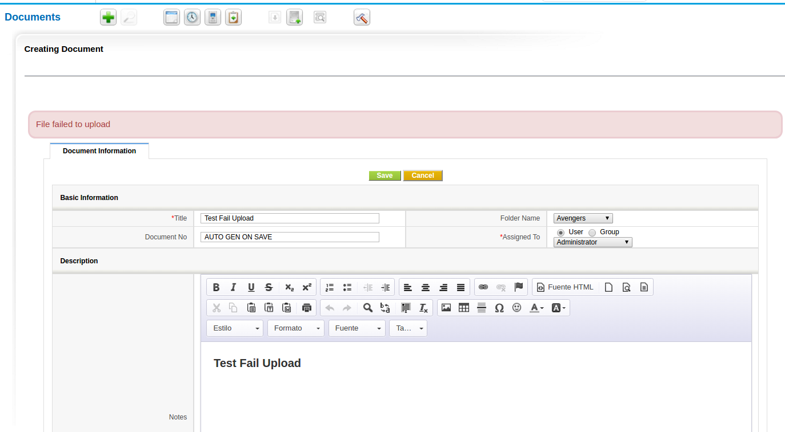
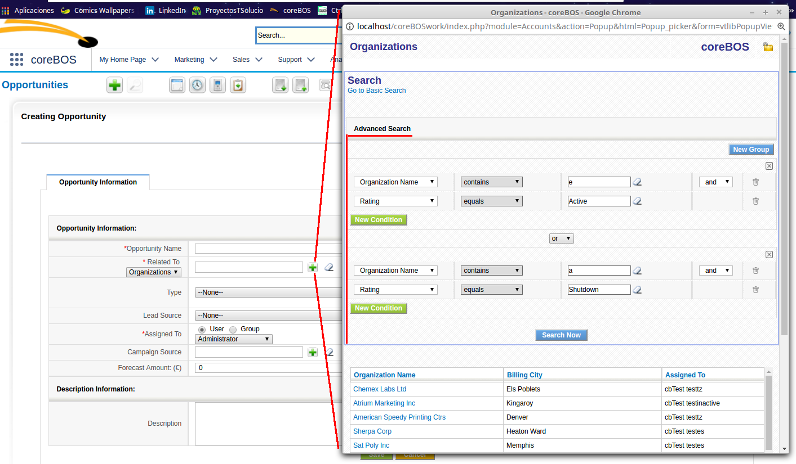

We dedicate August and September of 2015 to some long running projects. So, although coreBOS still gets a lot of changes, all the action is going on in the branches as we eliminate prototype, start giving support for newer versions of PHP, and work on some very interesting integration projects like [Elastic Search](https://www.elastic.co).

===

 ! Long running projects

 - PHP version 5.6 support
 - Start working on PHP version 7.0 support
 - Start elimination of prototype and move to native javascript and jQuery

 

 ! Inform when document cannot be uploaded

The application was silently failing when a document attachment was uploaded but could not be written. This means that the Document record was created correctly, even indicating that the attachment was there, but, in reality, it wasn't, as it failed to write to disk for some reason. After this fix, we get an error message and we stop the creation of the record.

 ! Advanced search in popup

 ! preSave, preEdit, and preView Hooks

[Read all about them on our documentation site](http://corebos.org/documentation/doku.php?noprocess=1&id=en:devel:corebos_hooks:precrud)

 ! Generalize base modules code

As we tend to standardize the base module code we also modify the application standard modules to make them use this base so they all have the same functionality and directly inherit the new functionality.

In these two months we clean up and **standardize ALL** the base modules so they get all the enhancements we have been making, including the preSave, preEdit and preView events.

 ! Workflows
 - **Distinct Operator**.
 - Permit editing update fields workflows with **incorrect mappings**.
 - Better **from mail** settings.
 - Fail correctly when **incorrect expression** is given.

 

 ! Some others:

 - PHP version 5.6 support
 - Cron based backups
 - Special characters on multipicklist and picklist
 - New field type (1024) which is a Role List multipicklist
 - Calendar fixes and enhancements
 - Import enhancements: the application does not try to create related inventory modules, and **set default values from layout editor** on related records that are created
 - Eliminate PostgreSQL code, the application only supports MySQL and MariaDB
 - Special characters in password
 - Tax labels with special characters
 - Helper Script **getjslanguage** to get language translations in javascript
 - Alphabetical sorting everywhere
 - Eliminate warnings, notice, MySQL strict and code cleanup (this one is a constant every month, even today).
 - Translation. Notice warnings, eliminate unused code, cleanup

**Thanks for reading.**

