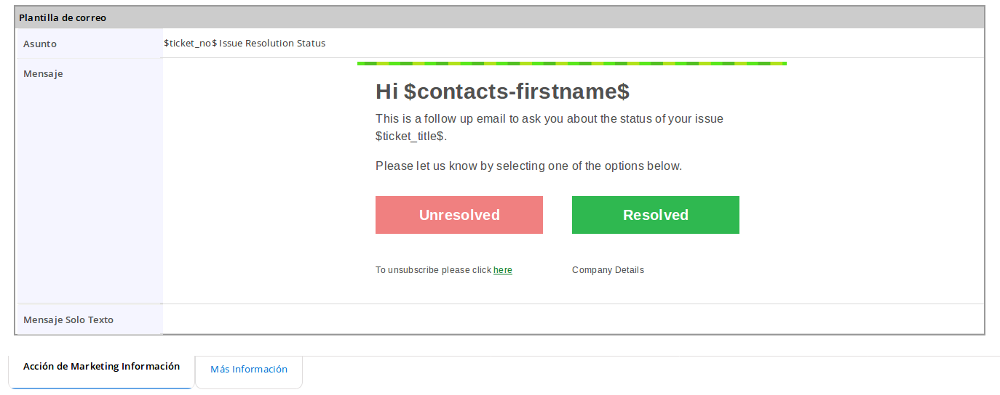
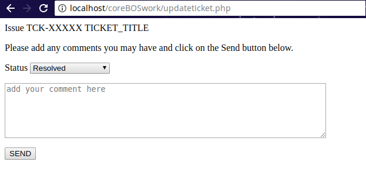

Do you need the ability for clients to click a button in an email and have it automatically change the Status of an associated Ticket? If so, you have come to the right place to learn how to implement what I call the **Get back into the web pattern**.

===

 ! Request

I received this request the other day from a client.

> We have an automated workflow system that sends out emails every so often on tickets that are in status "confirm resolution".
>
> As part of that email we would like the recipient to be able to click on buttons and have it either mark the ticket as closed, to be scheduled, or possibly another status.
>
> It would also be nice to have the user be able to add a comment to the ticket directly from this email as well. But this is not as necessary as the other needs.
>
> With the loss of our secretary this is an important change that needs to be made to save time and productivity.

 ! Solution

The solution to this request is to get the user **out of the email** Inbox and back **into the web** where we have full control.

So we will set up an email similar to the this:



Both buttons will have a very similar link that looks like something like this:

```
UNRESOLVED:
https://yourWebsite/updateticket.php?ticketid=$helpdesk-ticketid$&ticketstatus=Unresolved
RESOLVED:
https://yourWebsite/updateticket.php?ticketid=$helpdesk-ticketid$&ticketstatus=Resolved
```

Once we are in the browser and in PHP we can do everything we need to do. The two links will send the user to the website with enough information for us to know what ticket we are talking about and which button the user clicked on. From there we can implement any business logic we need to.

Following the request above, I quickly set up a HelpDesk web form page using the native webform extension which would serve to show the user the option she has selected and permit them to enter a comment. Once they click on the send button all the information would arrive at another PHP script which would be configured to send the information into the coreBOS application using the web service interface.



Although in this post I am giving a more or less specific solution the **Get back into the web pattern** is a very powerful and versatile way to redirect the conversation with your clients as once we have them in our website or customer portal the possibilities are endless. For example, another typical use case would be to manage email preferences and email opt-out.

Let me know how you are using this pattern.

**<span style="font-size:large">Thanks for reading.</span>**

