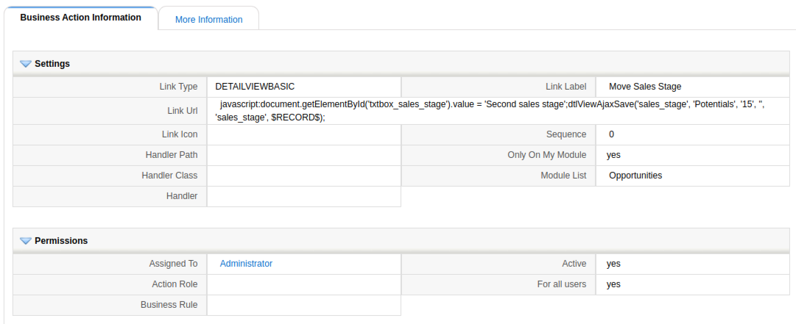

On occasions, we want to force our users to follow all steps defined in a business process. There are many variations on this idea and many ways to implement it. In this post, we will see a validation and business map solution based on steps defined in a picklist.

===

Let's suppose that we have these sales stages defined for our opportunities

- First sales stage
- Second sales stage
- Closed won
- Closed lost

Currently, coreBOS does not impose any sort of process, a user could edit the stage picklist and go directly from *first sales stage* to *closed*. We want to prohibit that and force our users to pass through the *second sales stage* before closing

Three approaches come to mind

1. add validation mappings that drive the sales stage changes
2. make the picklist read-only and add action links to change the values effectively pushing the sales along
3. Full-blown Business Process Management

Let's see how we would do the validations. The basic idea is very simple; we add a validation map with some conditional expressions that make sure that the previous value is the right one for the new value we are trying to save. For example to validate that we can update to the value *second sales stage* we check that the previous value is *first sales stage*, and so on. This would look something like these business maps.

- Business map name: ForceStep_Validations
- Business map type: Validations
- Business map module: Potentials
- Business map contents:

``` XML
<map>
  <originmodule>
    <originname>Potentials</originname>
  </originmodule>
  <fields>
    <field>
      <fieldname>sales_stage</fieldname>
      <validations>
        <validation>
          <rule>expression</rule>
          <restrictions>
          <restriction>ForceStepExpression</restriction>
          </restrictions>
        </validation>
      </validations>
    </field>
  </fields>
</map>
```

- Business map name: ForceStepExpression
- Business map type: Condition Expression
- Business map module: Potentials
- Business map contents:

``` XML
<map>
<expression>if AND(sales_stage=='Second sales stage', current_sales_stage!='First sales stage') then 0 else 1 end</expression>
</map>
```

For the second option, the idea is to dynamically generate action links that take us from one step to the next while blocking any edit on the status picklist field. This requires a field dependency map to block the field and a global variable to stop inline detail view edit (because we still don't have the Field Dependency maps working on Detail View) and a set of business actions to generate the action link. The field dependency map looks like this

- Business map name: Potentials_FieldDependency
- Business map type: FieldDependency
- Business map module: Potentials
- Business map contents:

``` XML
<map>
  <originmodule>
    <originname>Potentials</originname>
  </originmodule>
<dependencies>
<dependency>
    <field>sales_stage</field>
    <actions>
        <readonly>
            <field>sales_stage</field>
        </readonly>
    </actions>
</dependency>
</dependencies>
</map>
```

And the business action would be something like this



where you would have to add some conditional business rules to dynamically show the correct links depending on each picklist value.

I share here the code in the business action above so you don't have to type it:

`javascript:document.getElementById('txtbox_sales_stage').value = 'Second sales stage';dtlViewAjaxSave('sales_stage', 'Potentials', '15', '', 'sales_stage', $RECORD$);`

As you can see coreBOS is REALLY a flexible platform that you can adapt to your needs just playing around with the different configuration options. If you add to the above two options, the fact that, in the end, you are saving a value in the record which triggers the workflow system so you can do any amount of tasks when moving from one step to the next, you end up with an incredibly powerful system.

 !!! Read that as the new buzz word: coreBOS is a complete **LOW CODE business platform**!

That said some things are missing or could be nicer

- we cannot launch tasks when the validation fails because there will be no "save action" to trigger the workflows
- the actions are hard to configure and maintain and the visual effects could be better
- the action only supports linear business process
- the validation could be easier to create and maintain
- if we want to have alerting and SLA type of functionality we have to create scheduled workflows to control the status and time elapsed

Thus enters the [Process Flow modules](https://github.com/coreBOS/ProcessFlowPerspective) which we will explain in detail in next month's blog post.

**<span style="font-size:large">See you soon!!</span>**

<a href="https://www.freepik.com/free-vector/illustration-gears_2945069.htm#page=1&query=gears%20business&position=49">Business vector created by @rawpixel.com - www.freepik.com</a>
