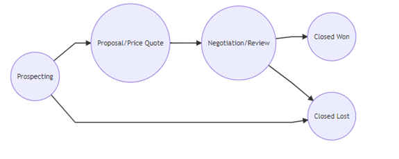
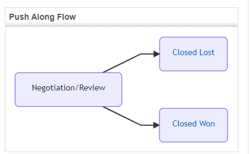
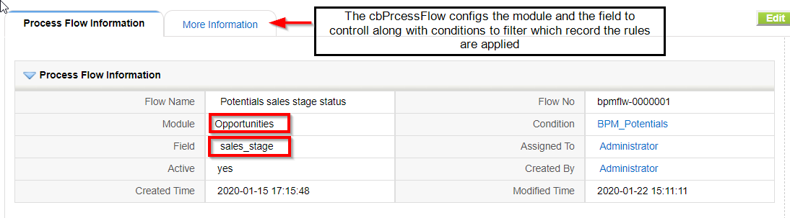
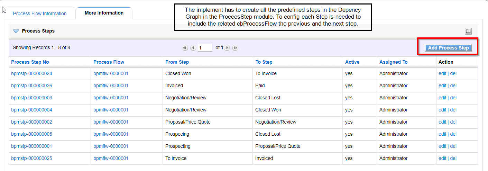
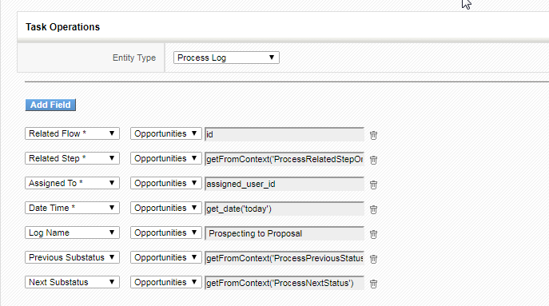
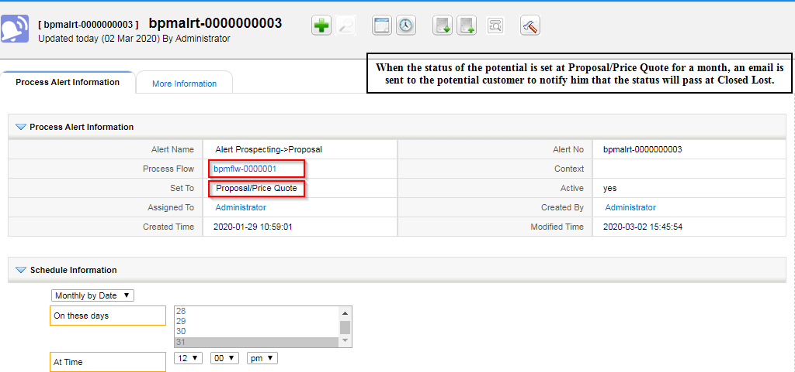

In [last month's post](../BPMProcessFlow1) we discussed two approaches to the **Force Steps Pattern** based on business maps. This month we study the third option commented there based on the Process Flow modules with a very complete guest post from one of our team members Franceska who has been testing and implementing it for the past weeks.

===

Most of the companies invest time and effort analyzing in the management of business processes and identifying areas of improvement to create more effective operations. Taking all the BPM concepts and approaches, in the last weeks we have invested time in creating a BPM coreBOS engine able to **follow all steps** of a **Process flow** activities and perform a set of defined **actions and workflows** passing from one state to another.

Starting from the beginning. It’s not uncommon for people to use workflow management and process management interchangeably. Whether you call it a workflow or BPM isn’t going to necessarily impact the concept itself, so during the analysis of this project we thought,

> why not use the coreBOS workflow system as a backbone to execute and perform actions on different state activities of a designed process flow?

**So for this purpose a set of process Flow modules were created.** This set of modules implement the standard structure to manage a flow of field value changes inside a module.

- **Process Flow:** Defines the module and field to control along with a condition to filter which records in the module we want to apply the rules.
- **Process Step:** This module defines one exact value change, from one value to another. It forces a validation and a set of actions to execute if the validation is true and another set if the validation is false. It is also related to the process log module.
- **Process Alert:** This module defines a set of actions that must take place while the field being controlled is in a certain state.
- **Process Log:** a reporting module to log the changes of state

This set of four modules and the powerful workflow system will permit you to enforce the business logic your company has on any module. You will be able to control the status changes that your records should go through using coreBOS. In the rest of the post, we will try to enforce the Potentials Sales Stage values and block your users from going to certain values from others or simply logging the flow while launching workflow tasks on each change.

In the creation of BPM processes, the design and modeling phase are the most critical points on implementing a flow process, both are very important to give the end-user a clear idea of the sequence of events, and the flow of data through the process. Taking into account these approaches we enhanced coreBOS to read a dependency graph and a visualization library [Mermaidjs](https://github.com/mermaid-js/mermaid) as a graphical representation of the flow process.

The Dependency Graph is the exact setting of the process you need to enforce. It will permit you to define the validations and actions to be taken when going from one value to the next (Process Step) and also the alerts and actions that need to be taken at a higher level of the process, like an overall restriction between two states. This is a graphical representation of the Sales Stage Process Flow.



 !!! Push Along Developer Block

This developer block will show a graphical representation of the values the record can transition to depending on the current value assigned to the record and will permit you to move to one of the next steps by clicking on it. The mermaidjs library integrated into coreBOS is able to read the graph and transform it into a graphical view for the end user to push the changes. 

To activate the push along developer block two Business Action have to be configured:

- Push Along Flow (DETAILVIEW) action that permits the flow to be visualized in the detail view of each record
`module=cbProcessFlow&action=cbProcessFlowAjax&file=pushAlongFlow&id=$RECORD$`
- HEADERSCRIPT Business Action that will load the mermaidjs library `modules/cbProcessFlow/mermaid.min.js`



 !!! Setting Up the Process Flow

Next, we try to give a short manual for the road map that is needed for each implementor to follow to configure a Process Flow.

 !!!! Configuration of the Process Flow module and field

Configure the field and the module for the process you need to enforce in Process Flow module



 !!!! Create all the Steps in the Process Step module

These represent the action to take when going from one value to another in the Graph



 !!!! Setup the validations and the actions needed to be taken

Each of the actions that are needed to be performed have to be created using the Workflow tasks that coreBOS offers. In the last weeks we have implemented some important changes in the workflow system adding a "context environment" for the execution. This means that now a workflow execution has context variables that can be shared among all the workflows that participate in one individual execution. The variables can be set from outside the execution and internally by each task.

**Tricks for scheduling the Action Workflows**

- All the configured workflows have to be **System** so they can be triggered manually from the Flow without interfering with the normal Workflow system.
- To test the functionality of the system triggered workflows you must have the ProcessAlertQueue cronjob active.
- It is recommended to schedule the cron with a frequency of 1 minute so we are sure it will perform faster, taking into account that the functionality is needed for updating real-time changes in the records of modules.
- Adding validations in the Process Steps logically means that for that particular step the BPM Alerts is going to execute all the positive cases if the validations are passed successfully, if not it will execute all the negative cases defined for that particular step.
- The implementer has to be careful with the configurations of the validations map, they don’t have to be internal coreBOS maps because the system will execute them as an internal validation for all the business logic cases implemented.

<span></span>

 !!!! Configure the process logs registered for each route transition

The Process Log module is used to register different events that occur during the process. This logging will not happen automatically. If you want to log events you will have to add the corresponding actions wherever you need them.

When a potential changes its status a Process Step launches a workflow that launches a create entity task to create a Process Log (we want to log the status change). The creation is launched from the Opportunities. To permit you to access that information the Process Flow system loads some variables in the workflow context so you can retrieve those values and use them in workflow tasks with the **getFromContext** method.

These variables are:



 !!!! Alerting Procedure

If necessary configure the alerts in the Process Alerts module. When a record is set to a value controlled by a Process Alert, a record is created in the alerting queue with the record ID, the alert ID and the next trigger time as defined by the schedule fields in the alert. Every few minutes the queue is scanned in search of records whose trigger time has passed and those are launched:

- from the alert, we get the context map and evaluate with the record ID
- from the alert, we retrieve all the workflows and launch them with the context and record ID
- calculate next trigger time, if there is no next time we delete the record from the queue
- the record can also be deleted from the queue with the **deleteFromProcessAlertQueue** custom workflow method

<span></span>



 !!! Event: Send an email reminder

Let’s describe further in detail a few real cases from the Sales Stage Process Flow. The following example shows an example of the Flow where a Validation has to be met to execute the actions otherwise will show the message **Invalid Flow Transition.**

 ! Example 1:  Proposal/Price Quote > Negotiation/Review

> Validations: The price is greater than 0.00

So it will execute the designed workflows for that specific step. For that purpose, a validation map is created and inserted in the Process Step (Proposal/Price Quote>Negotiation/Review).

``` XML
<map>
  <originmodule>
    <originname>Potentials</originname>
  </originmodule>
  <fields>
    <field>
      <fieldname>amount</fieldname>
      <validations>
        <validation>
        <rule>expression</rule>
        <restrictions>
          <restriction>8439</restriction>
        </restrictions>
        </validation>
      </validations>
    </field>
  </fields>
</map>
```

Related Expression (id 8439)

``` XML
<map><expression>if amount &gt;= 0.00 then 1 else 0 end</expression></map>
```

The map uses, as a rule, an expression that has to be created inside coreBOS and inserted the field_id of the records in the restrictions tags in the validations map.

Adding a validation in the Process Steps logically means that for that particular step the BPM Alerts are going to execute all the positive cases if the validations are passed successfully, if not it will execute all the negative cases defined for that particular step.

**Positive steps:**

- Generate a GenDoc offer template
- Send the offer template to the related account

<span></span>

 ! Example 2: Negotiation/Review > Closed Lost

> Validations: If exists a related quote will execute

``` XML
<map>
  <originmodule>
    <originname>Potentials</originname>
  </originmodule>
  <fields>
    <field>
      <fieldname>potentialname</fieldname>
      <validations>
        <validation>
          <rule>RelatedModuleExists</rule>
        <restrictions>
          <restriction>Quotes</restriction>
        </restrictions>
        <message>No related accounts</message>
        </validation>
      </validations>
    </field>
  </fields>
</map>
```

The Positive Actions for the step are:

- Update related Quotes, set the status to Rejected
- Set Next Step to Closed Failed

Through this post, we tried to give a short glimpse of this powerful system describing the modular approach and the functionalities offered by using real case examples. As you can see coreBOS is **REALLY** a flexible platform that you can adapt to your needs just playing around with the different configuration options. To wrap it up using the workflow system you can do any amount of tasks when moving from one step to the next, you end up with an incredibly powerful system with the basic approach **LESS IS MORE !!**

**<span style="font-size:large">Hope you have enjoyed this post. Thank you!</span>**


**<span style="font-size:large">Wonderful job. Thank you Franceska!!</span>**

<a href="https://www.freepik.com/premium-vector/bpm-business-process-management-word-lettering-typography-design-illustration_3346649.htm#page=1&query=bpm&position=1">Business vector created by @bebarrel - www.freepik.com</a>
