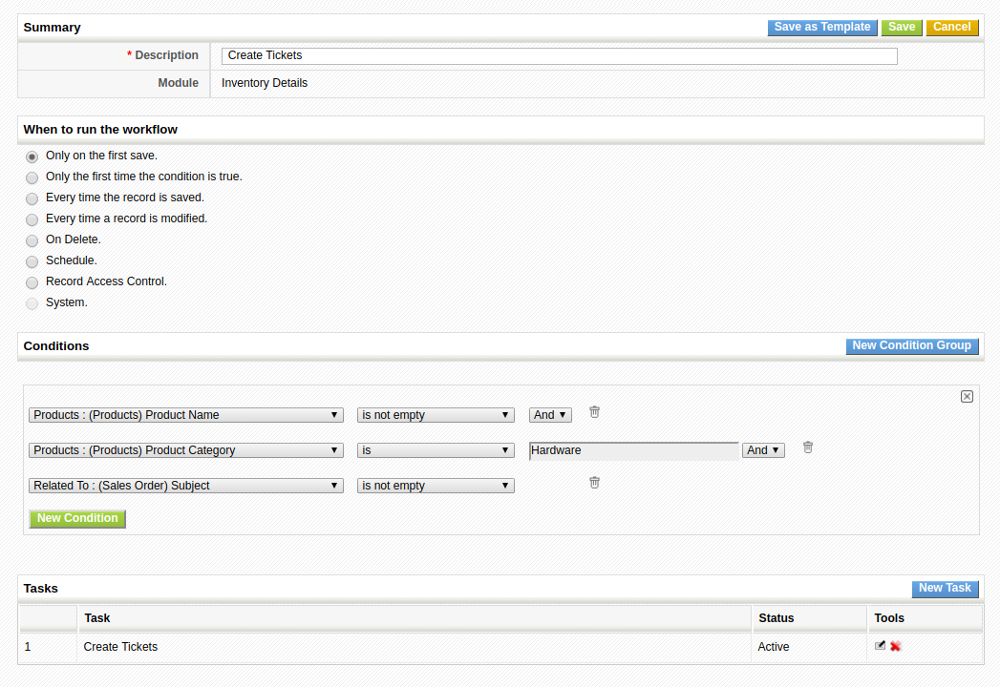

Learn how to create different records from the inventory lines of a Sales Order (or other inventory modules) with this simple and powerful **coreBOS** workflow setup!

===

 ! The Goal

Create support tickets for each product line of a Sales Order where product category is Hardware.

Obviously, you will be able to create any other type of entity under any type of conditions.

 ! The Solution

There are only a few things that you need to understand to get this workflow working correctly.

 - How to loop over all the inventory lines of the sales order to create the records. It turns out that there is no way of doing that in the workflow system, but thanks to the [Inventory Details module](../InventoryDetails) we can accomplish this by creating workflows on this module.
 - How to launch a workflow only when a record is related to an entity. To accomplish this we simply need to do an **empty** or **not empty** check on any non-empty field in the related module. So, for our case, we will check the _Related To_ field of the Inventory Detail module for the _subject_ field on the Sales Order. If the Inventory Details record is related to a Sales Order then this field will have a value, if the record is related to some other module, the SalesOrder field will be empty.
 - In order to be able to use the **Create Entity** workflow to create a record in another module, that module must have a relation field to the first module. This field can be created in the layout editor. In this case, we add a relation field to Inventory Details on the Support Ticket module.

With that information the final workflow looks like this:

You can see a full explanation and working example in this video:

[plugin:youtube](https://youtu.be/xZ2K_7Kx7yQ)

 
**I'm sure this Business Process Management setup will help you make your coreBOS more useful!**

 
Cover photo by <a style="background-color:black;color:white;text-decoration:none;padding:4px 6px;font-family:-apple-system, BlinkMacSystemFont, &quot;San Francisco&quot;, &quot;Helvetica Neue&quot;, Helvetica, Ubuntu, Roboto, Noto, &quot;Segoe UI&quot;, Arial, sans-serif;font-size:12px;font-weight:bold;line-height:1.2;display:inline-block;border-radius:3px" href="https://unsplash.com/@nikhilmitra?utm_medium=referral&amp;utm_campaign=photographer-credit&amp;utm_content=creditBadge" target="_blank" rel="noopener noreferrer" title="Download free do whatever you want high-resolution photos from Nikhil  Mitra"><svg xmlns="http://www.w3.org/2000/svg" style="height:12px;width:auto;position:relative;vertical-align:middle;top:-1px;fill:white" viewBox="0 0 32 32"><title>unsplash-logo</title><path d="M20.8 18.1c0 2.7-2.2 4.8-4.8 4.8s-4.8-2.1-4.8-4.8c0-2.7 2.2-4.8 4.8-4.8 2.7.1 4.8 2.2 4.8 4.8zm11.2-7.4v14.9c0 2.3-1.9 4.3-4.3 4.3h-23.4c-2.4 0-4.3-1.9-4.3-4.3v-15c0-2.3 1.9-4.3 4.3-4.3h3.7l.8-2.3c.4-1.1 1.7-2 2.9-2h8.6c1.2 0 2.5.9 2.9 2l.8 2.4h3.7c2.4 0 4.3 1.9 4.3 4.3zm-8.6 7.5c0-4.1-3.3-7.5-7.5-7.5-4.1 0-7.5 3.4-7.5 7.5s3.3 7.5 7.5 7.5c4.2-.1 7.5-3.4 7.5-7.5z"></path></svg>Nikhil Mitra</a> on [Unsplash](https://unsplash.com/search/photos/create?utm_source=unsplash&utm_medium=referral&utm_content=creditCopyText)