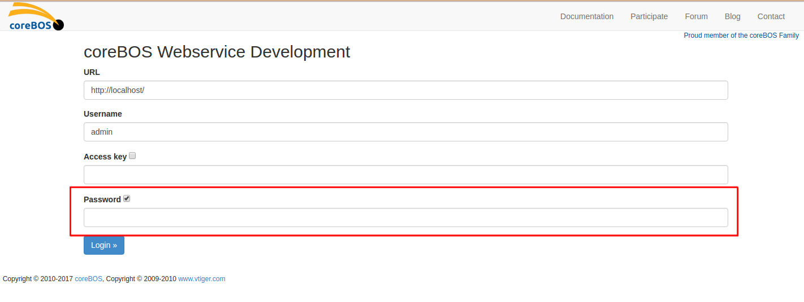
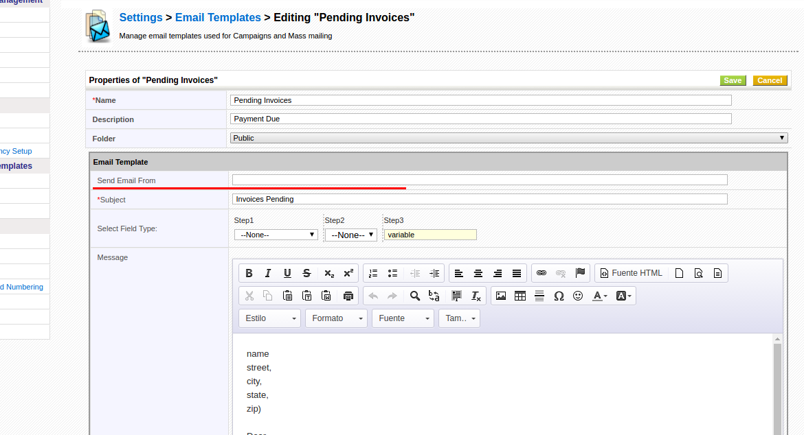

December of 2014 brings, among others, two very important enhancements that will mark the future development of the project: **Standardize base module code** and **coreBOS Events**.

===

 ! Standardize base module code

We start another long running project to standardize the code in all the modules. The goal is to have all the functionality of a base module in the same directory so that the modules themselves are merely includes of those files. This way when we add new functionality all the modules get it and we make the application easier to maintain.

In this process we add in methods and hooks so that the developer can customize each module to it's specific needs while still inheriting all the functionality of the modules in the application.

This month we layout the **FindDuplicateRecords.php** functionality

 ! coreBOS Events
 
This is another one of those massive game changers that the vtiger company had in front of them and just kept ignoring. [Stefan Warnat](https://stefanwarnat.de/) implemented a whole new eventing extension for vtiger crm and shared it with the world! We picked up his work and integrated it into coreBOS.

**Thank you Stefan, for this and for many other acts of support to the coreBOS project.**

Once we get the basic functionality of Stefan's work into coreBOS we enhance it and start adding events all over the application. You can get more information and details about the event is on the [documentation wiki page](http://corebos.org/documentation/doku.php?noprocess=1&id=en:devel:corebos_hooks).

 ! Webservice: Feature to log in with normal user password

In order to access the application via the webservice interface you need a user name and the value of the access key field which you can find on that user's profile screen.

I understand that this was done for security issues, so we don't send our user password through the internet and,  in case the access key is compromised the malicious user will only be able to access that information available in the webservice application, not everything that is accessible via the main application, but I must admit that this system confuses the users and adds no real security as you can use the compromised key to access via the webservice development tool, for example.

In any case we added the possibility for the webservice application developer to decide how he wants his users to access the application. He can continue to use the access key, which is the default method or he can access using the users password by adding the with password parameter to the login call, like this:

You can actually see this working in the [Webservice Development Tool](../corebos-webservice-develo)

Additionally we now **change the user access key** when his password is changed as there was no way of changing this value if it was compromised.

 ! Popup capture hooks

One the most requested features is to be able to customize the popup capture. Either when it opens or when selecting a record, or both.

So we added a set of different options to attend this requirement and we documented it on the wiki where you can find all the details and some examples.

 - [Popup open hook](http://corebos.org/documentation/doku.php?noprocess=1&id=en:devel:corebos_hooks:popup_open_hook)
 - [Popup capture hooks](http://corebos.org/documentation/doku.php?noprocess=1&id=en:devel:corebos_hooks:popup_capture_hook)
 - [How to open a capture popup with a preselected set of records](http://corebos.org/documentation/doku.php?noprocess=1&id=en:devel:conditional_popup)

We also add the **convertArrayOfJsonObjectsToString()** vtlib helper function.

 ! Pin popup option

In certain use cases it is interesting to be able to select records individually as you see or find them. This was not possible as every time you selected a record the popup window would close obligating you to open the window again to select the next record. Thanks to the pin popup window functionality you can now fix the popup window in place stopping it from being closed and you can quickly select records as you need.

[plugin:youtube](https://youtu.be/8L26sGiHsuI)

 ! Google calendar sync

We update **Google Calendar Synchronization** to their latest **version API v.3**, as the previous one is made obsolete and discontinued.

 ! From address on Email template

You can now specify the **from email** on the application email templates

 ! Ping feature

This feature is ideal for monitoring the uptime of your **coreBOS** install. It is specifically designed to be executed from tools like [Nagios](https://www.nagios.org) or [PandoraFMS](https://pandorafms.com) and let your tech team know when things are not working correctly. [Read all about it here](corebos.org/documentation/doku.php?noprocess=1&id=en:adminmanual:monitorstatus)

 ! Support for more than one capture field on related lists. [fixes #252](http://corebos.org/development/view.php?noprocess=1&id=252)

When a module has two or more uitype10 capture fields pointing to the same module (for example Domains that has two accounts fields) the get_dependents_list default function does not use all the fields, it only relates with the first capture field it finds.

The **get_dependents_list** method must return all related records independent of which field the relation is on.

 ! Some others:

 - Eliminate warnings, notice, MySQL strict and code cleanup (this one is a constant every month, even today).
 - Translation and special characters support: picklists
 - Transfer documents and comments on deduplication: Fix an important error whereas related attachments and comments were being lost on Deduplication.
 - Translation of PDF name: We translate the file name of the native PDF export depending on the users language instead of hardcoded English.
 - Force complex passwords: Integration of open source code shared on the vtiger crm forum to enforce complex passwords. Thanks Sam Hast.
 - webforms: returnSuccess does not output a result in JSON
 - Contact/Invoice Reporting. B2C
 - validate Negative Numbers (NN) in advanced filters
 - [fixes #249](http://corebos.org/development/view.php?noprocess=1&id=249) Language and Theme set incorrectly when editing/duplicating

**Thanks for reading.**

