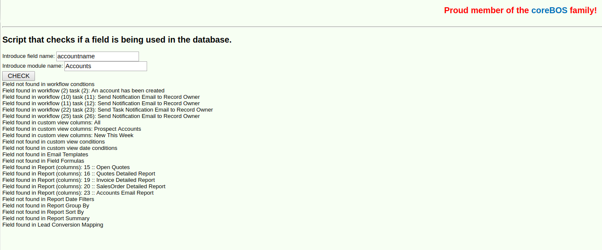

Reports, Import, [Asterisk](http://www.asterisk.org/), tools and functionality enhancements: **Merry Chirstmas coreBOS!**

===

 ! Report Enhancements

 - Excel export boolean and numeric fields as such so they can be used correctly in the spreadsheet
 - Set currency fields to user format totals block
 - Reports totals support for multi-currency with multiple inventory modules
 - More accurate totals calculation when distinct and inventory lines are selected
 - Support for report_to user fields (uitype 101)
 - Speed and clean up

 

 ! Import Enhancement

- In [April 2014](../March-June2014) we enhance the import process so you can search related entities on any field. This month we add this functionality for product/service in inventory modules import
- Do not assign deleted users.
- Wait 5 seconds to refresh summary import page so it gives you time to read and cancel.
- Support for direct image import. If the file is already on disk you can import it without uploading via code script

 

 ! Hidden form variables for developers

We add two hidden variables to the Edit Form of all normal vtlib modules:

 - cbcustominfo1
 - cbcustominfo2

They will automatically get filled in with the value of any REQUEST parameter sent into the edit view action.

These two variables have no specific use inside coreBOS (although they are used for some processes), so they can be used freely by any developer who needs to pass information from the edit process to the save process.

The use case is, more or less, that you launch an edit/create action on a record from some process you are developing and you want to be able to detect that the save process associated to that edit/create was actually initiated from your process. To be able to do this you need to save some flag or additional information in the form so that it gets sent to the save process. One of these two variables is exactly what you are looking for!

 ! Create Ticket and/or Potential from Asterisk call

When a call is received from the [Asterisk integration](http://www.asterisk.org/), a calendar event of type "Call" is created to register the event. This call is related to the contact who is calling.

In this month's changes, we add two actions to the PBXManager call screen that will permit you to create a Ticket or Potential record directly from the call.

The use case is VERY common, you are on the phone with a customer, talking about a business opportunity or a support question, so when the call is finished you automatically create the record and note all the information about the conversation that just took place.

Also, the ticket and potential created from the call will automatically be related to the activity of the call.

Have a look at this video for a quick overview.

[plugin:youtube](https://youtu.be/UbB2dWtB6oU)

 ! Helper script check field usage

This small [helper script](https://github.com/tsolucio/corebos/blob/master/build/HelperScripts/checkFieldUsage.php) is very useful when you need to delete a field. Once you have copied the script to the top of your install, you call the script passing in the name of the variable you want to check on and the module it is in. You will get a report that shows:
 - Workflow Conditions it is in
 - Workflow Tasks that use the field
 - Custom View Filters Columns, Conditions and Date Filters that use the field
 - Email Templates
 - Field Formulas (totally deprecated!!)
 - Report Fields, Date Filters, Group By, Sort By, Summary
 - Lead Mapping

 !!!! This should be integrated into the Layout Editor. Anyone up for it? I can help :-)

 ! Workflow Enhancements

- Geo Distance tasks to calculate distance of different addresses in workflows
- "is" and "is not" condition for pick lists

 

 ! Some others:

 - Add HTML ID to all fields for JavaScript reference in detail and edit view
 - [Check upload error status](../augustseptember2015) and set location type to external if no file is given in Documents
 - Various Calendar Global Variable to establish default values and similar
 - Recurring invoice check to get discounts correct
 - Special characters on global search
 - [EvalWF](http://corebos.org/documentation/doku.php?noprocess=1&id=en:devel:helperscripts#evalwfphp) show values of fields on conditions
 - QueryGenerator support conditions on report_to user fields (uitype 101)
 - Sort project task by name when they have the same start date in Gantt Chart
 - Google calendar sync fixes and enhancements. Force Google calendar sync option.
 - Eliminate warnings, notice, MySQL strict and code cleanup (this one is a constant every month, even today).
 - Translation. Notice warnings, eliminate unused code, cleanup

**Thanks for reading.**

