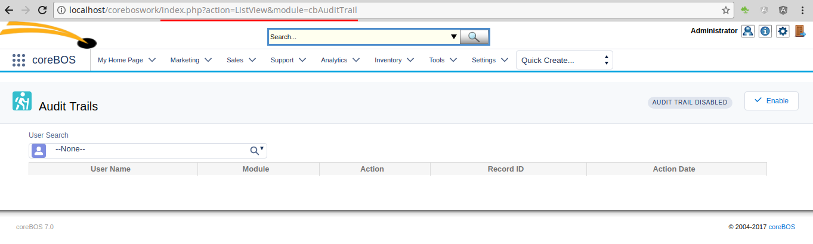
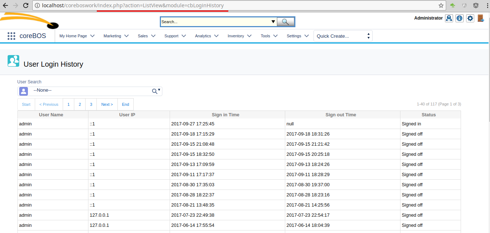
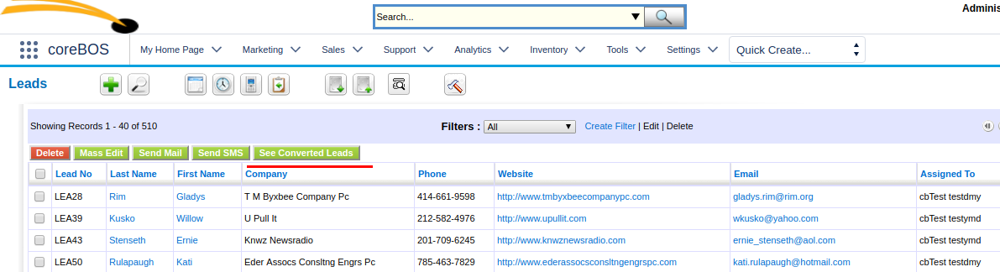

Full PHP 7 support arrives with a whole new chart interface and a totally revamped reporting system along with new features as we continued to construct the perfect Christmas present for your business.

**Merry Christmas!!**

===

 ! Browser Tab Identifier

Some development projects require you to be able to distinguish which browser tab you are in so you can interact with your user differently. As we continuously convert coreBOS into a productive development framework and that ideal business operating system, we add this functionality and even [document a real use case](http://corebos.org/documentation/doku.php?noprocess=1&id=en:devel:corebos_menufilter)

 ! "Created by" field everywhere

We add a read only created by field on all modules. We are already saving the information so it just makes sense to show it and you can hide it using the privileges or field access if you need to.

 ! Reports Enhancements

The reports extension, although basically functional, has had a lot of performance issues and limitations. So we set out to give it a little love and attention.

In this first review, we eliminate one of the major problems it had which is that the reports were not paged, obligating the browser to receive the full output of the report in order to be able to export it or simply see the values. So we decide to use a pure vanilla javascript library called [BunnyJS](https://bunnyjs.com/) that has a very nice and functional data table. In order to support this data table, we add a paging and JSON report retrieval interface. Exactly we implement Laravel’s PHP framework pagination interface.

We add some global variables and fix another all-time classic issue whereas you had to save to be able to export the report with the conditions on screen, that is not the case anymore as on-screen conditions are respected.

 - Paged reports instead of full output based on [BunnyJS DataTable](https://bunnyjs.com/examples/datatable/)
 - HTML and JSON paged API interface
 - Report_ListView_PageSize global variable
 - Report_MaxRows_OnScreen global variable
 - Export reports with screen conditions
 - Migrate the create/edit steps to JavaScript in order to eliminate PHP from the templates (PHP7/Smarty3)

 

 ! Charts

In order to support PHP 7 and to get a cleaner and more up to date chart experience we eliminate the obsolete image library and substitute it for the more modern [chartjs library](http://www.chartjs.org/)

We update all graphs in reports, home and dashboard

 ! ModComments

A recurrent request is to be able to edit and delete comments. It comes up so much that we decide to convert the module into a normal module which permits these operations depending on profile permissions.

 ! Settings Clean Up

The settings cleanup project migrates a few options this month.

Audit trail migrated to its own extension

Login history migrated to its own extension

Terms and conditions is converted into a module

[plugin:youtube](https://youtu.be/Y6bb3UinFJM)

 

 ! Developer

 -  **__cbSaveSendHeader** certain implementation request need to capture the flow of the code after a save has been finished in order to redirect the user to some other place or to launch some code. That is what this variable will accomplish. You can see a [real use case in the calendar module](https://github.com/tsolucio/corebos/blob/master/modules/cbCalendar/Save.php) where we detect the save of a new event and refresh the graphical calendar view
 - Generic network library support for setbody post sending

 

 ! Global Variables

 - **Inventory_ListPrice_ReadOnly** will permit you to fix the unit price of your products so the users will not be able to change it when creating inventory module records
 - **Application_Group_Selection_Permitted** will hide the group option on the assigned user field, in case you need to have groups but you don't want your users to select them

 

 ! Leads see converted leads

We can now toggle between converted and non-convertible leads, permitting us to see and work on converted leads. This setting affects the whole system.

 ! coreBOS version 7

[We release our first fully compatible PHP7 version](http://blog.tsolucio.com/ha-llegado-corebos-7/)

 ! Other changes:

 - White label
 - MySQL strict SQL fixes
 - Upgrade fullcalendar and Google sync
 - Workflow set correct operation options for reference fields on referenced modules
 - Mail converter support to process messages from users and employees
 - User language in browser variable
 - Web Service field information add displaytype
 - Smarty 3 full support
 - PHP7 support
 - Eliminate dunzip in favor of native PHP
 - Upgrade phpmailer
 - SMS providers help URL
 - Mobile
 - Vtlib base module code cleanup
 - Deduplication fix on custom fields
 - Fix edit and del link permission on list view
 - Eliminate warnings, notice, MySQL strict and code cleanup (this one is a constant every month, even today).
 - Translation. Notice warnings, eliminate unused code, cleanup

**Thanks for reading.**

