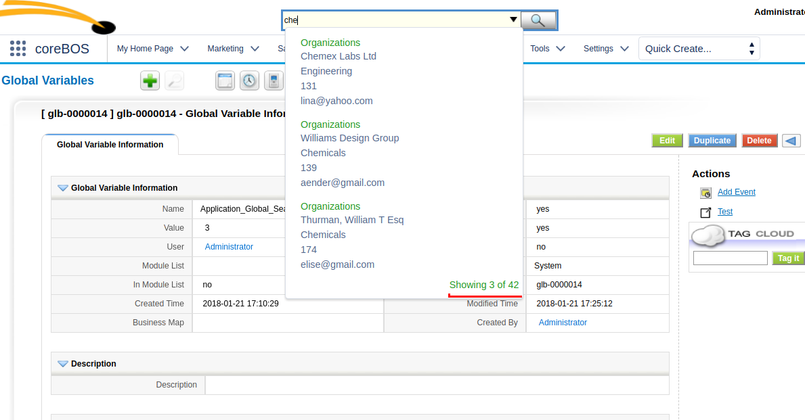
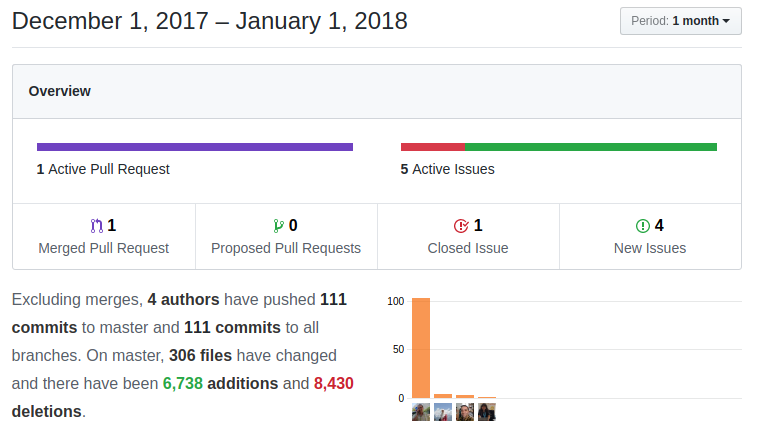

We close the year with a small set of enhancements and a lot of optimizations as we prepare for a whole new year of illusion creating awesomazing software together.

===

 ! [coreBOS standard coding format](http://corebos.org/documentation/doku.php?noprocess=1&id=en:devel:developmentguidelines)

We dedicate time to cleaning some files. This is a long-running project to make the application slimmer and consistent, eliminating warnings, optimizing code, eliminating unused code and, in general, making it easier to modify and maintain.

This month, among the many changes, we standardize the base module files so it is easier to create new modules and they will automatically be following coreBOS standard code recommendations.

This will consume a lot of our time in the next months as we strive to make the application more **Secure, Stable and Speedy**.

 ! Assigned to field is not mandatory

The assignedto field is not mandatory anymore so we eliminate it from the hardcoded mandatory property of some modules that still have it.

The actual functionality of this is to act as if the field was given and set the value to the current user or to the already assigned user. In other words, if we are saving a new record and no assigned user is given, the current user will be used, if we are editing an existing record the currently assigned user will be maintained.

You can define the visibility of this field in the layout editor and profile settings.

 ! Calendar

Some final adjustments and features in the calendar update bring follow up and google sync fixes and saving the state of the left panel blocks per user.

 ! Mobile

The mobile interface to coreBOS keeps getting better every day

 - add apple and standard favicon to avoid errors in log files
 - cbCalendar listview showed an incorrect start date
 - correctly load javascript files on delete confirmation screen
 - fix error with emails fields when are show on DetailView
 - fix time zone in the calendar view

 

 ! Reports

The reporting extension gets a set of fixes and an interesting auto-healing feature for some reports.

 - retry reports that have temp tables and produce an error without the temp tables
 - send temptables SQL on error. When a report SQL produces an error, the offending SQL is sent to the browser so the implementor and/or developer can debug it, but before this change, we didn't send the temptable SQL which was incomplete
 - add fieldid on join alias to support multiple capture fields to the same table
 - empty temptables property when we enable/disable them
 - standardize Invoice module to support uitype 10 capture fields
 - support for uitype 10 capture fields on the custom field table

 

 ! GlobalSearch 

A new global variable and some additional information on screen come to finish this very interesting feature. Thanks [Albana](https://github.com/AlbanaCelepija)!

 - add the count of records being showed
 - autocomplete total results
 - replace empty limit with new Global Variable Application_Global_Search_Autocomplete_Limit
 - move CSS of total records

 

 ! Development

coreBOS updater gets some new utility methods to help with customizations:
 - convertTextFieldToPicklist
 - massMoveFieldsToBlock
 - support for multi-select fields on mass field create 

We also enhance the vtlib create field error message to give some more information about what went wrong.

 ! Optimizations and security

 - inlined variables that are immediately returned
 - load config.inc instead of config
 - move sequence increment to MySQL in order to reduce blocking time on auto-sequence fields
 - optimize get_themes function and open support for more theme names
 - eliminate unused variable and function call
 - calculate the count of array once outside of the loop and eliminate an unused variable
 - cache block sequence for each field to avoid database calls
 - avoid empty elements in array so we don't have to check for them in the workflow loop
 - change autoload in [coreBOS Message Queue and Task Manager](http://corebos.org/documentation/doku.php?noprocess=1&id=en:devel:corebos_mqtm) and eliminate each in install process for PHP 7.2 support

 

 ! Translations

Every month gets some translation and UI changes, which seems rather incredible after all this time, but this month sees a lot of movement thanks to our [partner in Brazil](https://br.linkedin.com/in/ranierislemer). Thanks!!

We also enhance our translation module, which brings very advanced translation capabilities to the system, by adding functionality to convert numbers to their text string representation

 - Calendar: add some missing FR translations and add missing End Date label
 - GlobalSearchAutocomplete
 - Leads: move lead conversion labels to main language file
 - A lot of updates to the pt_br files
 - Payment: eliminate duplicate entries
 - Potentials: add Forecast Amount label and clean up files
 - Reports: translate report wizard buttons and standard email reports
 - Tooltip/Webservice: use getTranslatedString
 - Users: add missing label in de, nl and pt, add Reminder Interval picklist translations and cleanup files

 

 ! Workflow

We continue the constant enhancement of the workflow system incrementing the functionality and power of the whole system through this extremely important part of the application

 - convert a number to a text string, based on the new translation functionality
 - create email record for emails sent via workflow
 - support for reference fields (uitype 10) in expression editor, update field and create entity task
 - now that we can set reference field values in the user interface we don't need to hardcode their values, so we only fill in those fields if they are not given on create entity task in order to maintain backward compatibility
 - recover lost array to permit editing attached documents in email task

 

 ! Others

As usual a complete set of fixes and enhancements as we make the application safer, faster and trustworthy

 - add send email screen to campaign related list
 - we use incorrect tabid when getting the DetailView output for InventoryDetails fields and can't get the typeofdata to know the correct decimals for numeric fields
 - set proportional maximum scale value for better rendering of charts
 - Google Contacts sync OAuth reference to two inexistent classes
 - correctly get cookie value when it has a preceding space
 - fix DateTime field: unset time format after first use
 - increment size of fieldname and fieldlabel meta-data
 - correct Import_Utils and Smarty references in Inventory modules import
 - if calendar reminder or asterisk ajax call detects login screen we direct the user to the login page
 - MailManager: correctly relate emails sent to users and recover lost ListView code to fast filter emails
 - translate picklist values when they have dependencies
 - profile was losing the first module on the list due to an uninitialized array. micro-optimization and format code
 - respect special characters and eliminate warning in RecentView
 - support for uitype 101 fields in RelatedList
 - always translate Salutation values with Contacts module
 - PHP 5.5 support for deleteStartsWith in Session class
 - add Create/Edit to the Audit save action when done from inside the application
 - permit total configuration of image and assignedto fields: now we can set them in layout editor and profiles

**Thanks for reading.**

