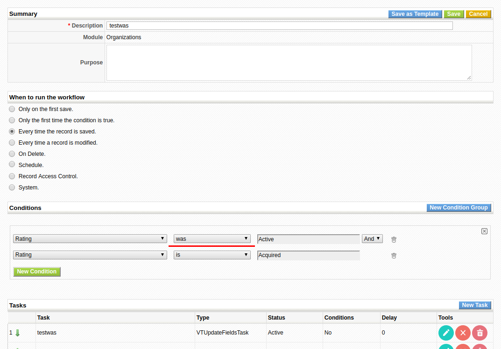
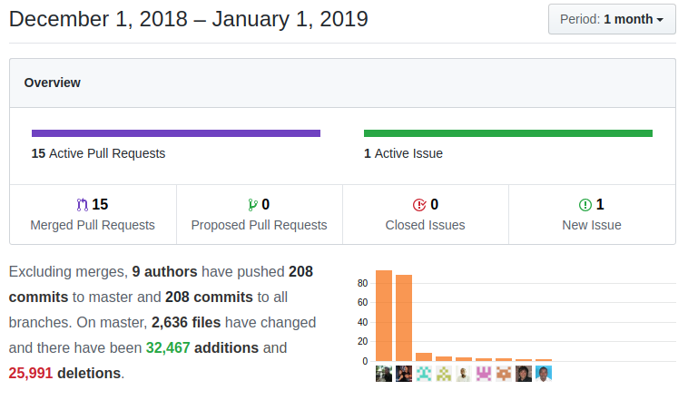

A fabulous month to close the year with a very interesting set of new functionality and the normal set of steady work. For an in-depth look at the most outstanding features [read the previous blog post](../xmaspresents18), for the rest of changes read on...

===

 ! Security, Optimizations and PHP support
- eliminate warnings, obsolete code and format code
- PHP 7.2 and 7.3 support
- eliminate warnings and format code
- optimize products by moving a section of code so it is executed only when needed
- take away execution bit from PHP files for security
- update [valitron library](https://github.com/vlucas/valitron)

 ! Features and New Stuff
- put [product component functionality into production](../xmaspresents18),
 - change Product-Subproduct Relationship
 - price roll up
 - show unit/cost price in bundle related lists
 - adapt Copy_Bundle_OnDuplicate
 - move Webservice GetRelatedRecords Products-Products relation to ProductComponent
- add two global variables to hide status and priority panels in calendar: **Calendar_Status_Panel_Visible** and **Calendar_Priority_Panel_Visible**
- global variable **HelpDesk_Sort_Comments_ASC** to sort ticket comments
- coreBOS Business Questions module continues it's journey towards production
 - getAnswer method
 - getTableFromAnswer method
 - add fields
- add support for standard uitype 10 popup capture hook on product/service inventory line select and autocomplete capture
- [Save and Repeat](../xmaspresents18)
- [Mass Edit 1 by 1](../xmaspresents18)
- [ListView inline column search](../xmaspresents18)
- select all roles by default when adding new elements to a picklist
- add **workflow metavariable inventory details** with table and list format
- implement Workflow **'was'** condition

- permit creating system/manual workflows which are launched by some external event. These events can basically be triggered in two ways, one is with a link or button from inside the application (see the Business Actions and Mass Edit 1x1 videos from the previous post), the other is using the new web service endpoint **ExecuteWokflow** which accepts a workflow ID and a list of application crmids upon which the workflow should be evaluated and launched if necessary
- we add  a "purpose" description field to the workflows so that you can write a small explanation of what this workflow is for
- [FieldDependency](../xmaspresents18) 
 - add missing code in Documents
 - correctly hide fields on read-only
 - format files and debugging
 - support everywhere and support application picklist dependencies
 - support translated block names

 ! Developer enhancements
- update CI configuration. Getting ready to set up continuous integration
- cleanup comments
- return more default fields in Company details
- support **continuous** directive on coreBOS updater export and import changes functionality
- permit using Related Records WS method from inside application
- create **aftersave.first event** that fires before workflows and other after-save events
- function to get CustomView filter field specification from module and field
- vtws_getAssignedGroupList internal group retrieving function
- Update LDS to full version: A record-breaking 90 commits from Luke to upgrade our [LIGHTNING DESIGN SYSTEM](https://www.lightningdesignsystem.com/) library opens the way to applying the LDS guidelines freely inside the application. As far as I know this is the first month that someone actually makes more commits than me in the project!  Thanks [Luke](https://github.com/Luke1982)
- change coreBOS CSS to follow LDS naming convention
- add default support for cbTranslation in getTranslatedString. Now, after searching for the string in the language files, if we can't find a translation we will ask the coreBOS translation module. This way we leverage the work and speed of the language files and also get the power of the new translation module for new and custom fields
- Enhance web service new query language
 - consider column alias
 - add count, sum, min, max, avg functions for select column list
 - support new column advanced syntax 
 - support for "group by" clause
 - support order by and limit clause
 - consider functions on related modules
- add possible user and group options to uitype owner field in Describe in order to make it consistent with other picklist type fields
- web service [Create](https://github.com/tsolucio/coreBOSwsDevelopment/blob/master/testcode/020_createContactValidation.php), Update and Revise with validations
- permit web service access to virtual modules: workflow, audittrail, and loginhistory, so you can now use this type of queries from the web service API: `select * from Workflow;`
- web service Validate information endpoint: **ValidateInformation** where you can send an array of field values and a module type to get the result of applying all the validations defined in the application on the fields
- add HTML ID on currency fields
- permit workflow tasks to have a different name than their class implementation

 ! Others: Fixes and changes
- fix incorrect variable in personalized autonumber error message
- increment size of uitype 3314
- create integrations help screen
- fix error uploading image attachment that contains colons
- format N and NN fields in listview the same way we do in detailview
- convert uitype 7 with CurrencyField class in related lists for consistency
- encode Mass Edit URI to support advanced search with special characters when ALL are selected
- support for quotes in picklist elements
- prevent empty values on Recurring Invoice taxes and shipping taxes
- exclude filename from QueryGenerator emails query to avoid duplicate entries and warning messages
- correct parameter count passed into HelpDesk getUpdateLogEditMessage in web service to eliminate the warning
- eliminate warnings from web service global search and add field label index to results to make it easier to create translated headers
- fix Web service **related.** query dialect for parenthesis on documents
- correct nested get_date functions for scheduled workflow query
- fix incorrect uitype for datetime fields in  Workflow merge functionality
- pt_br translations
- Translate to Dutch: company, surveys, Custom view management, product component
- validation functionality translations
- translate definitions for new Global Variables
- add missing ModTracker NL file
- fix Scheduled Workflow query in order to retrieve the set of records permitted by the user

**Thanks for reading.**
