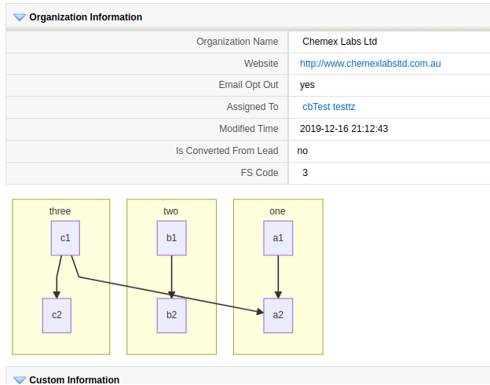
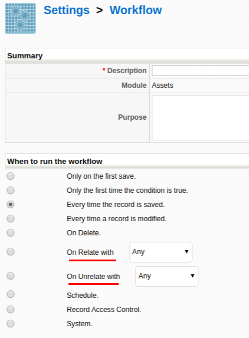
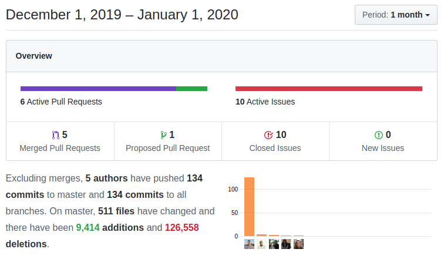

Wow! I started this post thinking, not much has happened this month. I thought, "just cleaning up PRs and some other stuff". When I saw the monthly Insights graph I was even more convinced, but as I started ordering the commits and writing about what has happened I realized I couldn't have been wronger. coreBOS doesn't seize to surprise me. Enjoy!

===

 ! Features/Implementor

- migrate uitype 78 (quote capture on SalesOrder) to uitype 10
- recover select functionality of Potential on SalesOrder lost when converting to uitype 10
- migrate uitypes 51, 57, and 73 (account/contact capture on inventory modules, account, and contact) to uitype 10
- add support for RULE in Business Map Webservice mapping
- Business Map Generators (YES! we finally started. Click on the "Generate Map" link):
  - Condition Expression
  - Duplicate Relations
  - Module Set
  - define the infrastructure for other editors
- support for mermaid graphs in Business Question and Business Question Widget

- **Application_DetailView_Sticky_BlockStatus** global variable for Detail View
- **Inventory_Tax_FillInMode** global variable to define which group taxes are activated by default on inventory modules
- support filtering modules to show using Module Set Business Map and global variables in Quick Related List. Apply LDS styling
- activate/deactivate sync between ServiceContracts and HelpDesk in Settings of Service Contracts
- support individual tax activation in quick create screen
- support setting quantity and price through business map in Convert Inventory Workflow and set relation with origin record
``` XML
<map>
  <originmodule>
    <originname>CobroPago</originname>
  </originmodule>
  <targetmodule>
    <targetname>Invoice</targetname>
  </targetmodule>
  <fields>
    <field>
      <fieldname>qty1</fieldname>
      <Orgfields>
        <Orgfield>
          <OrgfieldName>2</OrgfieldName>
          <OrgfieldID>CONST</OrgfieldID>
        </Orgfield>
      </Orgfields>
    </field>
    <field>
      <fieldname>listPrice1</fieldname>
      <Orgfields>
        <Orgfield>
          <OrgfieldName>amount/10</OrgfieldName>
          <OrgfieldID>EXPRESSION</OrgfieldID>
        </Orgfield>
      </Orgfields>
    </field>
  </fields>
</map>
```
- find field label using also fieldname in Validation Business Map
- Relate/Unrelate Workflow trigger


- [Webservice Call Workflow](https://corebos.com/documentation/doku.php?id=en:adminmanual:businessmappings:webservicecall&noprocess=1)
  - validate, test, document
  - support multipart/form-data and one level of subobjects with dot notation `data.field`

<span></span>

 ! Developer enhancements

- support for additional product line rows in Inventory Modules with hooks to add any contents
  - **corebos.filter.inventory.itemrow.detail**
  - **corebos.filter.inventory.itemrow.edit**
  - **corebosjshook_InventorymoveUpDown_customrow**
- make Business Actions convertToObject public so it can be used anywhere
- add support for form file upload in NET library
- support for custom menu entries in Settings: **$custom_menu_array**
- move ID unset for create in Web Service Upsert so we can do searches on ID field
- add relation type in RelatedModules Web Service
- implement business action support via web service
- Utils:getTypeOfDataByFieldName

<span></span>

 ! coreBOS Standard Code Formatting, Security, and Optimizations

- Standard Formatting and warnings in Custom View, CommonUtils, Workflow, Detail View, Inventory, Webservice, javascript and application
- eliminate references to config.php file to avoid useless include
- change switch for generic function in GenDoc
- move ModuleManager javascript from template to script and cleanup template
- use relationtype from Web Service call to avoid another query to the database in Relate Workflow
- refactor showHideStatus javascript function so we can eliminate hard-coded copy in the template
- move BuisnessMaps file ajax actions to class-based actions to make it cleaner for generate map
- eliminate obsolete uitype 51 and 73 code.
- eliminate GenDoc specific function getDataType in favor of the generic getUItypeByFieldName
- markdown adjustments in README
- convert module Settings files to the new format in order to reduce duplicate code
- eliminate obsolete hardcoded Calendar module references
- eliminate unused code in Detail View
- optimize Inventory javascript: reduce the size and use modern JS to make calculations
- add "console" to delete set in BetterSafe script
- Update CI check code
  - update eslint and PHPCS
  - apply the latest phpCS and eslint formatting rules
  - update docker image to PHP 7.3
  - add xmlwriter extension which is now required by phpCS
- PHP 7.4 validations and support. Although we are still waiting on some external libraries we user, you can already use coreBOS with PHP 7.4
  - update TCPDF to the latest release for PHP 7.4 and security
  - RecycleBin, Accounts, correct order of implode arguments
  - Leads, Reports, application PHP7.4 warnings
  - vtlib eliminate reference to magic quotes
  - run and update all unit tests to validate they are working on PHP 7.4

<span></span>

 ! Record Versioning

This month I finally get to reviewing and accepting the Record Versioning pull request shared by Lorida (Thanks!). This work permits us to have different versions of the same record in the application and easily move from one to the other. You can find more information in the previous post.

- review and accept pull request
- cleanup, format and optimize code
- change activation to a more visible layout
- LDS style detail view widget and add double click support
- change workflow custom function to update workflow: less code and more customizable
- refactor update revision fields code into a function so it can be called also when duplicating from Duplicate Record Workflow

<span></span>

 ! GenDoc

This month GenDoc gets a whole bunch of interesting enhancements. These things are very curious when you thought that an extension was basically done it turns around and gets a bunch of changes that make it even more powerful than it already was!

- multiple Conditions in FOREACH Loop (THANKS Luke1982!!) I added this example to the documentation:
```
{foreach InventoryDetails [linetotal > 300 && quantity>=6]}
	{InventoryDetails.quantity}	{InventoryDetails.listprice}	{InventoryDetails.linetotal}
{/foreach}
```
- convert documents web service [getmergedtemplate](https://github.com/tsolucio/corebos/blob/master/build/wsChanges/GetgendocWS.php) you can now send a template and CRMID to get a merged document back (!)
  - if onepdf or oneodt return the name of the final file instead of the .zip
  - use user language to compile and apply cbSR
  - fetching the correct template
  - using OpenDocument to generate file
  - using output_format and return response correctly
  - use new GenDoc web service to return default inventory module template on customer portal PDF (WS:PDFData)
- Convert to PDF using unconv docket container
  - use https://github.com/sfoxdev/docker-unoconv to convert documents based on the GenDoc_Convert_URL global variable
  - permit setting PDFLinks in settings
  - show GenDoc convert URL info in setting screen and set showpdflinks if the URL has a value
- Others
  - control query to get image on modules with empty image field
  - use user number formatting preferences
  - only split modulename from spaces when using multiple conditions
  - Pear_Exception class error
  - change condition indicator to [] as parenthesis were conflicting with IN operator, add debug message and eliminate warnings
  - eliminate useless code

<span></span>

 ! User changes and fixes

- convert Workflow DummyTask into error reporting task and use it when a workflow task cannot be saved for some reason: we return a controlled error state
- eliminate unused settings script in RSS
- refactor Actor query to use wsVTQL2SQL like Module does making it more testable and standard (works correctly on Business Question now)
- support for Actor modules in Business Question and return a controlled error when an incorrect module is given
- word-wrap Business Question query on any character so we do not break layout on big queries
- add new workflow "relatemodule" column as soon as possible so code can work correctly
- correct label position and eliminate unused variable in Condition Expression Business Map
- border Business Map test output table to make it easier to read
- change structure of Business Map Web Service mapping: flatten the options and change the response
- eliminate inexistent class from Module Set Business Map generator
- set ID if empty and we have record_id in Business Map
- better module detection in Condition Expression
- avoid query to save existing image fields on create
- call **link.delete** events from related lists delete action also
- add HTML ID to uitype 10 edit field in Detail View
- add HTML ID property to folder picklist in Documents
- add HTML IDs to Inventory edit view fields so master-detail map works as expected
- eliminate lineitem_id input when creating a new record in Inventory Modules as it doesn't exist yet
- update Inventory Module datetime field (uitype 50) for master-detail edit
- set z-index on Inventory Modules tax and discount divs
- set Services HTML input name when adding service row in Inventory Modules for correct saving and validating
- use the current Module if none is set in Developer Blocks
- avoid warning when no condition exists in Duplicate map/workflow
- parent_id field name conflict obligates to manually set it in HelpDesk and Payments when coming from related lists
- really delete messages in Mail Manager
- error with relation link, some libraries did not load correctly in Mobile
- validate and update Photo2Document
- delete related products from Vendor related list to be consistent with that list permitting selecting also even though it is a 1:m relation
- add header icon in Webforms
- support spaces in comma-separated strings in Upsert Webservice
- use the correct method to obtain query in Webservice Actor
- convert inventory module Workflow: use correct field values for context and avoid trying to create a record with no contact or account
- convert inventory module Workflow: set convertfrom record_id so that expression can be evaluated in business map
- support special characters in workflow and task name
- skip uitype 10 mappings that expect another module in the field value when updating from Workflow
- adjust to new map format, add workflow context and test Web Service Call Workflow
- add missing parameter and eliminate hardcoded relations which are not uitype 10 in Related Module Web Service
- Luke1982 fixes a couple of issues with the ListViewColumnSearch and adds the **Application_ListView_SearchColumns_AC_Trigger** global variable
- apply LDS to payment settings
- apply LDS and cleanup code in Inventory Taxes
- **Continuous translation effort:**
  - GlobalVariable: translate Application_ListView_SearchColumns_AC_Trigger
  - Workflow: retry trigger labels in workflow module
  - Taxes translate hardcoded string and avoid repeated HTML IDs



**<span style="font-size:large">Thanks for reading.</span>**
