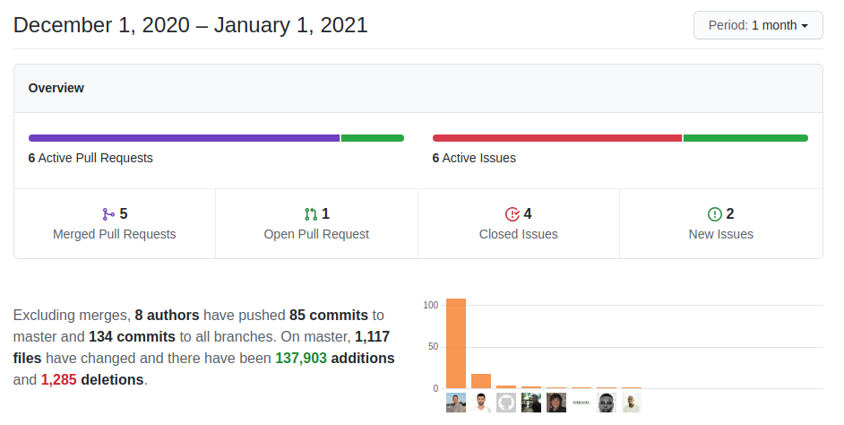

A nice set of new functionality and the normal beat of fixes and tweaks brings us to the end of an incredible year. **Happy New Year!**

===

 !! PHP 5 Support ends

Starting this new year we officially stop supporting PHP 5.x. We are working on PHP 8 support and PHP 7.x has been supported for many years now. It is time to move on!

 ! Features and Implementor/Developer enhancements

- **Business Question** gets some enhancements in the generate file export
  - date format property for filename generation: **filenamedateformat**
  - support filename property on generate file with date replacement support
  - close file when finished exporting
  - correct regex with incorrect 's' elimination
- **Business Maps**
  - better parameters for Field Mapping testing; you can now set field value in the URL
  - remove the empty check for condition value when processing Decision Table Map
  - move global search list columns map to Utilities after the move of the functionality there (not in 'Home' anymore)
- [WebDAV Integration](../webdav)
  - add Sabre/DAV library
- **Product/Service Autocomplete search**.
  - debounce and provide feedback on when the search is performed
  - adjust debounce time
  - send account/contact ID correctly when getting product/service
  - autocomplete get the correct unit price for services
- Delete both incoming and outgoing SMTP settings in individual user settings functionality
  - add functions for deleting user SMTP settings for both incoming and outgoing server
  - correct SQL call, coreBOS formatting of method names, and reload settings after change to update page correctly
  - eliminate warning and translate delete message
- Picklist enhancements
  - include salutationtype as a picklist albeit it special uitype (for the moment)
  - support for non-role based picklist in utility functions and uitype 1615
  - support multipicklist in translations
- [field metadata information](https://github.com/tsolucio/corebos/blob/master/include/fields/metainformation.php) to eliminate magic numbers. This will be used in the future refactor uitype project (right after we finish the [denormalization project](../denormalize))
- new utility function [suppressAllButFirst](https://github.com/tsolucio/corebos/blob/master/include/utils/CommonUtils.php#L3477) and refactor the code to use it in various places
- **Message Queue**
  - keep the connection alive and increment MySQL packet size
  - [reboot script](https://github.com/tsolucio/corebos/blob/master/include/cbmqtm/reboot) to be launched to restart the message queue run script every 5/6 hours or more
- increment size of the value field in **coreBOS key-value store** to support very big mass edits
- OnDemand variable to block modules exports: **cbodBlockModuleExport**
- permit loading **coreBOS Updater** without changeset so we can use its' functionality in any class (in our custom code)
- fill in the **stage history** and **launch workflows** on origin record when converting inventory modules
- **Web Service**
  - save and restore global REQUEST state on Create/Revise/Update so they can be called from inside a save process
  - **relationtouse** parameter [in GetRelatedRecords](https://github.com/tsolucio/corebos/blob/master/include/Webservices/GetRelatedRecords.php#L45) that permits selecting a relation when there is more than one
  - revert global state only for modified variables, not flush all
- **Workflow**
  - implement networkdays for SQL scheduler functions
  - set potential by default if converting to an inventory module from Potentials to Quote/SalesOrder
  - add fields to custom workflow expression in order to support new information selection: you can add your own custom workflow expression functions WITH documentation
  - put delayed tasks on queue even when being executed in background (scheduler)
  - email task with empty SendGrid template produces incorrect javascript
  - strip order by if global variable is set and add parenthesis for correct OR conditions
  - image copying support fixes while debugging (unit testing) Create

 ! coreBOS Standard Code Formatting, Security, Optimizations, and Tests

- coreBOS Standard Formatting
  - GlobalSearch, vtlib, workflow, config file, Company, Mail, Roles, Message Queue, Inventory lines, picklist: format, change quotes and eliminate warnings
- optimizations
  - eliminate unused code in various parts of the application (EMails, Global Search, ...)
  - use list_field columns instead of All filter to avoid database query in Global Search
  - move constant assignments outside loop in Global Search
  - eliminate unnecessary IF in common Utility script
  - rename properties to correct standard, convert variable to a constant string, and fix missing cache check in Event Handler
  - Workflow:
    - calculate constant outside loop
    - use and return direct results
    - reduce SQL fieldset
    - only loop over active workflows in event trigger/handler
    - refactor Products: delete local method in order to use standard central method for query export
    - refactor Web Service: extract repeated code to common file
- document vtlib function headers
- security
  - inform the user when trying to upload insecure image inside application and web service API
  - update ADODB 5.20.19
  - update Valitron to 1.4.9
- Unit Tests: keeps getting more and more assertions
- increment year in Licence files: **Happy New Year!**

 ! Others

- avoid a double load of general.js in Mail Manager
- clear IMAP errors after checking for them in Mail Manager
- support for labels with single quotes in Advanced Filter
- change uitypes and database meta information for legal fields on Company. Add legal Information block
- correct SQL for roles and add more debug messages in Custom View Management
- handle if SendGrid template is empty when accessed from javascript
- add styling on **Debug_Access_Restricted_File** stack dump
- increment Documents "file type" field for strange Microsoft file types
- set correct typeofdata in Emails parent_type field
- better treatment of reference fields for Export custom queries that already have transformed the ID to a name (Products:VendorName)
- delete HelpDesk custom list query in favor of standard one to support business maps
- standardize SalesOrder related lists
- trim extra image information from type in validate for upload
- display correct result template in Import
- avoid usage of REQUEST global to get "stage change" history information in Inventory conversion
- delete Inventory.js load as it is done by business action
- deactivate deduplication support in isPermitted (before it was hardcoded in the templates)
- do not call Notification function if the driver is not found
- recalculate privileges when role hierarchy changes
- set user if not set in **expire password service**
- correctly throw exceptions in vtlib ActionController
- constant translation effort:
  - add delete confirmation message label for user SMTP settings
  - add missing translations in IT file for jscalendar
  - translate a hardcoded message in Inventory Lines

**Thanks for reading.**
