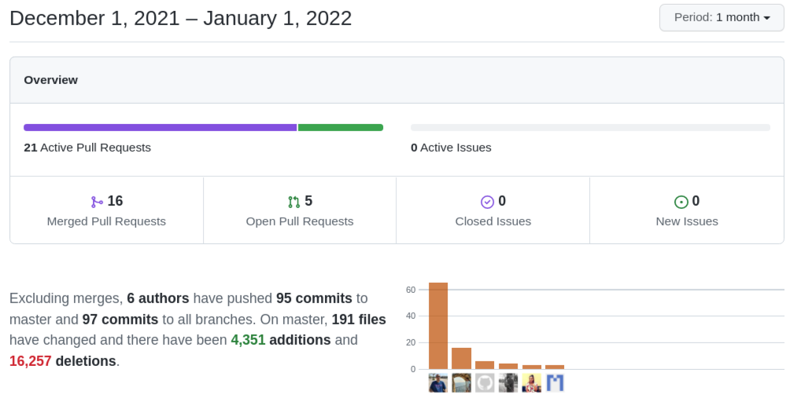

We close 2021 with a maintenance month: typical chores, some new features required as we use the application, and a nice set of security issue fixes. **On to 2022!**

===

 ! Features and Implementor/Developer enhancements

- change uitypes 55 and 255 of fields firstname and salutationtype to 1 and 15 on modules contacts and leads
- add functionality to return delimiter of the business question
- generic Hierarchy support: now any module with a uitype 10 referencing itself can easily add a business action to obtain a hierarchy view as we had in Accounts and Contacts
  - apply tui grid in hierarchy listview
  - update Accounts and Contacts Business Actions with new action URL
- Reports get a face lift. We evaluate different layout libraries and decide which one to use for the dashboard view project. We dedicde to implement a proof of concept with the report view which turns out to be rather nice. We apply LDS styling along the way.
  - icon for scheduled reports and LDS icon for shared ones
- Import
  - force duplicate handling during import process using global variables
  - overwrite Import values coming from the screen
  - enable the customization of the fields in the deduplication view
- `containsnc` QueryGenerator operator: it is a `like` without comma separation which `contains` does automatically
- new Utils functionality `suppressHTMLTags` support for single quotes and `deleteHTMLTags`
- Web service
  - **Debug_Send_WebService_Error** global variable to send errors by email when something goes wrong
  - processmap support for ListColumns map
- Workflow
  - support generation of excel file in generateReport task
  - manual workflow name change warning adjustments: manual workflows are usually used by some internal process (web service) that searches them by name, if you change the name that process will not work so now coreBOS warns you about this potential issue
- deactivate related Business Actions on module deactivation

 ! coreBOS Standard Code Formatting, Security, Optimizations, and Tests

- coreBOS Standard Formatting: eliminate warnings eliminate useless code and comments, format code
- Documentation:
  - function headers, and comments
  - non-stop wiki enhancements
- Optimizations
  - reduce variable usage
  - eliminate useless assignment in Mobile
  - eliminate deprecated function call
  - eliminate duplicate slash and mark `from_html` function as deprecated
  - optimize the Business Question functionality to retrieve question properties (we create a specific function)
  - eslint/sonarlint optimizations in Reports
  - move Reports javascript from template to script file, so it gets cached
  - `textlength_check` eliminate redundant preg_replace
- Security
  - improper sanitize of RTE fields in DetailView
  - filter direct edit/create values from URL to avoid XSS (XSS in picklist fields)
  - improper neutralization of ListView output
  - add CSRF check to Logout
  - add isPermitted check for edit/delete/move actions in MasterDetail
  - delete obsolete migration files
  - XSS based on XML file upload in Products (and in general)
  - CSRF in Reports actions CWE-352
  - stricter malicious code in SVG images check
  - XSS in Users name
  - apply all validations again in PHP on Save
  - sanitize URL output and validate CSRF in Workflow Activate/Deactivate all actions
- Updates
  - Gridstack 4.4.1
  - ServiceWorker to version 6.4.1
  - PHP 8 fixes in Charts (correct math operation) and Installation process
  - support for PHP 8 case sensitive array elements in Inventory modules
  - update DOMPurify library to 2.3.4
- **Unit Tests:** keeps getting more and more assertions

 ! Others

- minor changes detected by code analysis and unit tests update
- use selected Business Map Module to evaluate condition expression if no module is given as a parameter
- Business Map XSD updates (Pivot)
- update Credentials entity fields
- return controlled error when trying to set picklist to non-existent value in DetailView
- force Transfer-Encoding in cURL GenDoc to support newer versions (more secure?) of cURL
- eliminate error when trying to order a list of selected records that are not being saved
- update labels in inventory modules when tax label changes
- fix uitype 77 incorrect export
- support special characters in field labels when doing module export
- PHP Version error with less infrastructure so we show message correctly for the install process
- support for double quotes in Picklist value
- update README badges to GitHub actions
- Reports
  - avoid creating an index on temporary table columns that do not exist
  - convert error messages to LDS
- DetailView inline edit reload formatting incorrectly special characters
- permit changing Users password if there is no history yet
- finish Web Service migration of UIType 58 and 68 to 10 after all this time
- Workflow
  - set `Conditions` as the default action on the Record Set for Mass Actions
  - add `status` filter at workflow list
  - three digit placeholder for extended select syntax
- Translations
  - translate warning when workflow title changes in manual trigger
  - new Hierarchy generic support
  - Import: Import_ForceDuplicateRecord_Handling global variable ES
  - Reports: translate hardcoded error messages in Folders and Save
  - SlemerNet keeps pt_br up to date: main application, message template, reports (thanks!)

**Thanks for following.**
