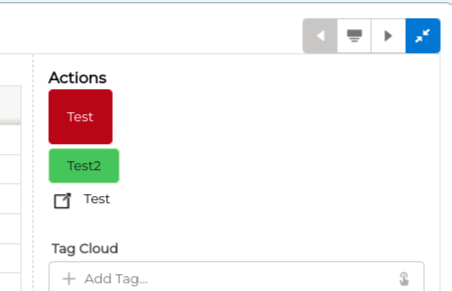
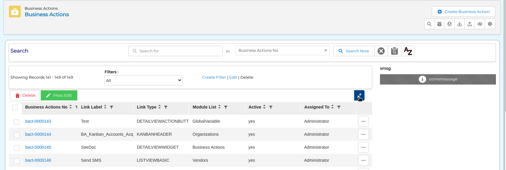
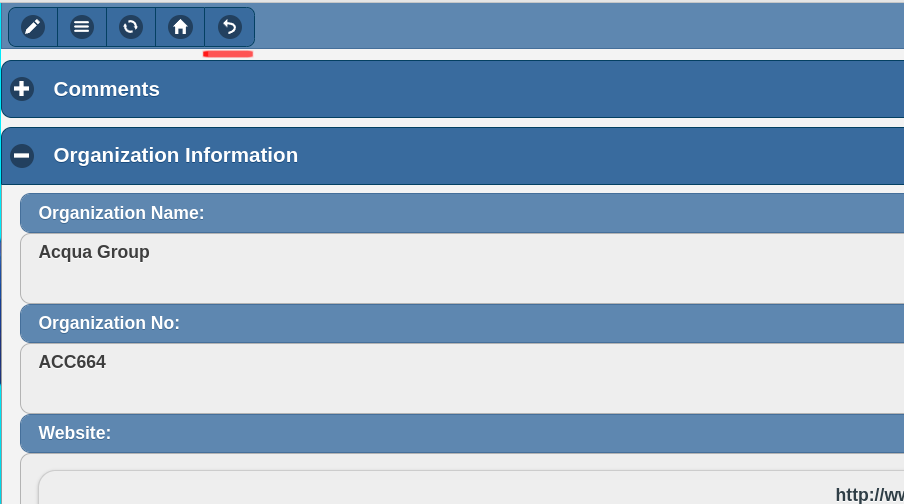
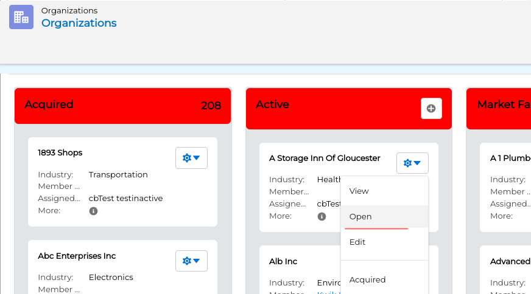
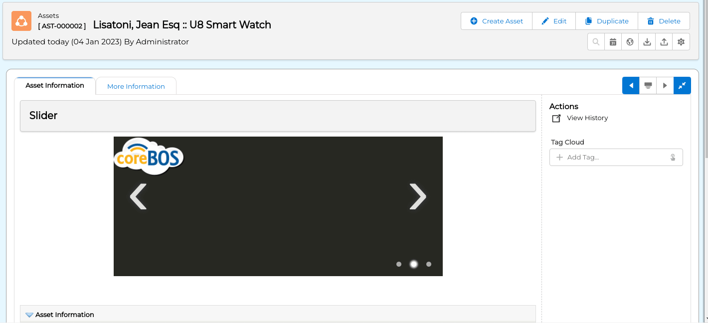
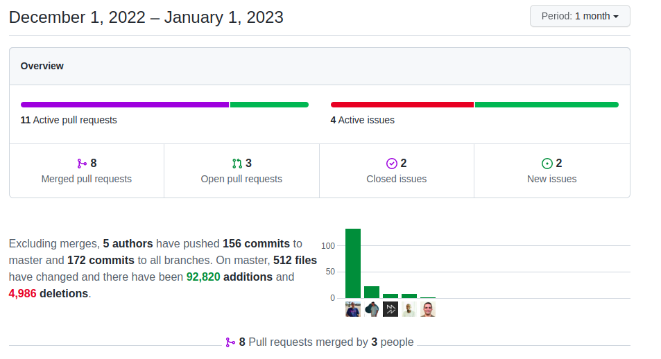

Enhancements everywhere and a lot of new widgets (very happy about this), code cleanup, and an important performance optimization. Impressed, as usual.

===

 ! Features and Implementor/Developer enhancements

- Pending Tasks widget and Notification Panel enhancements

[plugin:youtube](https://youtu.be/qNySiqtb7lw)

- **DETAILVIEWACTIONBUTTON** business action type permits us to add buttons instead of links in the detail view action panel.

- Document PDF Preview
  - simplify query and support loading any document with docid parameter
  - support for business map
  - add view PDF link to document detail view
  - add documentation link
- [GenDoc conditional blocks](../GenDocPDFMaker/)
- List View collapsable actions

- adda a new icon to the Mobile detail view to return to the list view

- support for custom action with CANCELGO parameter in Cancel button
- `getConditionsFromSQL2CV` convert SQL to custom view filter syntax
- `getFieldValuesFromRecordRecursively` ability to add multiple setFields
- refactor getEntityFieldNames to create getEntityFieldNamesByTableName
- add an `Open` menu option to Kanban that takes you to the detail view of the record

- disable database logging in key-value store
- relate Messages on Leads conversion
- set default queue manager to database
- move the filter creator to hover in Key Metrics table
- support ProcessInfo popup as validation and business action
- ProcessSetting functionality action
- convert RECORD to CRMID if given in screen_values in Validations
- in the Database abstraction layer: use the logging method everywhere and add a switch to deactivate logging
- add Slider component

- support linked columns in Table, Grid, and Pie question types. coreBOS will use the grouping column to autogenerate links for those questions that have a `group by` option
  - get the correct filter conditions for the linked tables option
  - set conditions on empty values of grouped link table entries
  - correctly set list view conditions for reference fields (uitype10)
  - use the correct property to get the field name
- Web Service
  - update or create Products if upsert_conditions is set in the map
  - add meta infomation for fields in related modules
- Workflow
  - getRequest workflow expression function
  - support multiple IDs for getFieldsOf expression

 ! coreBOS Standard Code Formatting, Security, Optimizations, and Tests

- coreBOS Standard Formatting: eliminate warnings, eliminate useless code, variables, and comments. Format code. General, Accounts, Duplicate, Import, Install, Business Question, JSLibraries, modules, RecycleBin, Settings, Templates, Utilities, Vtiger
- Documentation:
  - function headers, and comments
  - Launch Work Flow widget example of call
  - non-stop wiki enhancements
- Security
  - Images: eliminate unneeded grouping from security check regular expression, optimize and correct them
- Optimizations
  - delete obsolete migration files
  - **denormalize CRMENTITYREL**. This is an important speed optimization. The generic many-to-many relation was based on one database table that can relate two entities in two ways, so the code had to use an "OR" condition to get the correct related records. With this change, we now have a database table that we can query with one condition. The difference is very important.
  - Custom View: eliminate unused variables, move variable calculation
  - List View: delete an unused variable and function call, use empty instead of isset
  - Tracker: move variables
  - Calendar: move action construction to function, move action Smarty assignment to separate function, move pending task query and card output to functions
  - PopupFilter: moving object instantiation into condition scope, using array_walk instead of a foreach loop
- format ClickHouse utilities template
- filter Custom View edit buttons
- reduce Tooltip header size in tuigrid tooltip
- update installation database to latest corebos updates
- eliminate deprecated LDS CSS syntax
- **Unit Tests:** keeps getting more and more assertions.

 ! Global Variables

- **Application_Global_Search_PlaceHolder:** text to show in the global search input as a placeholder.
- **Import_Check_Apache:** the import process does a check for apache to show results in the browser or not. In some environments where apache is not being used this check must be deactivated.
- **HomePage_KeyMetrics_Max_Text_Length:** size of the title text in the key metrics home page table

 ! Others

- Advanced Filter
  - catch JSON parse errors on a null string
  - validate string characters individually and accept plus sign as a valid character to support Regular Expressions
- change deprecated fetchUserProfileId for getUserProfile
- use FQN in pending task query
- set `ruleOutput` to be in lowercase for Decision Table evaluation
- Custom View
  - add missing variables for REGEXP and SOUNDEX filters
  - calculate access permissions based on View Permissions
  - calculate Application_ListView_FilterPanel_Open without view type
  - calculate Default filter based on View Permissions
  - calculate user preferences before role preferences
  - set the assigned user to active admin if the user who created the filter is no longer active
- Document Preview
  - download external libraries at version 3.2.26
  - only retrieve PDF documents to preview when a related record is given
- Documents
  - define relation Docs-Folders correctly (reports)
  - support AdvancedSearch business map and Application_ListView_FilterPanel_Open Global Variable in Documents Folder view
  - try to fill in mime filetype if it isn't detected
- apply Application_ListView_FilterPanel_Open Global Variable in tuigrid view
- hide field element in Field Dependencies map
- force UTF8 in install
- correctly assign globaluitype when we use direct save method in detail view Inline Edit
- check if XML element exists before using it in DuplicateRecords map
- Email
  - protect query in fill-in email fields event handler
  - permit preloading email fields in custom modules
- GenDoc
  - apply user formatting to integer numbers instead of US formatting
  - correct integer visualization.
- Launch Workflow Widget: read alert messages from fields
- Popup Filter
  - get value from inside uitype10 fields
  - adding popupFilter support inside Popup windows
  - deep cloning the arr object
  - make popup_filter_map_popup_window return value not promise
- Kanban
  - format values: apply user preferences and retrieve related information
  - permit clicking on links in card
  - sort records as per application/user settings
- List View
  - add widget headers for block actions if checked in business action
  - eliminate decimals in integer numbers
  - fill in total records when totals are turned off
  - sync TUIGRID with the latest application changes
  - eliminate undefined CSS class
  - get the name of the related field in the related module instead of ID (tuigrid)
  - resolve error when recordID is not given in Business Actions
- Logger: change empty variable for hard-coded value
- better key filtering for menu typing search
- QueryGenerator
  - allow passing text on integer fields
  - do not add empty filter conditions
- add the TOTALS tables to the Reports planner in case they are aggregating on a field that is not included in the report
- permit clicking on links in tooltip
- make user first and last name fields larger in the database
- Workflow
  - accept "newline" in group_concat separator
  - avoid warning in Update Field task when lanchwf property is not defined
  - correctly support optional condition parameter in time aggregation function
  - CSRF check for get calls
  - pass context from runBAWorkflow
  - hide error while loading workflow task in help as one of the two will always fail
  - launch 'on relate' events for custom hard-coded Documents, HelpDesk, and ServiceContracts relations
  - support condition query and use FQN in query in Mass Update related task
- Translations
  - translate hover title in validation widget
  - ClickHouse hard-coded strings and web service grid
  - Documents View PDF
  - Global Variables definitions
  - Key Metrics translate hard-coded string

**Thanks for reading.**
