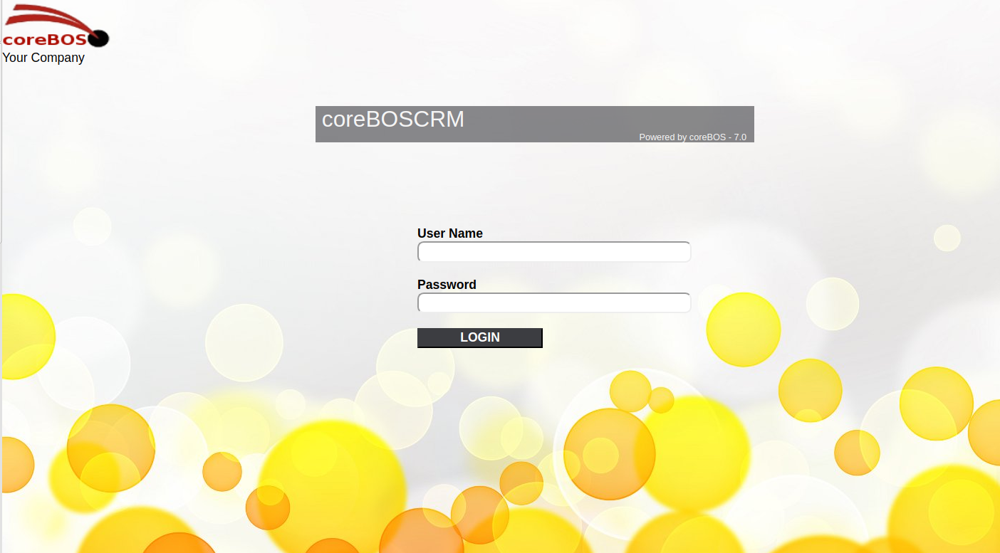
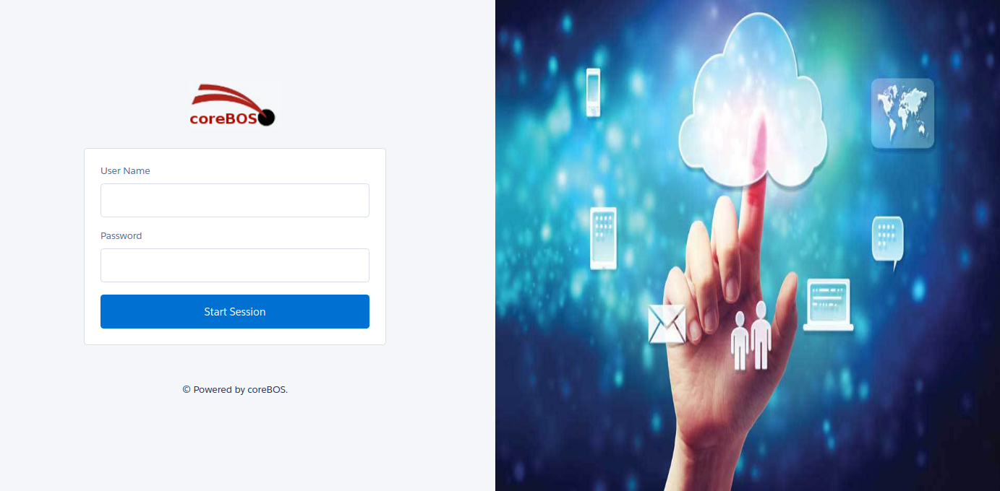
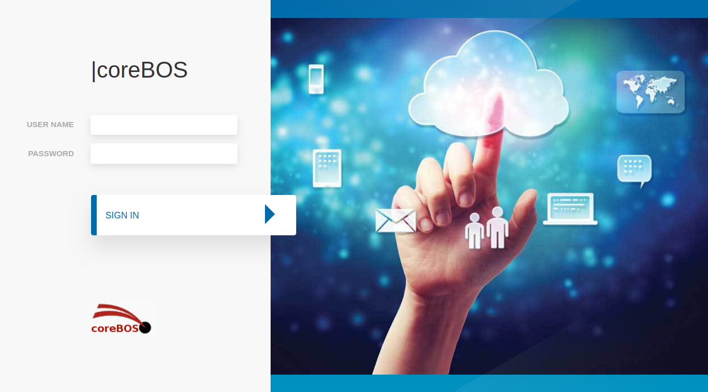

Have you been thinking of changing the coreBOS Login screen? You probably already have, it is the part of the code most people modify. **Now that task has become a lot easier and less conflictive.**

===

The login page is one the most modified parts of the **coreBOS** code, producing conflicts when we want to modify it, so we decided to implement a way for each implementor/developer to define their own page layout and switch easily from one to another. As of January 2018, you can now setup your own Login page without having to modify the coreBOS base code.

You can find the exact steps you need to take in the **coreBOS Documentation project**, [exactly on this page](http://corebos.org/documentation/doku.php?noprocess=1&id=en:devel:designloginpage)

We have implemented some examples for you to study:

 ! coreboscrm

 ! Lightning Design System

 ! Split Frame with image

**I look forward to seeing some new designs from the the community!!**

