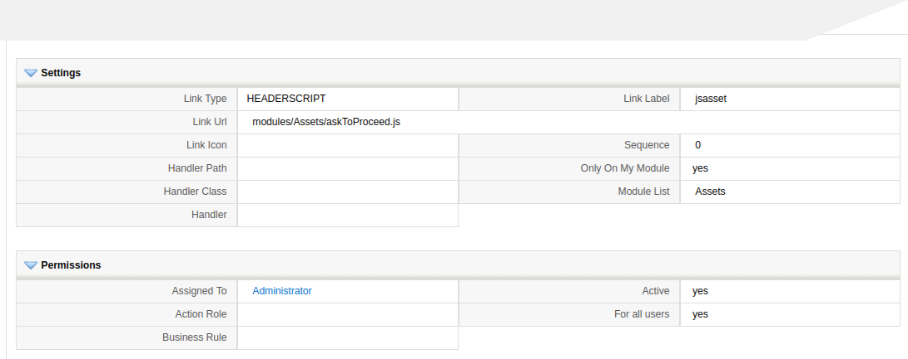
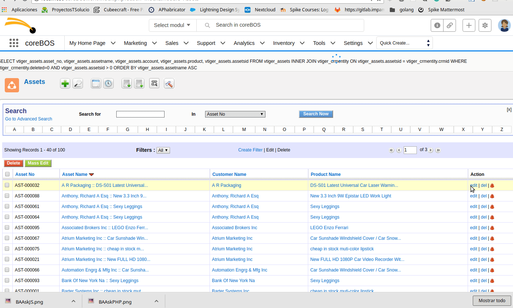

In February 2019 we introduced a Developer Widget class that permits us to easily add widgets, in April we created our first public chart widget which [is documented in the wiki.](http://corebos.com/documentation/doku.php?noprocess=1&id=en:devel:add_special_block#developer_blocks) This August we release another widget to mass upload documents and I thought it would be a good idea to create a tutorial using Developer Blocks and the PRESAVE event we introduced in March. **Enjoy!**

===

I was reviewing the code for the Mass Upload Developer widget that we created a few months ago and I had the idea to create a widget that would launch before a record is saved. So, as a proof of concept, I wrote it and will document the steps here as a tutorial.

## The Goal

When the application user clicks on the save button of a chosen module we must launch some code that will ask the user if he wants to proceed with the save or not. We will be able to execute code both in the backend and in the browser.

## The Tools

To accomplish this (without modifying any base code) we will need:

 - [Business Actions (Links)](http://corebos.com/documentation/doku.php?noprocess=1&id=en:adminmanual:businessactions) to add code in the application and in the events
 - [Developer Blocks/Widgets](http://corebos.com/documentation/doku.php?noprocess=1&id=en:devel:add_special_block#developer_blocks) that will actually do the work. In our example, I will simply ask for consent to proceed with the save or not
 - [The **PRESAVE** event](https://corebos.com/documentation/doku.php?noprocess=1&id=en:devel:corebos_hooks#linkstypes_and_usage) (which is launched when the user clicks on the save button). Code can be associated to the event and will be launched in the background, permitting us to do anything we need with the information coming from the screen and then we can answer back with a function to be called or not.

## The Steps

### Code we want to execute

First let's create the code we need: the developer block and the javascript that we want to launch when the button is clicked.

We need a Developer block that will contain the code we hook into the PRESAVE event and that will permit us to execute code inside the application. This code can live anywhere but I am going to put it in `modules/Utilities/askQuestionOnSave.php` and it looks like this:

``` php
/*************************************************************************************************
** PUT YOUR LICENSE HERE **
 *************************************************************************************************/

// PRESAVE ACTION: block://askQuestionOnSave:modules/Utilities/askQuestionOnSave.php:recordid=$RECORD$
// javascript action: modules/Assets/askToProceed.js

require_once 'modules/Vtiger/DeveloperWidget.php';
global $currentModule;

class askQuestionOnSave {
	// Get class name of the object that will implement the widget functionality
	public static function getWidget($name) {
		return (new askQuestionOnSave_DetailViewBlock());
	}
}

class askQuestionOnSave_DetailViewBlock extends DeveloperBlock {
	// Implement widget functionality
	private $widgetName = 'askQuestionOnSave';

	// This one is called to get the contents to show on screen
	public function process($context = false) {
		global $adb;
		$this->context = $context;
		$smarty = $this->getViewer();
		// Here we have full access to the application and the information on the screen should be in the context
		// We return the function name and parameters.
		// since we have full control of both anything could be sent and processed
		return '%%%FUNCTION%%%askToProceed%%%PARAMS%%%Should we proceed?';
	}
}
```

As you can see it is just "send a string to the frontend" but we could do anything we need. In this case, I am sending a specifically formatted string that instructs the browser to look for a function with the given name (askToProceed) and call it with the default parameters and the given ones.

As per the definition of the PRESAVE event, these functions take full control of the save process and receive the context they need to do so in the form of these parameters:

 - edit_type: mass_edit or edit
 - formName
 - action: MassEditSave or Save
 - callback a callback function if any is necessary
 - any parameters sent by the developer widget

In our case, we will use the javascript "confirm" function to show the message given by the backend and will proceed with the save or not depending on the answer to the dialog. As before, the code can live anywhere inside the application. I put it in modules/Assets/askToProceed.js because I am going to associate this code to the Assets module. The code looks like this:

``` JS
function askToProceed(edit_type, formName, action, callback, message) {
	var goahead = confirm(message);
	if (goahead) {
		if (typeof callback == 'function') {
			callback('submit');
		} else {
			submitFormForAction(formName, action);
		}
	}
	VtigerJS_DialogBox.unblock();
}
```

### Hooks to launch our code

Now that we have the code we have to add links so that coreBOS knows that it must execute it and where to find it. This is can be done with [the `addLink` vtlib function](http://corebos.com/documentation/doku.php?noprocess=1&id=en:devel:add_actions) or with the Business Actions module. I am going to do it with Business Actions. Go to the module and create two records that look like this:




It cannot be easier. The HEADERSCRIPT will load our javascript code and the PRESAVE will launch our developer widget.

### Give it a try



It is really that easy to add functionality to coreBOS while you keep up with the constant development changes we make.

## Mass Upload Documents

If you want another example [have a look at the new Mass Upload Documents widget](https://github.com/tsolucio/corebos/commit/889884362b82ff24a8c1b5499f22e7705e55d519) we introduced this week.

[plugin:youtube](https://youtu.be/lW3RrQQQb-4)

<p></p>
**<span style="font-size:large">Enjoying the power of the coreBOS framework.</span>**

<a style="background-color:black;color:white;text-decoration:none;padding:4px 6px;font-family:-apple-system, BlinkMacSystemFont, &quot;San Francisco&quot;, &quot;Helvetica Neue&quot;, Helvetica, Ubuntu, Roboto, Noto, &quot;Segoe UI&quot;, Arial, sans-serif;font-size:12px;font-weight:bold;line-height:1.2;display:inline-block;border-radius:3px" href="https://unsplash.com/@markusspiske?utm_medium=referral&amp;utm_campaign=photographer-credit&amp;utm_content=creditBadge" target="_blank" rel="noopener noreferrer" title="Download free do whatever you want high-resolution photos from Markus Spiske"><span style="display:inline-block;padding:2px 3px"><svg xmlns="http://www.w3.org/2000/svg" style="height:12px;width:auto;position:relative;vertical-align:middle;top:-2px;fill:white" viewBox="0 0 32 32"><title>unsplash-logo</title><path d="M10 9V0h12v9H10zm12 5h10v18H0V14h10v9h12v-9z"></path></svg></span><span style="display:inline-block;padding:2px 3px">Photo by Markus Spiske on Unsplash</span></a>
