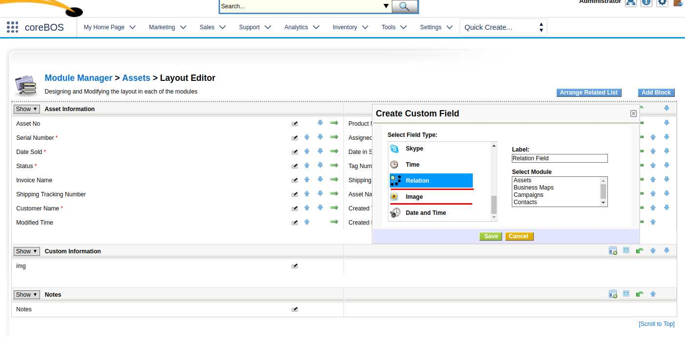

The birth of the **coreBOS Test Project** along with a whole set of enhancements, features, and implementor utilities make for a very productive Valentine's month.

===

 ! coreBOS test project

This month sees the birth of our **unit and integration test project**. This is an on going project that lives and breaths along side coreBOS as a corner stone for stability and a pillar upon which the main project stands firmly.

The project itself arrives very late, but week after week, month after month it gets new tests and keeps covering more and more aspects of coreBOS as the test philosophy gets into the mindset of the whole team.

After my current blogging series about **coreBOS enhancements**, I plan to start another series talking about all the satellite projects that are around coreBOS and I will dedicate a full post to this project then.

 ! Reports

 - Support for Document custom fields
 - Fix error with fields whose label contains an ampersand (still!!)

<br/>

 ! Layout editor

Support for **Relation** and **Image** fields.

Have a look at this [Image Video](https://www.youtube.com/watch?v=vgbrz092VDE) to see how the images work.

The relations are rather simple, you pick the modules you want to be able to select and you will get a capture field and the corresponding related lists on the modules.




 ! Add new background log for background processes

Those developers who have spent some time working with coreBOS know that the [debug mode](http://corebos.org/documentation/doku.php?noprocess=1&id=en:devel:debuging) fills the log file with too much information. It is usually more useful to just output your own messages. All this noise gets in the way when you have one of those difficult problems that are hard to pinpoint. For those types of problems you would activate the debug log and have the users work a while to reproduce the issue and you end up with a lot of information to sift through. To make this a little easier we added another debug log file called background log and mainly use it for logging message of workflows and schedules tasks that work, well, in background :-)

You can use this log exactly as you use the main log, with the same levels and accessibility. The name of the internal global variable is **$bglog**


 ! Workflow

 - Workflow_Send_Email_ToCCBCC: If this variable is defined and contains a comma separated list of emails, ALL workflow emails will be sent to this list.
 - Better support for groups
 - Support for functions in if conditions. We can now execute expressions like this:
```
if substring(phone,0,2) == '00' then concat('+',phone) else phone end
```
You can see more examples in [our test project.](https://github.com/tsolucio/coreBOSTests/blob/master/modules/com_vtiger_workflow/expression_engine/VTExpressionEvaluaterTest.php#L2303)
 - Accept 0 for dates and hours in conditions
 - [Ordered execution of the tasks](../patternRelatedSteps)
 - [Delete related records task](../patternRelatedSteps)

<br/>

 ! Display type 4 save from Workflow

We add a new display type, which could be called **read-only updatable**.

It is read only, like display type 3, but unlike that type, it is updatable using the workflow system.

The use case is obvious, it is a field that is auto calculated by the application, so it cannot be edited by the users and must be filled in directly in the code. A display type 3 cannot be updated using the workflow system, it must be updated directly in the database, so we created display type 4 to act like a display type 3 but letting the workflow system to update it.

[List of display types](http://corebos.org/documentation/doku.php?noprocess=1&id=en:devel:field_structure#display_types_for_fields_in_modules)


 ! Some others:

 - Correctly format email subject on reply and forward
 - Tooltip everywhere
 - [Webservice for sending portal user password email for customer portal](https://github.com/tsolucio/corebos/blob/master/build/wsChanges/CPsendRecoverPassword.php)
 - Webform support for groups
 - Documents attachments are deleted from physical storage when recycle bin is emptied
 - Correct pagination issue with related lists
 - vtigerCRM 6 migrations
 - Better calendar and related IDs support in QueryGenerator
 - Alphabetical sorting everywhere
 - Support for capture fields on any table
 - Better install defaults
 - Calendar Google sync
 - Eliminate warnings, notice, MySQL strict and code cleanup (this one is a constant every month, even today).
 - Translation. Notice warnings, eliminate unused code, cleanup

**<span style="font-size:large">Thanks for reading.</span>**

