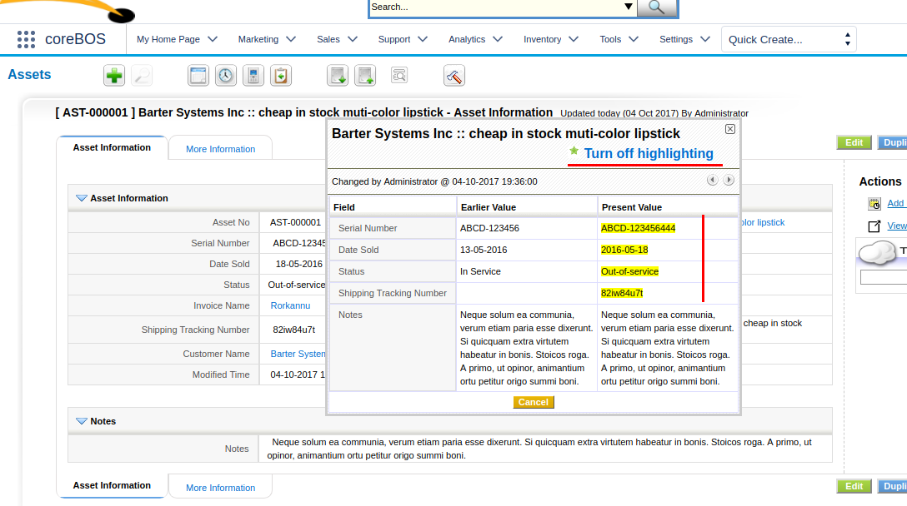
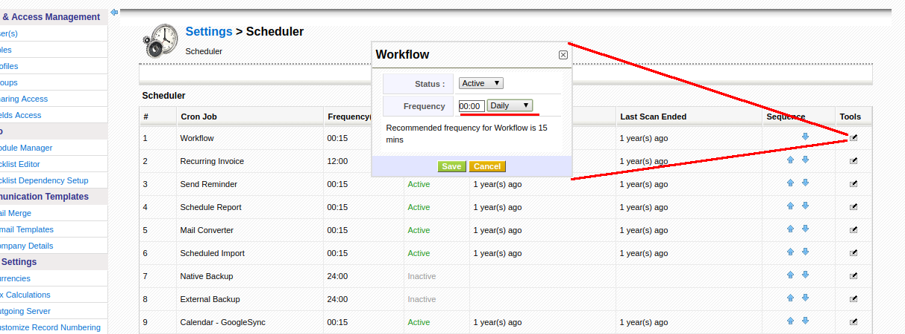
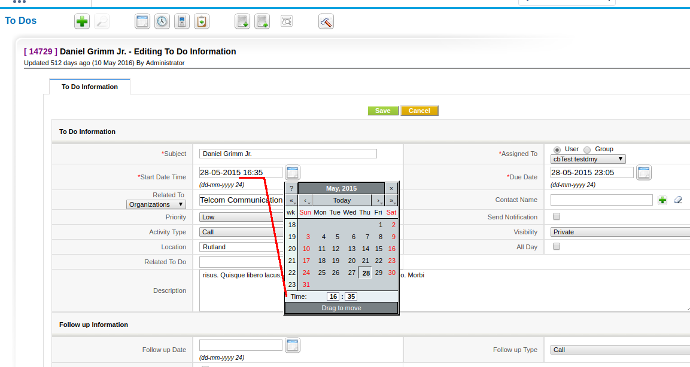

A long time missing DateTime field, security and performance changes along with some new functionality make for another interesting and productive month.

===

 ! Calendar

 - reset reminder when an event is dragged on the calendar into the future
 - send reminder up to 10 minutes after an event if it hasn't been sent

 

 ! Service Worker Cache

In order to control the JavaScript browser cache and reduce file downloads from the server we introduce a [service worker cache](https://github.com/GoogleChromeLabs/sw-precache) and a script to generate it automatically

 ! Developer

 - First-time login audit event
 - Add new function isPicklistUIType() to check if a field is picklist
 - vtlib API enhancements: more field properties, update field, more options to retrieve fields, sort returned values
 - isInsideApplication security function to check if a file is contained inside the coreBOS installation directory tree
 - Add possibility to indicate custom values on popup request via the cbcustompopupinfo hidden fields. This is used to maintain sort by column and search alphabetically when you navigate

 

 ! Global Variables

 - **Application_ListView_Default_Sort_Order** to define the default sort order on first click on column header label
 - **Application_FirstTimeLogin_Template** first time login welcome screen

 

 ! Security

 - path traversal
 - SQL injection
 - XSS
 - specifically crafted URL permits deleting a record on another module if the user has permission to delete
 - bettersafe script

 

 ! ModTracker

Activate hidden functionality to show differences

 ! CronTask

Add daily option. Thanks [Lorida](https://github.com/loridacito)

 ! DateTime Field

Add DateTime uitype to application: uitype 50

 ! Other changes:

 - Add Detail View to PBXManager
 - Mail Manager: when saving email with attachments to record, relate the documents also with the record
 - Reports: direct SQL, external URL, and crosstab reports
 - Change uitype 68 (HelpDesk) to 10
 - Cleanup and update Merge Document
 - Do not show the delete button on user list view if the user is not Active
 - Direct paste from clipboard support for Image Fields
 - Make login username case sensitive
 - Move hardcoded javascript to files so it gets cached
 - Fix translation of picklist values on scheduled Reports
 - MySites open in new window on x-frame denied. Thanks [Eduardo Jimenez](https://github.com/EduardoJimenez)
 - Mobile
 - Eliminate warnings, notice, MySQL strict and code cleanup (this one is a constant every month, even today).
 - Translations. Thanks [Paul Levre](https://github.com/polanskiman)

**Thanks for reading.**

