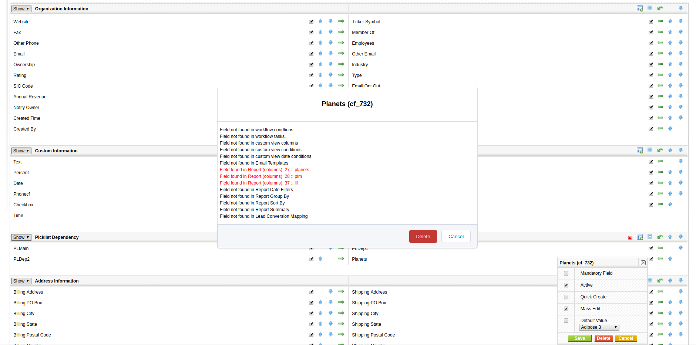
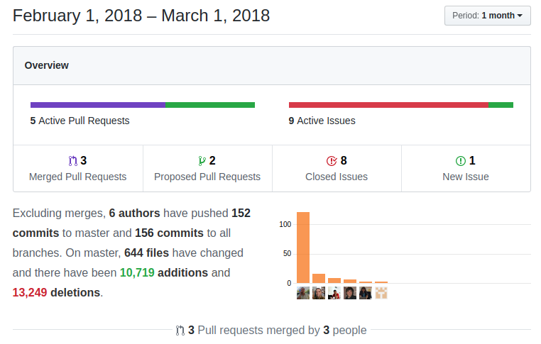

A short month but with a good punch. This month sees a nice set of new features, security and optimizations enhancements and some bug fixes. Continue reading to get an idea of the important things that happened.

===

 ! coreBOS Standard Code Formatting

We spend a lot of time this month playing at this very addicting game. I am competing with my son to see which of the two can invest more hours on the computer for something that seems, at least partially, pointless... he kills all sorts of extraterrestrial (and some very strong looking human beings) while I kill spaces and unused variables :-)

We update the cbSR ruleset to catch conditional connectors and require/include statement and add [PHP Mess Detector](https://phpmd.org/) to the validation suite.

In this category, we also standardize MassEditSave, CallRelatedList, and EditView and eliminate a lot of unused code.

 ! Developer
- we add the **is_adminID** function which will permit us to know if a given user ID belongs to an admin user without instantiating an object
- deleteAllPicklistValues, deletePicklistValues, setQuickCreateFields, setTooltip cbUpdater methods
- uitype 1616 picklist of available custom views
- helper scripts to report duplicate labels in language array
- add javascript promise web service library to the application so it can be used when needed. We also upload this library to the [coreBOS WS Library](https://github.com/tsolucio/coreBOSwsLibrary/blob/master/javascript/WSClientp.js) project so it can be used in any satellite application to avoid [callback hell](http://callbackhell.com/)
- Order fields on "describe" Webservice end point
- extend CORS support to more call types for JavaScript Webservice applications
- add license and origin reference for the iCal library
- fix error in RelatedLists blocks so they show or hide block depending on the settings in Layout Editor
- add CSRF keys to gitignore
- When editing an Inventory module, we assign the last row number to rowCnt javascript global variable. We need this when we are customizing the code to give more functionality to the inventory lines.

 

 ! Security and Optimizations
- add [CSRF library](https://github.com/ezyang/csrf-magic)
- Mobile_UI_Enabled and SOAP_Outlook_Enabled global variables so we can deactivate these services individually. This is recommended if you aren't using them
- upgrade to latest version of PHPMailer to avoid XSS
- use array_diff_key instead of _assoc to avoid warning in PHP7.1
- cache block name optimization
- eliminate unused global variables: entityDel and display in the main index script
- convert duplicate code in Roles management into a common function getRoleAndSubordinatesHierarchy
- comment out the isPermitted database cache for the moment as it is causing more issues than benefits. At least now we know where we can optimize and that we need to create a generic caching system that uses Memcache if it is present
- Remove unnecessary reference to a class in mobileUI.

 

 ! Check field usage before delete
We incorporate a community member contribution that applies the check field usage helper script logic directly into the layout editor so we can see where a field is being used by the application before we delete it. [Thanks Denald!](https://github.com/denaldd)

 ! Mobile
We continue our ongoing effort to convert the coreBOS mobile UI into an awesome and useful tool.

 - add support to uiype 70 to show in user format on the display
 - adding correct support to followup date on Calendar module. Now when we create an event we will have the actual date time or the selected date from the calendar on date/time fields and we add support for the Global Variable Calendar_other_default_duration
 - Add support for uitype 51 on related search.
 - fix link fields (uitype 17) on detail view

 

 ! Reports
- Open external reports on a new tab. [Thanks Denald!](https://github.com/denaldd)
- method to retrieve report name, optionally with no spaces and translated
- export reports with report name
- get the base query from generic method to support uitype10 capture fields on Inventory modules
- try to correctly find the FQN of the relation field
- update duplication insert query with new report fields and add SQL injection protection
- translate hardcoded error message

 

 ! Site Maintenance
We add the possibility to put the application into maintenance mode. Once activated there will be no access to
 - the application itself unless you are an admin user
 - the mobile UI no matter what user you are
 - the web service API
 - SOAP services 
 - the cron system will keep working.

Currently, there is no way of activating this mode from inside the application itself, you must activate it from the command line by executing the script **build/HelperScripts/togglemaintenance.php**. This script will toggle the mode so you execute it both to activate and deactivate the maintenance mode.

 

 ! Workflow
 - check and unregisterTaskType methods
 - set current user start hour on datetime fields mapped to date so it does not get set to 00h
 - **time_diffweekdays** expressions function which gives us the difference between two dates without counting the weekends
 - translation function for workflow tasks. This will permit us to make some email templates with translated contents or fill in fields with contents depending on the current user's language. This function uses the **cbTranslation** module
 - fix correct action name
 - support ID field in related fields for create entity task

 

 ! Others
 - add audit message on approval/revoke view
 - Global search for tags with **tag::** prefix
 - Import Row based match when there is no header - but saved map is loaded
 - Import search for column name in CSV header labels if the label is not found when loading and applying mapping
 - move install database name to on-demand configuration file so we can install different initial settings
 - change color for Gantt charts on weekends columns as it was difficult to see
 - Brazilian CPNJ validations. Thanks SlemerNet
 - eliminate HTML syntax error defining world clock style
 - hide capture/related fields with no related modules (because they have been deactivated)
 - send SMS text in unicode on ClickATell HTTP
 - update installation database with latest changesets, menu fixes and eliminate Vendors activity history related list
 - contact selection in Calendar detail view was not working correctly due to searching for a dependent module
 - Create calendar Follow up Workflow Tasks
 - make comment block more compact
 - eliminate return path as of RFC5321 section 4.4
 - move GlobalVariable validation info from global space to private property, add index link on the test page and convert method to private.
 - quote home card title to avoid a syntax error
 - no need to add glue between import conditions as QG knows how to do that correctly now
 - When cloning the first row of inventory modules to add a new product, there was an error when empty image fields were present
 - fix isInsideApplication to correctly detect windows paths
 - Set MassEditable to 0 for created and modifiedtime fields in base manifest.xml file
 - fix Potentials to avoid duplicate insert on contacts/potentials/products/vendor relations
 - correctly translate standard datetime filter columns in custom views
 - translate Inventory modules line title labels
 - translate module name in index.php for inactive message
 - Translation sees an effort to eliminate duplicate keys and apply cbSR

**Thanks for reading.**

