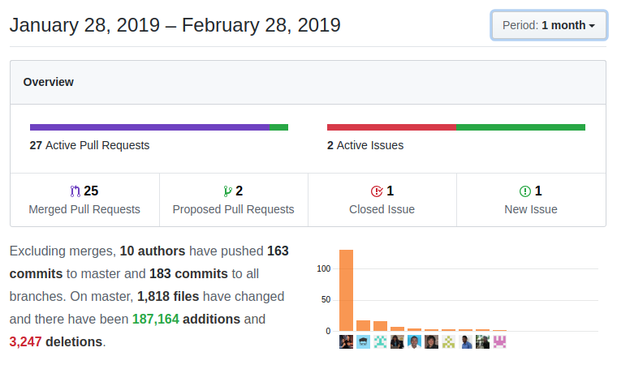

A short month but with a good punch. This month finds us mainly concentrated on some private and long-running projects (LDS UI) so coreBOS "only" gets its typical set of maintenance bug fixes, unit tests, and constant feature enhancements

===

 ! coreBOS Standard Code Formatting, Security, and Optimizations

 - coreBOS **Debug Message Reduction** (DMR) project continues and almost ends :-)
 - coreBOS Standard code Formatting: Backups, Changesets, HelpDesk, ModComments, Emails, Install, Message, Picklist, TransferRelatedRecords, WhatsApp, CRMEntity
 - fix debug message and eliminate warning in Webservice
 - correct and eliminate code comments
 - fix MySQL strict get activitytype query in Calendar
 - fix MySQL strict history with hidden fields in Potentials
 - an optimization which returns result directly and eliminates unused method in FieldDependency
 - an optimization to check for deleted records only once on a retrieve
 - faster glob expression in Updater
 - an optimization to add static cache to getEntityFieldNames

 ! Features and New Stuff

 - transfer calendar records on Accounts and HelpDesk when deduplicating
 - transfer calendar events and more related entities on Leads conversion
 - Business Maps validations. this month we review all the business maps validation files to try to make sure they reflect the actual accepted structure of the implemented logic. Thanks Glory
 - new module property **moduleIcon** to indicate module LDS Icon
 - load module icon into recently viewed information (Tracker)
 - **go back** button in Mass Edit 1x1
 - new module cbPulse which will permit defining scheduled questions so your coreBOS will be able to inform you of important events
 - add email status fields to Message and Emails
 - support **current_user** filter metavariable on uitype 101 fields in Filters
 - refresh list view after mass edit respecting search conditions
 - show user name with asterisk extension when duplicate extension error is detected

 ! WhatsApp Integration

With the new [WhatsApp for business](2do) support in [Twillio](2do) we create an integration with the service so you can send messages to your customers through the workflow system. You can find all the details on [how to configure it in the documentation wiki](2do)

 - add and adjust the Message module and use it to register message sent through WhatsApp and their status
 - WhatsApp configuration, workflow task UI and functionality
 - support multiple recipients, cleanup phone number, change layout, load Twilio library
 - add attachment message and multiple attachments in WhatsApp Integration

 ! Developer/Implementor enhancements

 - include **Twilio** library
 - getDisplayDateTimeValue function
 - make idColumn meta information public in class
 - fix Console code validation to include .inc files
 - correctly launch change event after capture of uitype10 field to support FieldDependency
 - default Business Action **addLink** creation to activate **for all users**
 - add WebService operation **getAllUsers** to retrieve all users
 - always return document attachment full path and name in Webservice query operations on Documents
 - add date field default value to web service Describe depending on generatedtype column value like inside the application
 - Business Action web service calls to get the list of permitted actions and execute the executable ones: **getBusinessActions** and **executeBusinessAction**
 - workflow UI fixes: add delete confirmation prompt, URL redirection for task activate/deactivate and cancel button
 - translate related module fields in update workflow task, avoid duplicate field names and put module name first
 - use correct metadata for expression evaluation in update workflow task
 - fix the vtiger crm 5.x migration process while updating a vtiger crm 5.2 install
  - add mandatory corebos changes to migrate from vtiger crm script
  - MySQL strict change in migration query
  - temporarily deactivate MYSQL strict for migration
  - set current user and apply cbSR formatting
 - **Notifications entry point:** we add a new entry point to the application exclusively designed to receive callbacks from webhooks and similar services. We were already doing this with individual scripts but the necessity to constantly integrate with many different services and the recent WhatsApp integration which also required this functionality made us decide to create a unique entry point for this type of integrations. With this functionality, WhatsApp can send us information about the status of a message and we will update that inside the application. We will migrate our Sendgrid, Chatwithme and similar integrations to this new entry point. I will explain more about this in individual blog posts.
 - **DeveloperWidgets** we enhance the existing developer widgets or blocks in order to make them much easier to implement and use while supporting more parameters. I will explain how this important functionality works in upcoming individual posts.
 - we found yet another error in the picklist translation changesets so I decided to do it right once. I fixed the first changeset so it does what it should, I prepared it to be re-entrable so if it times out you can just launch it again and it will continue, I canceled the other two changesets and I configured the first one so it can be unblocked and undone as many times as you need in order to launch it again in the future if needed..

 ! Others

 - History changes fixes to correctly highlight changes and show changed user names
 - eliminate G+ reference from README and install process
 - add list of valid values to global variable specification
 - initial password not being updated error due to incorrect display type
 - Helper Script to add all fields of a list of modules to all profiles (updateProfileForField.php)
 - make migrate links changeset dependent on Company and workflow purpose field
 - avoid error when relating leads as a contacts in calendar asterisk calls
 - eliminate duplicate call to transfer parent method in Campaigns
 - avoid duplicating organization record on cbCompany install and correctly support special characters in fields
 - modify htaccess to permit unrestricted access to the new notifications entry point
 - apply mandatory changesets on access
 - avoid single comma when no email is present
 - update email_flag hardcoded picklist values
 - correct CSS for global autocomplete
 - decode HelpDesk comments in ajax call
 - adapt **InsideAppCheck** function to work in windows
 - set width to List View columns search so the action icons do not get lost
 - incorrectly balanced parenthesis in MailManager
 - support user decimal setting in Payment benefit calculation
 - eliminate incorrect parameter in translation of picklist label
 - recover arrow image size lost during LDS update and translate hardcoded strings in Picklist assignment editor
 - recover Popup quick create button lost during LDS update
 - do not lose multicurrency on edit both from inside the application and the web service API in Products and Services
 - recover "more currencies" link in DetailView of Products and Services
 - never overwrite price with product cost when editing existing Purchase Orders
 - decode HTML entities and standardize report SQL **group by** field name in Reports
 - constant translation effort:
  - Company: fix incorrect spelling
  - Documents: missing strings in nl_nl
  - GlobalVariable: missing definitions
  - Message
  - Payment: missing language files
  - Services: multicurrency div header
  - Users: better asterisk repeated extension message
  - Workflow: eliminate duplicate label
  - Workflow: translate delete workflow

**Thanks for reading.**
