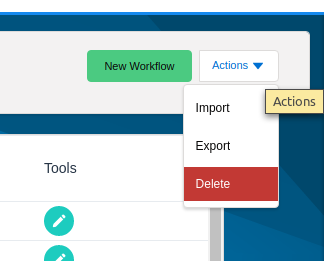
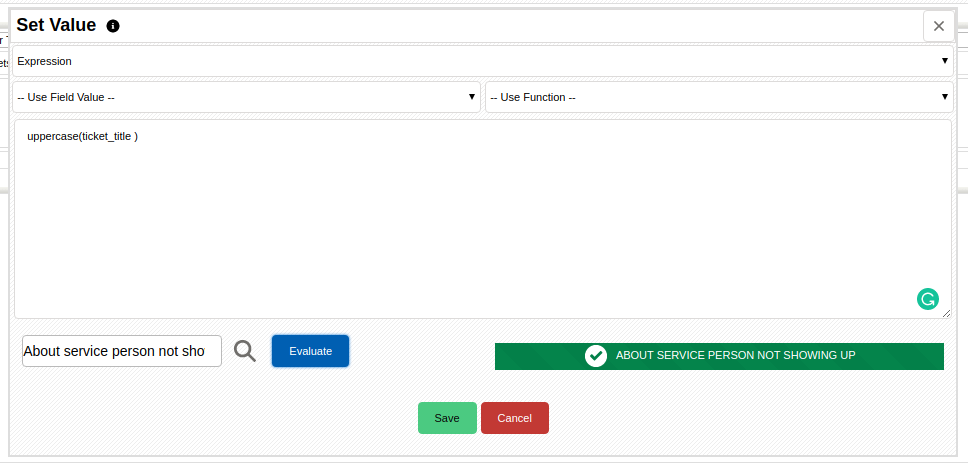
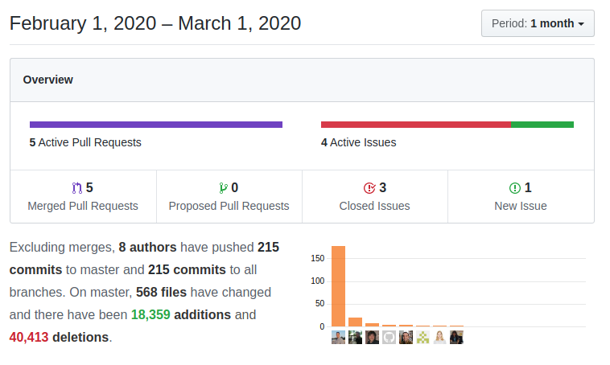

Another month that leaves me with the sensation of astonishment. LDS styling, Workflow and Document Generation enhancements mix in with fixes, new development features, and powerful user functionality. Simply incredible!

===

 ! Lightning Design System implementations

Luke implements a fantastic Page Header for coreBOS based on LDS and starts a wave of LDS changes throughout the whole application. **Thanks Luke!** The best I can do here is recommend you to upgrade and give it a try!

- adapt main detail view and listview blocks to page header with
- bring document listview content area in line with the rest
- bring export screen content area in line with the rest
- bring user edit view content area in line with the rest
- compensate for possible premenu
- don't show create button when it has no function or value
- get RSS and recyclebin in line with other content areas
- move hidden spinner to separate list to prevent round corner on hidden LI
- move save and cancel buttons from record body to page header
- some tweaking to try and solve the 15 rows problem
- start rewriting the dynamic page header part
- **Application_UI_CoverImage** global variable
- add missing variable in extensions
- don't start page header code when none is present
- fix double indentation of code
- fix return value when no premenu is present
- move custom event header below the page header
- replace accidentally removed lines
- sticky page header version without scroll jump
- warnings
- support new page header in BusinessMap testmap
- Integrations:
  - apply LDS to the home integration app launcher
  - LDS for each settings page
  - correct aria attribute name and eliminate unused HTML id
- apply LDS styling to GlobalSearch
- apply LDS to make Error Message visible with new background and eliminate obsolete HTML directive center
- apply LDS to Account/Contact hierarchy table
- apply page header and LDS to Settings: first step clean up and structure
- apply LDS to coreBOS Updater
- apply page header and LDS to CronTasks
- apply LDS styling to deduplication
- apply LDS to the home menu
- standardize picklist dependency cyclic error message
- additional LDS styling throughout the application
- Footer
  - apply LDS styling with modern CSS
  - set background so it doesn't blend with background image
  - cleanup and coreBOS Standard Recommendations
- Workflow:
  - popups and modals: LDS
  - apply LDS to the expression editor
  - apply page header and very basic LDS
  - add sorting arrows and LDS styling to list view

<span></span>

 ! Document Generation Enhancements

- add related modules to HelpDesk
- direct support for including ODT documents. Before this change, the `include` directive required an external call to an open office headless service. Now we directly include the documents without the need for the external service. You can only include OpenOffice (ODT) documents
- support for sorting records in the `foreach` directive
```
{foreach Timecontrol [title=MyTitle && tcunits>5] *date_start DESC*}
{foreach Timecontrol *date_start DESC*}
```
- eliminate warnings and apply coreBOS Standard code formatting
- fix the `include` directive inside foreach which was always loading the same document
- LDS adjustments
- use correct record id in GenXML
- optimization GenDoc:
  - calculate strtolower once inside the loop
  - move constant calculation outside the loop
  - use existing class properties instead of calculating again in Include
  - avoid external system call if not needed

<span></span>

 ! Workflow Enhancements

- we add an action menu



- mass delete action
- export and import actions. **Yes!** We can now export workflows from one coreBOS and import them into another one.
- add `number_format` function with SQL support also
- `NOT` expression operator
- add `allrelatedare` expression function which permits us to search the values of a field on a related module and return true or false if the values of that field are all of the same given value
- change the workflow data table to Vaadin grid from BunnyJS. This was an evaluation which, although has gone well, will be changed again shortly
- parse and evaluate workflow expression. Now, when we are creating a workflow expression we can select a record and evaluate the expression to make sure it is correct



- REST call Workflow task enhancements
  - support for URL encoded parameters using http_build which already encodes for us, so we do not encode and make sure we call http_build
  - support XML input type which encodes the field value
  - support for XML response
  - support multiple parameters in URL input type
  - support for getting OAuth token from the context
- permit selecting workflows from related lists and capture inputs
- evaluate the expression in the context of the workflow module
- cancel submit on create validation error.
- fix create from template SQL error
- eliminate warning on UpdateField tasks created before having launchrelwf
- validate module selected on create and preselect module when coming from settings
- record template from string was calling incorrect save method
- throw an exception if workflow expression function is not found instead of stopping execution

<span></span>

 ! Features and New Stuff

- we set the default operation to equal and add support for filtering on some user fields in the list view advanced search
- we enhance the Business Questions to support for filter conditions
- permit mass edit of one or more records in a DeDuplication group
- filter document selection to Internal documents only in Emails, so when you try to select an attachment you are shown only those that have a file
- field type restriction search in Global Search. We can now put a field type followed by a value and the search will be launched only in those types of fields, like 'phone::value', 'picklist::value'
- global variable **Inventory_Quantity_Precision** to define decimal places in inventory lines quantity which, for some reason is special. We also set the default value of the variable to the current user's preferences
- We add support to show record comments in the Tooltip. The number of comments is defined by the **ToolTip_NumberOfComments** global variable and they will scroll if too many are present

<span></span>

 ! Developer/Implementor enhancements

- we add more information and parameter support for Condition Business Map testing. You can now pass the `testrecord` parameter to set the record to evaluate with
- align validation exists search with underscore naming and global variable BusinessMap_, like most other business maps to support **BusinessMapping_Validations** global variable for user/role based validations
- base application changes to support **Warehouse** perspective
- new business action **listviewRow** which permits us to easily add actions to the list view action column:

`index.php?module=$MODULE$&action=DetailView&record=$RECORD$`


- method to get file path of a document attachment: **getAttachmentPath**
- GlobalVariable method **isAppliable** that returns true if the given global variable affects the given module and user
- add related_module parameter to **corebos.filter.inventory.getprice**
- **Inventory_Other_Modules** global variable for easier support of custom inventory modules (like [Massive Warehouse Movements](https://github.com/coreBOS/MassiveMovements.git))
- new utility function **getColumnnameByFieldname**
- refactor massEditRecords function so it permits us to mass edit any set of records. Use it to mass edit from deduplication screen and looking towards permitting this also on Business Questions
- refactor DeDup code to convert ID selection to a function so we can reuse it
- refactor getInventoryTaxType to support any module (custom modules)
- refactor MasEdit move mass edit HTML to file so it can be included and avoid duplicate code
- fix WebService Attachments functionality:
  - delete temporary attachments independently of FILES global variable and without emitting warnings if it cannot be deleted
  - unset $_FILES element after file upload
- support custom translation files in web service translation service
- **vtws_getWsIdForFilteredRecord** function which returns the web service ID of a record [based on a conditional search](https://corebos.com/documentation/doku.php?id=en:devel:querygenerator&noprocess=true)
- add new method **constructAdvancedSearchConditions** to Query Generator to get a coreBOS filter query string format. The result of this method can be fed directly to **addUserSearchConditions** to set query conditions as can be seen in the **vtws_getWsIdForFilteredRecord** method and [the unit test](https://github.com/tsolucio/coreBOSTests/blob/master/include/Webservices/UtilsTest.php#L99)
- better hooks support for (Issue  and Receipt cards
- **Tests:** this month (again) has seen a lot of activity in the unit tests project with a lot of new tests, even on external modules (chatwithme).

<span></span>

 ! coreBOS Standard Code Formatting, Security, and Optimizations

- coreBOS Standard code Formatting: quotes, spaces, and warnings: CustomView, Workflow, Duplicates, EMails, GenDoc, Global Variable, Home, Header and Page Header, Inventory, Products, Reports
- optimization eliminates variables and apply cbSR
- optimization change CSS import to link for quicker loading
- optimization avoid concatenation in Emails
- optimization move Global Search javascript from template to script and optimize function
- optimization make a direct call to Business Action to avoid a useless call to Vtiger_Link for ListViewRow hook
- optimization reduce translation calls in Reports
- optimization eliminate a variable for a direct parameter in SalesOrder
- optimize SQL and apply cbSR in Tooltip
- optimization Utils functions getUItypeByFieldName and getUItype
- avoid warnings by setting default values for custom Business Map validations
- eliminate warnings creating users from web service
- fix ternary operator ambiguity in PHP 7.4 in Reports
- update TCPDF to 6.3.5 for PHP 7.4 support
- use older PHP array reference format for better backward compatibility
- update ADODB to 5.20.16
- add more security checks when deleting user through web service
- simplify DateTime code
- eliminate duplicate HTML ID: detailview_utils_actions
- eliminate unnecessary concatenation and standardize SQL in Documents
- eliminate and fix comments in EMails
- change License year
- Reports:
  - eliminate obsolete Calendar references
  - eliminate unused and incorrect method getStdCriteriaByModule: we use the one in CustomView
  - eliminate unused parameter
- SeriviceWorker: update workbox to 5.0.0 and delete 4.3 files
- optimize looping operations in list view row Business Action
- eliminate obsolete calendar code: List View, Web service and Reports among others
- eliminate unused parameter from Reports method after eliminating calendar code which was the only one that used it
- eliminate obsolete code: formname_specific from ListView (after adding unit tests)
- delete useless comment in Picklist and fix method comment in Workflow
- eliminate unused and incorrect method getStdCriteriaByModule from Reports as we use the one in CustomView
- optimize validation query
- delete unused variable in Inventory code
- optimize ListView: eliminate parenttab, eliminate unnecessary condition, eliminate unused parameters and correct function parameter definitions
- eliminate obsolete code related to uitypes and duplicate code in ListViewUtils
- reduce translation calls in Reports
- fix ternary operator ambiguity in Reports for PHP 7.4 support
- refactor ListView: change variable name and use HTML encoded string where necessary
- update Mermaid library
- permit no-extra-boolean-cast in eslint continuous integration check

<span></span>

 ! Others

- set action to "save" in order to eliminate warning in RecurringInvoice
- add fully qualified column name to "order-by" SQL clause in RelatedList and Popup
- set currentModule to correctly retrieve related lists records
- fix error getting related product block and eliminate warnings while creating unit tests for Reports
- use the regular search when no autocomplete results are found.
- Tooltip and Home:keymetrics were incorrectly cutting UTF8 characters
- include create and revise in Webservice Upsert as they weren't loaded in some situations
- correct variable name in sendRecoverPassword
- avoid loading Pear Exception if it is already loaded
- avoid duplicate general.js loading in Account, Contact, and Layout Editor
- move BrowserVariables to the header of HTML page
- delete extra directory separator in ApplicationMessage
- correctly detect am/pm option in Calendar and DateTime field class. fix PM to 24 conversion error for 12:00 hours and support for incorrect 24 hour format hours
- correctly evaluate **ActivityReminder_Deactivated**
- eliminate obsolete references to the old calendar
- change obsolete calendar reference in CustomView for Workflows which now are starting to act like a normal module
- eliminate hidden field in Contacts form which conflicts with Reports To
- set address on contact capture: error using incorrect fields
- automatically set CronTask sequence on load. **orderTasks** method
- CustomView SQL from filter with advanced grouping conditions was joining incorrectly
- fix "send document by email" link functionality
- add missing closing div in GlobalSearch
- trim helpinfo from database to prevent javascript errors
- save correct discount_amount in InventoryDetails when discount_percent is checked
- fix partial Invoice line. We were losing relations with sales order line when moving invoice lines
- correctly move inventory module product lines when there are deleted lines
- Inventory:Price hook pass around parameters on search and page change
- load common detail view code before calculating email permissions in Leads detail view script
- fix incorrect order-by parameter name in LoginHistory and AuditTrail
- miniCalendar: avoid incorrect link redirection and apply LDS styling
- limit size of uitype 3314 modulelist for big selections
- add XSD feature for Business Map Validation element parameters
- set default map to "expression" in the condition expression editor
- users module does not have assigned user so we add a validation exception to permit inline edit
- constant translation effort:
  - use an existing label for group create error message
  - module standard labels for CronTask
  - Payments it_it

<span></span>



**<span style="font-size:large">Thanks for reading.</span>**
