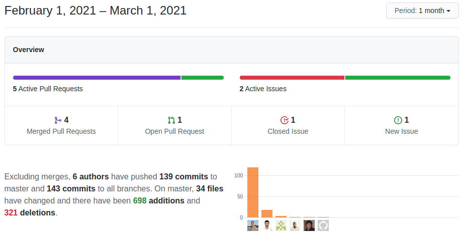

This month we review the whole Web Service API and release the Denormalization Project... Impressive!

===

 ! Features and Implementor/Developer enhancements

- **Denormalization Project release**
  - update install Database with denormalize changeset
- **Customer Portal Enhancements.** Due to an increment in the type of projects that require coreBOS to be a backend for a large amount of external web application users, we introduce a set of changes to cater to the needs and make the backend more secure. I will write about this shortly.
  - add query restrictions and support for Contact only login (no related account)
  - apply getRelatedRecords query restrictions for customer portal users
  - apply query restrictions for customer portal users
  - Portal Module Restrictions query generation function
  - register contact and user as customer portal login in session so we can apply restrictions. eliminate accesskey from the response so they can't login with the user directly
  - restrictions on getFieldAutocomplete, getReferenceAutocomplete and getReferenceValue. fix permission check and eliminate warning
  - apply isPermitted restriction for customer portal users
  - add logged in contact to contact module query restrictions
- **Web Service Enhancements**
  - export module base table as meta information
  - move Documents Portal conditions to main function
  - query can stream results using the **format=stream or format=streamraw** parameter. **This is an important enhancement** that permits a direct streaming feed of query information. There is a blog post on its way about this.
  - support for multiple modules in SYNC call
  - support for streaming results of SYNC call and setting the limit with the Global Variable: Webservice_Sync_RecordLimit
  - change CRMEntity table for base table to support SYNC on denormalized modules
  - set correct user for global search module restrictions
- **[WooCommerce integration.](../woocommerce)** We merge this integration which was in a branch into the main branch
  - initial version ready for validation
  - bidirectional product categories sync based on wcProductCategory module
  - debug log messages
  - coreBOS to WC product category sync
  - correct SQL for product category module
  - set draft as default status and eliminate record_id to evaluate map in WooC product context
  - use correct record ID to get category code for parent relation
  - change log message to indicate sequence of event
  - detect event with alternative key case
  - detect source URL and signature with alternative key case
  - direct DB update for readonly fields
  - give default precedence to WooCommere information when updating from there
  - make methods more generic
  - only send categories if there are any
  - Sending and retrieving GTIN
  - set correct default field for shipping and handling
  - sync status: publish product/services
  - testing and validating
  - update record if it already exists even though WC says it is new
- **Workflow Enhancements**
  - add **getIDof** expression function which permits us to obtain a CRMID by searching for a record in a module
  - add **getFromContextSearching** workflow expression function
  - [add upsert task](https://corebos.com/documentation/doku.php?id=en:upsert_workflows&noprocess=1)
      - ignore upsert when the given value is negative
      - change array format for reading in coreBOS Rules
      - change variable name
      - condition issue in creating new field
      - empty object created in current_user
      - foreach all entries from context
      - read fieldmapping and create/update record
      - remove comment
      - remove empty crmid variable
      - upsert always creates if no condition is defined
      - upsert support for web service IDs and add log message
      - support only one module
      - i18n upsert ES
  - run web service call task now returns array and objects as results instead of JSON encoded strings and does so with full support for field-dot syntax to run through the different levels of the response object. **CAREFUL**, [this is a breaking change!](../RunWSWFTaskChange)
  - set and get context function now support expression parameters
  - support access to array properties in JSON response of Web Service call task with the format property.index.field
  - change copyright year
  - get recordid if uitype10 is different value
  - remove ws_map_response context
  - sanitize data before save
  - set default trigger type for non-admin users
  - standardize error message
  - support for both string and encoded context parameter in QuestionAnswer method

 ! coreBOS Standard Code Formatting, Security, Optimizations, and Tests

- coreBOS Standard Formatting and Optimizations
  - corebos_cache, Reports, index, workflow: format, change quotes, and eliminate warnings
  - delete unused Calendar query security functions as we now use the common application ones
  - delete unused files in Picklist
  - deprecate getSecParameterforMerge
- document utility functions
- document picklist functions
- Optimizations
  - use a constant string and direct return of result, eliminate variables for constants, change quotes, format code in Utils
  - directly return result and eliminate warning when no Business Question properties context are given
  - eliminate unnecessary join on user table when fetching users in Application and Calendar role
  - PortalModuleRestrictions: eliminate quotes from SQL when using integers
  - eliminate SQL whitespace in DeDuplication
  - micro-optimizations and document using logging messages the **isPermitted function**
  - change preg_replace for faster str_ireplace in List/Report Queries
  - support for mono-language picklist setting. This is an important optimization. If you have any picklist that only has values in one language and all your users use that language you can mark that picklist as Mono-Language so the system can construct a faster SQL query.
  - use response variable instead of a copy of it
  - eliminate join on groups for fields that never contain a group value
  - calculate string position once in appendFromClauseToQuery
  - reduce SQL columns in Utils function
  - return the count of rows instead of all rows and directly save evaluation, change quotes in Web Service Sync method
  - move constant calculation outside loop, change query from count to count number of rows in Web Service Utils
  - directly return the result in workflow list
  - eliminate unused variables in workfow Upsert task
  - addPortalModuleRestrictions function so we can use it elsewhere
- Security
  - SQL injection in Business Question query context parameters
  - move PHPSQLParser to vendor directory
  - apply permission access restrictions to business action and question execution
  - change portal user password
  - Web Service
    - add permission checks for execute workflow
    - add permission control to convert lead
    - add permission check on Business Question context
    - check permission on related module when setting/unsetting relations
    - empty cache, path traversal check and deactivate GenDoc Conversion service by default
    - force strong password in webservice password change
    - restrict field uitype information based on profile
    - return immediately from javascript logging if it is deactivated
    - SQL injection
    - SQL injection in getReferenceAutocomplete
    - unnecessary data exposure
- Unit Tests: keeps getting more and more assertions

 ! Others

- ExpirePasswords scheduled task now has complete support of global variable to permit setting different expiration time per user (not just one for all)
- add cache integration for the coreBOS Rule evaluation function
- CSS and theming: set path for variable themes and apply minor font increment: Application_CSS_Properties. This permits us to define CSS variables per install.
- Database Utils
  - appendConditionClauseToQuery
  - appendFromClauseToQuery correct with the use of PHPSQLParser
  - more secure way to locate where position in appendConditionClauseToQuery and appendFromClauseToQuery
  - strip SQL clauses after WHERE
  - support for repeated joins in appendFromClauseToQuery and better where detection
  - use given query instead of parsed one
- move database helper functions to DatabaseUtils file
- getEditablePicklistValues add support for getting values translated or not
- support SQL with no parameters in ConditionQuery Business Map
- eliminate old calendar organization sharing
- in CRMEntity we add full SQL query to cache key to support multiple calls to the same module with different roles and use json_encode instead of serialize which is faster
- set Decision Table module if none given to avoid warning and instantiate stub class correctly
- keep currentModule context when automatically loading changesets
- Inventory Details
  - sanitize as late as possible to clean all fields: discount amount error
  - set quantity field to number
- Permissions
  - do not show Duplicate button if the user does not have create permission
  - treat duplicate functionality as create instead of edit for permission calculation
- editing Picklist in non-english language error and detect value change
- support for all fields on Potentials related lists: Accounts, Contacts, and Products
- Reports
  - change the decimal symbol on double when export to Excel
  - direct time calculations to support total times over 838 hours MySQL limit
- load cache integration information and make the connection only if it's active
- GetRelatedAccountContact return 0 if the record is not related so unit tests pass as before

**Thanks for following.**
