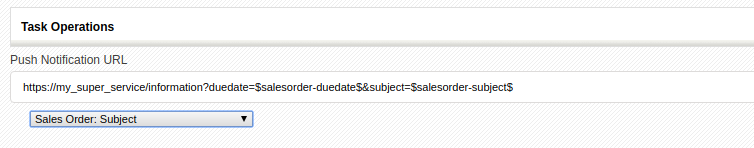

coreBOS now supports outgoing push notifications with an additional special case for Google analytics.

===

To get even more from the spectacular service Google analytics gives us, they support a feature called [measurement Protocol](https://developers.google.com/analytics/devguides/collection/protocol/v1). The idea is to be able to relate a website visit with a real sale so we can track our return on investment much more accurately.

To accomplish this we need to be able to inform Google analytics when a sale was made and which client bought the product.

The Google Measurement Protocol is rather simple, you make a call to a URL they give you with the identifier code of the client who bought, the amount of the sale and any other information you may want to save in analytics.

So we added a Google analytics identifier code field to the account module and created a workflow where you can specify the URL using variables that will be evaluated in the context of the sale being made (Invoice) and then the workflow will call the URL, effectively informing Google. Easy.

You can [get some more information in our documentation](http://corebos.com/documentation/doku.php?id=en:extensions:extensions:googlemeasurementprotocol&noprocess=1)

Push notifications
In effect the GMP workflow is just a glorified push notification to a URL endpoint, so we generalized the code and created another generic push notification workflow which you can use to call any service with a custom URL compiled with application variables

with these workflows, you can inform any external application of events that happen inside coreBOS easily.

**Awesome functionality!**

<a href="https://www.freepik.com/free-photos-vectors/business">Business vector created by pikisuperstar - www.freepik.com</a>
