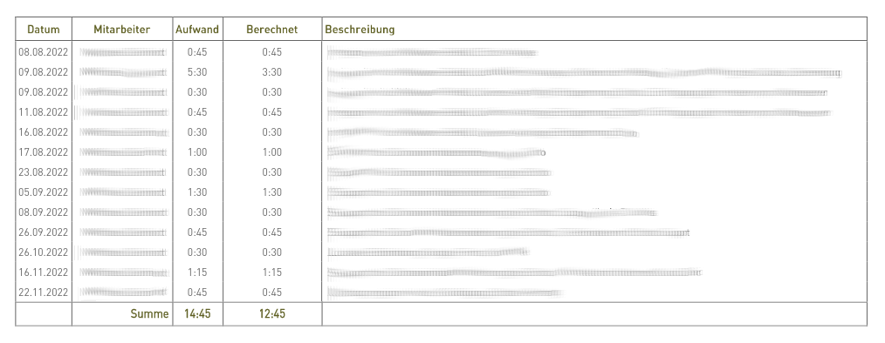
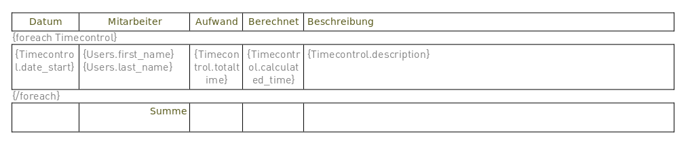
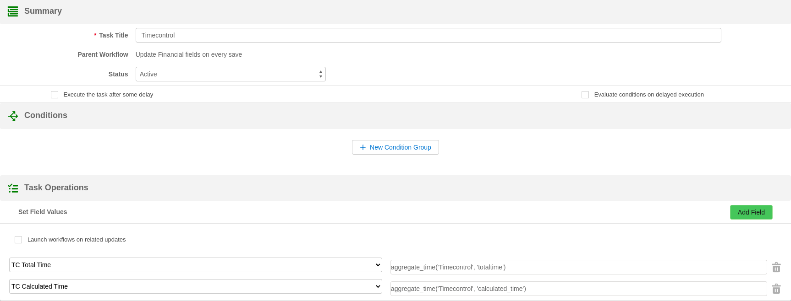
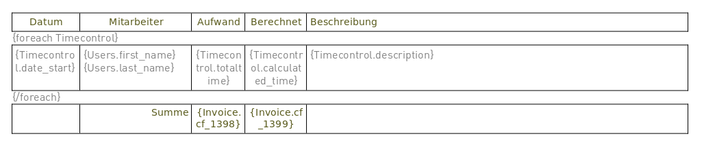

Read about a surprising comparison with PDFMaker and learn about some new enhancements in our document and PDF construction and generation system: GenDoc.

===

This year the first Sunday of the month is also the first day of the year, so I start by wishing you all **a great, happy and productive year ahead.**

 ! Time control table

Last month I implemented a couple of GenDoc templates while migrating from PDFMaker and I was surprised at how easy one of the requests was compared with the solution implemented in PDFMaker. Note that I have very little knowledge of PDFMaker so I don't know if the solution I found implemented there can be done in some other easier way using that tool, I am just comparing the solution that I found there with the way I solved it in GenDoc and how much more flexible and easy it is.

So, the request is to list all the time control records related to an invoice in a table with this output:



The solution in PDFMaker is a 350 line PHP custom function full of HTML and CSS. When I saw that I was a little depressed as I thought that we could not do that in GenDoc. In fact, we can't. We cannot create a piece of code that generates a whole section to insert into a generated document. I mean, obviously, we can, as we are doing more complex things manipulating the open office document internally, but it is not an easy task, it isn't that anyone can just add some function and we include the output in the generated open office document.

So, I stepped back and decided to approach the problem from a coreBOS point of view. Given the desired output, how to implement that with what we have, not the way they do it in PDFMaker? Six minutes later I had this open office template.



**Wow! That was easy.**

The sum cells are missing and can't be done in the GenDoc template, those calculations have to be done in coreBOS. So I added two custom fields and an update field workflow task that looks like this.



`aggregate_time('Timecontrol', 'totaltime')`

The final GenDoc template looks like this:



Looking at the solution and comparing it with the PDFMaker custom function I see that the flexibility of GenDoc is incredible. The template is easy to read and modify, with no CSS, no HTML, no PHP, just a nice WYSIWYG interface. All the calculations and conditions to aggregate are done inside coreBOS using the standard workflows expression language, so all the customizations are in the hands of the implementors, not the programmer, and it took me 30min. I can't imagine how much time it took to create the 350 line custom function.

 ! Conditional sections

Since we are talking about GenDoc I would like to share with you a new functionality that we added recently: **conditional sections**.

For some time now we have been asked to be able to include or not a section of text depending on some conditions in coreBOS. This is similar to the `ifexists` directive but that one checks if there is a related record or not. In this other request, it can be any condition. For example, show a section depending on the product category or on the value of an account rating.

We finally added this functionality with the directive:

`{conditional condition}`
`{/conditional}`

I share two real examples:

```
{conditional Invoice.invoicestatus != Cancel}
Buyer will have full rights to the above goods.
{/conditional}
```

```
{conditional cbOffers.description != }
Note: cbOffers.description
{/conditional}
```


**<span style="font-size:large">Enjoy!</span>**

Photo by <a href="https://unsplash.com/@joannakosinska?utm_source=unsplash&utm_medium=referral&utm_content=creditCopyText">Joanna Kosinska</a> on <a href="https://unsplash.com/photos/1_CMoFsPfso?utm_source=unsplash&utm_medium=referral&utm_content=creditCopyText">Unsplash</a>