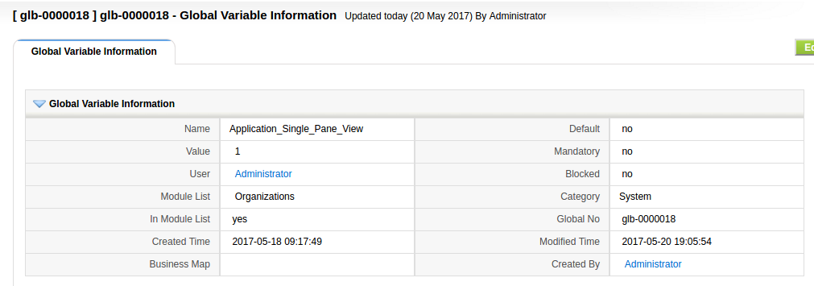
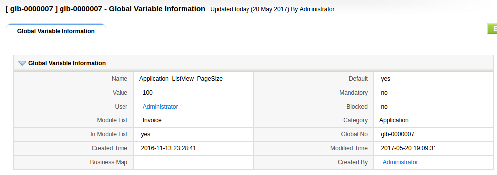

This module permits the implementor, administrator, and users to customize the behavior of the application to their requirements, taking the configuration and customization of coreBOS to a whole new level.

===

You can find a detailed explanation of this module in [our documentation project](http://corebos.org/documentation/doku.php?noprocess=1&id=en:adminmanual:globalvariables), so I will write here about the functionality and impact of this module, while I throw in some examples of existing variables.

I remember discussing the design of the global variable module with Elsida, who was in charge of developing it (thanks Elsida!). We were after a simple way of being able to eliminate hardcoded values that we put in the code in a way that they could be:

 - self-documenting and significant
 - easily changed
 - easily created
 - easy to use

Self-documenting is easy. In general, you just substitute the value with a constant string that holds the value. Look at the difference between these two pieces of code

```
...
$noofrows = $adb->query_result($count_result,0,'count');
if($noofrows > 0){
	$relstart = ceil($noofrows/20);
}
...
```

```

const Application_ListView_PageSize = 20;

...
$noofrows = $adb->query_result($count_result,0,'count');
if($noofrows > 0){
	$relstart = ceil($noofrows/Application_ListView_PageSize);
}
...
```

**No comments!**

Accomplishing the other points was a bit more of a challenge but I have to admit that we did a really good job.

We created an easy to use interface: one class and one method. We made it globally accessible and gave it a simple interface, just the name of the variable and a default value, so the code above becomes:

```
...
$noofrows = $adb->query_result($count_result,0,'count');
if($noofrows > 0){
	$relstart = ceil($noofrows/GlobalVariable::getVariable('Application_ListView_PageSize',20));
}
...
```


**Nice and clean, easy to use!**

The call works even if the variable doesn't exist. In that case the default value is returned, so it is easily created. Even if you just use it and don't document the variable, it still works!

Then we added a **scaled value search**. We created a module where any user can add values to a variable and we search for those values in order to get the right value to apply, so we made it **easy to change and adapt** to many cases.

 !!!! It was a very good job and the impact was far bigger than I thought at the moment.

The scaled search works like this: first, we look for a record set as **mandatory**, if we find one, we return this value, this permits the administrator/implementor to set a value globally for all users and modules. Next, we look for a record for this global variable assigned directly to the user, so each user can set their own values, if not found we look for a record assigned to the users' group and finally we look for a record marked as **default** value.

Besides the scaled search described above, all those queries are made against the list of selected modules if the "**In Module List**" field is checked.

 !!! So, **what does all that mean?**

Well, it means that you can set functionality per user, per module or globally with ease.

Let's see two very relevant examples which have been among the most asked feature on the forum.

 ! I want to activate single pane view for one user on one module

Now that we have converted single pane mode to a global variable we can create a record for this variable assigned to the user with the **In Module List** field and the module selected.

Let's suppose that we want the single pane active on Accounts for the admin user. That will look like this



It isn't **default** nor **mandatory** and the definition is restricted to the Accounts module for this user. That easy!

 ! I need to set the list view number of records for invoices to 100 for all users

We will select the **In Module List** field, select Invoices and set the default checkbox. Which looks like this:



With this record, any user can override this setting to their needs as we didn't make it mandatory.

 !!! Global Variables Reference

The list of variables is fully documented in the module itself. On the list view, there is a button to access the table, on the detail and edit view there is a block which contains the table with all the variables, their possible values and an explanation of what each is for.

 !!! Test your Global Variables Configuration

On the list and detail view, you will find a **Test** action which will permit you to validate the result of any variable on any module for any user. This is very useful when you have a lot of records for the same variable and need to make sure that the right value will be returned in each case.


 !!! Global Variables Accessible from everywhere

Finally, I would like to add that we also made the global variable values accessible from inside the browser, in the **JavaScript world** and from the **web service interface**.

In the browser we have a **JavaScript promise** that sets the value obtained from the application like this:

```
var calendar_call_default_duration = 5; // define the variable and set it's default value
GlobalVariable_getVariable('Calendar_call_default_duration', 5, 'Calendar', gVTUserID).then(function(response) {
	var obj = JSON.parse(response);
	calendar_call_default_duration = obj.Calendar_call_default_duration;  // set value from application
}, function(error) {
	calendar_call_default_duration = 5; // set default value on error
});
// You MUST give this some time to execute, so do not use the value at this line. Or execute your code inside the promise
```

External applications can get the values of global variables in the application using the **web service call: SearchGlobalVar**, which is a GET request with three parameters:
 - gvname: name of the global variable
 - defaultvalue: default value to be returned if not found
 - gvmodule: module to be searched on

You can see an [example of this call and try it out](https://github.com/tsolucio/coreBOSwsDevelopment/blob/master/testcode/500_GetGlobalVariable.php) using the [coreBOS web service developers' tool](https://github.com/tsolucio/coreBOSwsBrowser).


**<span style="font-size:large">Thanks for reading.</span>**

