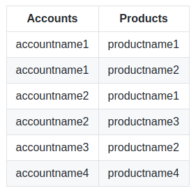

coreBOS has a very powerful import functionality which completely solves the problem of one to many relations but it has no native way of importing many to many relations. A few years ago we implemented the [Import/Export Relations extension](https://github.com/tsolucio/coreBOSIERelations), which has recently seen an interesting enhancement. Read on to learn how to manage importing relations in your coreBOS.

===

First I would like to leave here a [reference to the import documentation page](https://corebos.com/documentation/doku.php?id=en:importingdata&noprocess=1) where we explain the different options of how to import one to many relations and also note that there are various videos where I explain how this works. This native import functionality can also be [launched directly from the command line for batch imports](https://corebos.com/documentation/doku.php?noprocess=1&id=en:adminmanual:businessmappings:import#corebos_based_import_process).

 !!! Importing Relations: The problem

The problem is to extract a set of many to many relations between records from one system and establish those exact same relations in another system.

Obviously, the first step will be to import the records themselves from one application to the other, and this is where it gets complicated. The unique key that was used in the first system will change in the second one (usually the internal crmid), so the issue with importing many to many relations is that in order to establish a relation between two records we need to uniquely identify each one, but the IDs we have are the ones used in the first system which do not exist in the second one.

In other words, if we export the many to many relations from the origin application, we will get a set of IDs that do not exist in the destination application.

!!! Importing Relations: The solution

Explained like that, the solution is easy: when we export the data from the origin system we export also the ID used in that system. Then, when we import the records, we save that external ID in a custom field, let's call that field `externalcode`. Now we can export the relations from the origin system and create a script that will read those relations, search for those numbers in the `externalcode` field and establish the relation as expected in the destination application.

This is exactly the functionality of the [Import/Export Relations Extension](https://github.com/tsolucio/coreBOSIERelations). It will permit us to export the relations from an existing coreBOS into a specifically formatted file that contains the internal IDs of the records in the origin system and then it will accept that file and ask us for the name of the field it has to use to search for those IDs (our `externalcode`field). With that information it will be able to recover the many to many relations again in the destination application.

!!! Importing Relations: Alternative Format

The file generated by the Import/Export relation extension is an XML format optimized to be read by a machine. Sometimes we don't have the origin data in that format and creating the XML that this extension requires is complex. For this reason, (and because we like to help our users solve their problems efficiently and easily) we enhanced the extension to accept a normal CSV file with the keys of the records to relate. The extension uses this flat format to do the same work it does with the XML format.

The CSV format must follow these rules to work

- the first row must be a header that contains the exact module name that can be found in coreBOS
- the module in the first column header is the main module to set the relations
- all the other columns will be the ones we relate the first module with
- each row will contain a unique field value that can be searched in the module to get one record

The procedure followed with this format is more or less like this

- for each row in the CSV file, we search the first column value in the main module
- then we search for the second column value in the second module: we relate both records
- we continue with all the other columns relating always with the record in the main module

An example CSV file to relate Accounts and Products would look like this

An example CSV file to relate Accounts and Products would look like this

It is really that easy :-)

 !!! coreBOS UUID

A few weeks ago we introduced a universal unique identifier for coreBOS records. The IERelations extension hasn't been tested with this feature but it should work. Instead of having to create some artificial custom fields to hold the unique identifier from the origin application, we can use the cbUUID field. By default, the cbUUID field is included in the exports and is used when importing if given. So all we have to do is tell the IERelations extension to search on that field.

**Enjoying the power and flexibity of coreBOS!!**
