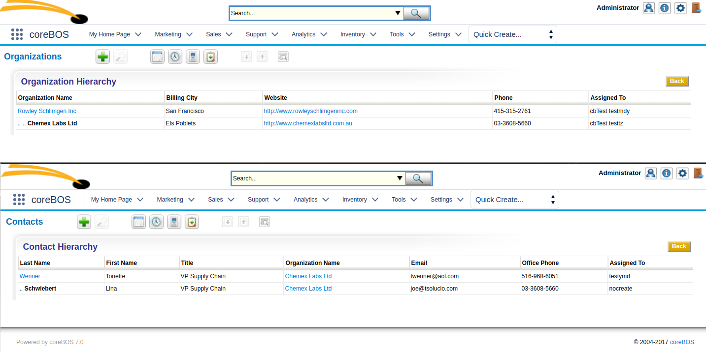
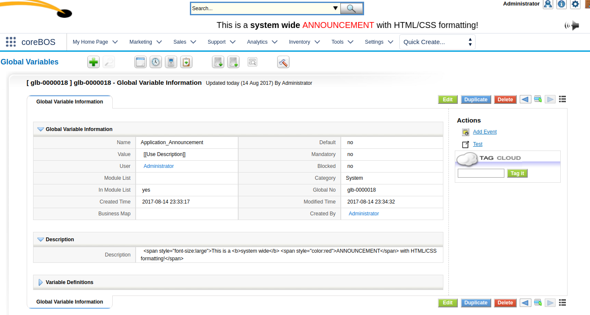

A new year begins as we continue our journey. Adding value and flexibility to coreBOS in order for you to do your business better and use this software as the lever you need to accomplish your goals: **Happy New Year from coreBOS!**

===

 ! Accounts and Contact Hierarchy

Thanks **[casati-dolibarr](https://github.com/casati-dolibarr)!!**

 ! Role based filter approval

Any user can create as many filters as they need on any module. Any one of those custom views can be set as **Public** so other users of the application can use it also, but, to avoid having each user's filter list filled with the different views of every user in the system, you can only see those public filters that an administrator has approved.

To approve a filter the administrator must select the filter and click on the "approve" link that will appear once selected.

This month we take part of that burden off of the administrator and permit any user to approve filters of those users below them in the role hierarchy. A user can see all the records and activity of all the users below them in the role hierarchy, so we extend this logic to the filters approval/denial process.

 ! Customer portal MYC support in the main application: product lines, PDF,...

We fork the [vtiger CRM MYC Customer Portal project](https://github.com/tsolucio/coreBOSMYCCP) and adapt it to coreBOS making some changes in both applications along the way. I will write a little more about this in the near future.

 ! WorkFlows
 - Send email to record assigned to group
 - Add reply-to on email task

 

 ! Shared Image Fields

Image fields can now share the same image among records, even of different modules. This is just the initial steps for this functionality to work completely. The relation must be established by custom coding saving the same image name in all fields and setting the relation in the database (seattachmentsrel) and there are some other features missing at this point in time.

At the moment of writing this article, this functionality has been enhanced a lot. In January 2016 it was just an initial setup but in August 2017 this functionality is mostly all in place and working as expected. At most there are a few things that could be looked into:

 - Select image from other existing attachments
 - Webservice support. The idea would be to be able to indicate an existing attachment as the source of an image field.
 - Workflow support (I'm not sure if this is actually needed or useful as I can't think of a use case for it)

 

 !!!! Anybody up for the challenge of finishing it? I can help :-)

  

!  Calendar fixes
 - Work correctly when. Contact module is deactivated
 - Work correctly with modules that have custom date fields and also some special customizations for helpdesk
 - Permit creating follow ups on the same day
 - Support for showing related module fields on calendar event
 - Reports add support for calendar custom fields. Cleanup and translation
 - Global Variable calendar slot minutes,

 

 ! Announcement supports HTML

 

 ! Some others:

 - Group creation with quotes
 - Document download count optimization
 - Mail Converter if contact does not exist save sender email on ticket
 - Global Variable user reply to secondary email
 - Developer getmoduleforfield: Function to get the module name from a 'fieldid'
 - When importing a module relate to tool menu if specified menu does not exist
 - Add IDs everywhere for easy reference in javascript and CSS. Themes
 - Helper Script composer to wiki
 - Permit deleting relation between vendor and contact
 - Skype field Direct call
 - Move to jquery
 - Eliminate warnings, notice, MySQL strict and code cleanup (this one is a constant every month, even today).
 - Translation. Notice warnings, eliminate unused code, cleanup

**Thanks for reading.**

