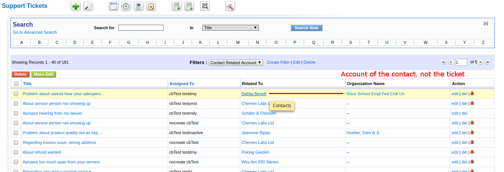

After the enormous uphaul of the last months bringing the code up to date while adding many changes, and our concentration on the total elimination of warnings, we spend most of the month stabilizing the code.

**Happy New year!!**

===

 ! Workflows

We can now **Evaluate Conditions on task execution**. These conditions will be evaluated at the moment the task is executed and the task will be launched only if they are true. So we can create workflows that will not launch all their tasks, only those that apply. For example, the typical use case where we want to send an email to the assigned user of a ticket 5 days after it was created but only if it hasn't been closed. So your workflow launches on the ticket creation and creates the email task to be sent in five days but also adds the condition on the task to check if the ticket is still open.

 ! Customer Portal

 - comment related to contact creating the comment not the contact related to the ticket
 - search creator on various conditions
 - support for list columns business map to define portal columns

 

 ! List View

Support for showing relational field values for related modules. Many, [many months ago](http://blog.corebos.org:8080/en/blog/april2015) we added the possibility of using related module fields in the list views, but if you tried to show a related field of a related module you would get the internal ID of the record, not its name. With the change we make this month you will now see the records' name.

 ! Global Variables

 - **User_AuthenticationType**
 - **Application_B2B**

 

 ! Other changes:

 - Report enhancement for direct SQL and External URL
 - Mail Manager fix date when it comes in textual format
 - MySQL strict SQL fixes
 - Database enhancements: studying MySQL slow queries for a while
 - Restrict empty global search
 - Smarty htmloptions sort
 - LDAP and AD authentication
 - Code cleanup and standardize
 - Eliminate parenttabdata which is not used anymore
 - Popup search fixes
 - Menu top links and bug fixes
 - Role tree formatting moved to LDS
 - Support for Created By field on export and reports
 - SMS nexmo provider
 - Uitype 1614 and 3314 for all modules and extensions
 - Mobile
 - Eliminate warnings, notice, MySQL strict and code cleanup (this one is a constant every month, even today).
 - Translation. Notice warnings, eliminate unused code, cleanup

**Thanks for reading.**

