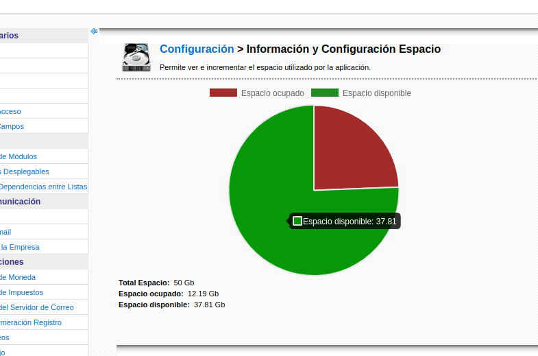
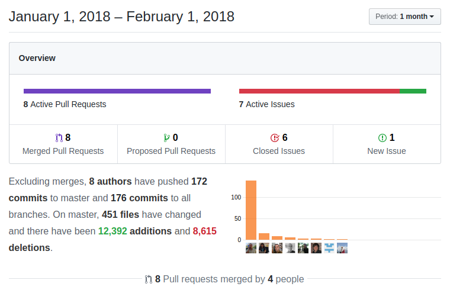

A very interesting start of the year where we get a lot of help from contributors (Thanks!!) who bring some fantastic enhancements like global variables, optimizations, functionality,... while we start customizing coreBOS with OnDemand features, construct login page infrastructure and keeping constructing a **professional, powerful and flexible application**.

===

 ! Documents

- global variables **Document_CreateSelectContactFolder**, **Document_CreateSelectAccountFolder** and **Document_CreateSelectAccountFolderForContact**. These variables permit us to configure coreBOS to automatically create and select folders for each Account and Contact when adding a new document to them.
- method to create folders
- storage increment license when On-Demand is active
- add settings section to show storage consumption and cron to calculate it once a day

 ! Global Variables

- Add role picklist field and role-based search, so we can now apply global variables by roles, making this configuration module even more flexible and powerful.
- **Debug_RelatedList_Query** to see queries in related lists. Thanks [David](https://github.com/kapsule)
- **CustomerPortal_PDF_Modules** to define which modules support PDF export via Webservice
- **Application_ListView_Sum_Currency** to hide/show currency field sum in the footer of the (related)list view tables

 

 ! Design your own login page

We add infrastructure for customizable login pages and create a bunch of examples along with a new login design for coreBOS. [Read all about it here](../DesignLoginPage)

 ! coreBOS On-Demand Project

We start another project to add On-Demand capabilities to coreBOS. Besides being able to adapt coreBOS to this types of services, we also get some nice and useful features that can be activated individually.

- on-demand configuration file
- blocked users array: a set of users that cannot be modified nor deleted, this is useful when we add a support user and we don't want it to be deleted nor modified
- block package import, update, and export in order to protect intellectual property
- log user create, edit status changes and trash so we have full accountability for the number of users and their status in any coreBOS install
- show license on user creation
- limit the size of the storage directory and emit an error on document upload when that size limit is exceeded
- list of fixed tasks in scheduler so we can define tasks that cannot be deactivated nor modified
- control unique user login and permit admin user to log out a user, so we avoid the same user logging in on more than one computer

 

 ! Calendar

- correct start time validation for planned events respecting user timezone
- use normal get_related_list for m:m relations with cbCalendar created from within the application
- When **Calendar_Show_Only_My_Events** global variable is active, we have to show the events assigned to user's group too
- filter activiyid==0 on seactivityrel migration query
- filter contacts by accounts in the popup if an account is selected, using special contacts module popup filter to support more modules

 

 ! Mobile

- Create Timecontrol screen from Helpdesk, needs to be loaded like an external relation because it was keeping the detail_page HTML from HelpDesk
- Custom view filter does not work correctly to show default filter
- problem with uitype 10 autocomplete, we have to use a different index for search result
- respect sequence to search in uitype 10 autocomplete
- we need a special query for some modules when using uitype 10 autocomplete

 

 ! Reports

- send URL option in scheduled reports
- check summary fields in the report editor
- respect special characters on the first load of report graph and in field picklists
- standardize Services report query and secondary report query to support related fields
- support for capture fields on custom field table in secondary table reports
- translate module name error

 

 ! Development

- coreBOS Updater order field method to mass sort fields in blocks: orderFieldsInBlocks
- coreBOS Updater always create picklist array, even when no values are given in masscreate method
- coreBOS Settings delSettingStartsWith method
- getFolderSize function
- add a method to Vtlib Field class to delete picklist values
- coreBOS Session isSessionStarted method
- permit setting CANCEL button destination via code for custom modules using the CANCELGO smarty variable
- export/import helper scripts for Groups, Roles, and Profiles
- correctly detect 0 on save of checkbox fields
- standarizeFormatCurrencyValue apply only on numbers

 

 ! Optimizations and security

- delete image SQL injection
- submit forms via post
- reduce loading of config.php file
- eliminate warnings on Documents folder save and optimize search for duplicate folder names
- reduce index action verification
- eliminate uploads directory and it's usage
- move migration specific functions to Migration
- return direct value and fix comment in isValueInPicklist function
- Implemented calculation of permissions per profile. Thanks [David](https://github.com/kapsule)
- improve the performance of permission calculations with multiple values insert. Thanks [afrohoxha](https://github.com/afrohoxha)
- move the isPermitted cache to the database to avoid session blocking when we get many consecutive requests (normally webservice)

 

 ! Workflow

- adding update entity on directly related module fields. We can now update fields on directly related modules and it even queues the task if there are more than 3 related modules!!  Thanks [Lorida](https://github.com/loridacito)
- protect SMS Workflow Task so it doesn't send an SMS if the recipient number is empty

 

 ! Others

As usual a complete set of fixes and enhancements as we make the application safer, faster and trustworthy

- PHP 5.4 support for Session control class
- eliminate obsolete file enletras from payment module as functionality has been extended and moved to the translation module
- add CSS word-break so long text values do not break the layout
- eliminate uitype 59 by converting them to uitype 10
- move download code to executefunction
- update year in license template
- update Mail Attachment MIME types for better email attachments detection
- ignore some additional google mailboxes in MailConverter
- Popup: incorrect paging due to recordid value being 0
- Popup: URL encode custom parameters
- Popup: show showall button when search is active
- make Potential Forecast displaytype 4
- correctly balance text area fields in the QuickCreate form
- RelatedList fix where navigation was incorrectly constructed using translated module name instead of untranslated value
- RelatedList fix to set correct module for picklist translation on related list
- short_open_tag => Off recommended value in Install
- support special characters in the file name on image edit
- implement an option to export user list. Thanks [David](https://github.com/kapsule)
- move the visual working status bar down a bit if an announcement is present so it does not land on the menu
- fix SQL so we get all related potentials of a Contacts in the related list
- avoid division by zero and call log only once for Currency fields
- correctly translate standard datetime filter columns in filters
- move delete image functionality to executefunctions so it is not blocked for users with no access to contacts
- support for [versatilesmshub](http://www.versatilesmshub.com/) SMS service
- add complete text value to fields in list tables that are truncated. You can see the value on mouse hover
- hide LDS links on print media as they do not make much sense in this type of application
- SMSNotifier: send text on Unicode on ClickATell HTTP
- Translations: reports, login screen, services, global variables....
- coreBOS Standard Recommendation code formatting and continuous warning eliminations

**Thanks for reading.**

