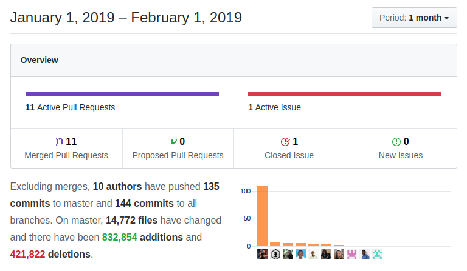

New Year, new code, same illusion, dedication, and commitment or more. As usual, a lot of things going on, so have a look at what happened to coreBOS last January to keep up to date.

===

 ! coreBOS version 8 !!

 - set [coreBOS version to 8.0](../corebos8)
 - update install database

 ! coreBOS Standard Code Formatting, Security, and Optimizations

 - coreBOS **Debug Message Reduction** (DMR) project starts. Debug messages are time-consuming and resource intensive. They should be disabled in all production installs, but even being disabled the construction of the message is still done so this project's goal is to reduce the messages themselves as well as clean up as many unnecessary calls as possible hopefully also making it a little easier to read the resulting log file. This will make the application a little faster.
 - coreBOS Standard code Formatting
 - eliminate warnings (Edit View, Documents, Workflow, cbQuestion, and Users) and application when standard fields are hidden
 - eliminate unused code in RelatedLists
 - eliminate duplicate assignment and warning in Contacts and Leads
 - eliminate unused variables
 - cleanup workflow template eliminating an inexistent variable reference and formatting code
 - use fetch_array in getProfile2ModuleFieldPermissionList to save 100ms
 - vtlib:Links delete action based on fetch_array instead of query_result and move initialization outside a loop
 - optimize Workflow to get extension operations faster
 - complete **PHP 7.3  support**
 - upgrade Full Calendar and Google Client library
 - update ADOdb to the latest version
 - security executable bit

 ! Features and New Stuff

 - permit sorting User List using the **Application_User_SortBy** Global Variable
 - Zendesk Integration entry point
 - support forward slashes as valid Picklist characters for values
 - global variables to control the Sales Order to Purchase Order conversion values (thanks Luke):
  - prevent carrying discounts to Purchase Order
  - fill the list price with the cost price when converting
 - support column sort in RecycleBin (thanks Glory)
 - add audit trail support for Report exporting and viewing actions (thanks Glory)
 - open capture popup when clicking on the input box
 - add field validations from the application (vtiger_field table) to backend full validation map
 - convert Workflow List to BunnyJs Grid (thanks Mario)
 - emit an error when trying to save a record assigned to an inactive user (while editing)
 - block import and export of changesets when OnDemand is active using business map condition (thanks Mohamed)
 - refresh list view once mass edit is done

 ! Developer/Implementor enhancements
 - support **Business Maps** condition expression functions with no parameters
 - **Business Question** getFormatted Answer and web service endpoint to get the answer
 - start putting composer libraries in one place
 - Continuous Integration code formatting automated check with Travis-CI. Thanks Geri.
 - ckEditor markdown plugin support
 - create web service console command
 - support parameters for context in DetailViewBlock definition separating by double colons
 - FieldDependency Map enhancements:
  - fieldDep_GetField function
  - launch change event after selection on uitype10 field
  - add support for user date format in AddDays function and implement SubDays by calling AddDays with a negative value
  - fix condition groups
 - Zendesk Integrations entry point: web service search/query
 - add the class name on updater error
 - support for custom messages in Validation map checks via optional message directive
 - permit returning result status on any web service call using wssuccess and wsresult. Before this change there was no way to control the status result of a web service call, the application always returned true as long as there was no exception, but sometimes we actually want to return an error status from one of our methods, we can do that now [returning an array with two elements:](https://github.com/tsolucio/corebos/blob/master/include/Webservices/ValidateInformation.php#L77) **wsresult**, which contains the answer and **wssuccess**, which contains the status to return
 - Enhance Webservice:
  - return hardcoded filter field information for Users module
  - return uitype 117 Currency reference values as a Picklist in Describe
  - return uitype 26 Document Folder reference values as a Picklist in Describe
  - return uitype 77 user picklist values as a Picklist in Describe
  - correctly detect default summary fields for modules with different field and column names
 - vtlib:Links: do not index non-multitype links by type to avoid overwriting links
 - delete the **coreBOS Tests** subproject as this approach was not practical, now if you want to use the tests project you have to clone it in the build/coreBOSTests directory. This way it is easy to add commits, branches and pull requests

 ! Others
 - [change README:](https://github.com/tsolucio/corebos/blob/master/README.md) update description, add CI information and add demo link
 - make migrate links changeset dependent on Company and workflow purpose field
 - chart format with unique HTML ID so we can have more than one chart answer on the same page
 - increment the size of filetype attribute on vtiger_notes
 - skip inactive modules in FinancialFields changeset
 - correct workflow link in evalwf
 - recover Home buttons lost in LDS update and use reload method to reload the page
 - recover and change lock image in Popup lost in LDS update
 - CSS adjustments to keep things looking like before
 - always return integer in getPrdQtyInStck()
 - ignore duplicate relations when creating a PBX call
 - use picklist field name instead of the column name to support shared picklists in list views
 - avoid losing taxes and prices on workflow update
 - support SSE mass edit of taxes
 - Reports fixes
  - eliminate parenthesis from column alias
  - error when trying to show S&H Amount column
 - change password javascript errors due to missing elements in Firefox
 - constant translation effort: pt_br, BusinessActions, GlobalVariables, GoogleSync, Mobile (fr),ModTracker, Workflow

**Thanks for reading.**
