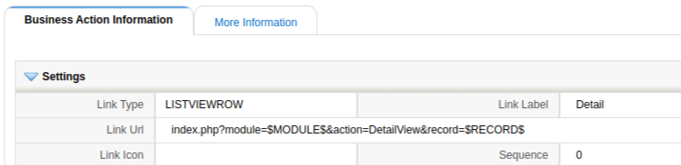
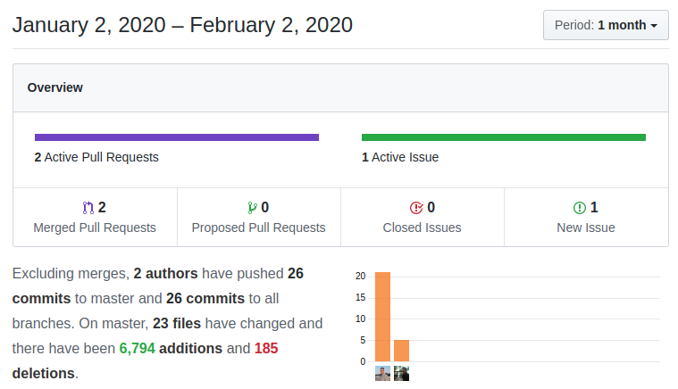
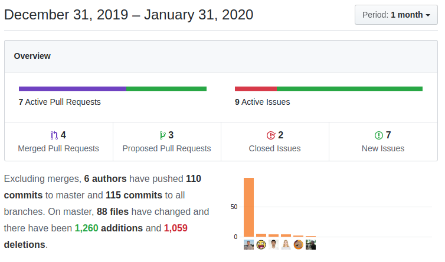

This past January has been about customizing enhancements to coreBOS as the many big projects of December land into production and they need tweaking and minor adjustments but we also get a really important contribution for E2E testing. Some interesting things have happened and some important bugs were fixed. Have a nice read!

===

 ! Features and New Stuff

- support direct copy from git clone copy button on GitHub when importing new modules
- use Business Question SQL in Direct SQL Reports
- add module and name to filter widget on edit in Home
- add displaytype 3 picklists to the editor
- return as soon as possible when report SQL has no rows/data
- translated user role internal reference to name in User exports
- support for *optional* validation as defined per Valitron

<span></span>

 ! Developer/Implementor enhancements

- Business Actions
  - Add **LISTVIEWROW** business action. This new type of business action permits us to add an action per row on list view and related list views. The condition on the business action is evaluated in the context of each record of each row so we can easily decide to show the action or not per row.

  - support for any record variable using workflow syntax. Until now you could use in the Business Actions URL there variables: $RECORD$, $MODULE$ and $ACTION$, now we can add any field workflow expression to get the value of that field also: `index.php?module=...&username=$(assigned_user_id : (Users) user_name)&aname=$accountname`
  - javascript service to retrieve SQL from question: cbqgetsql. Used in reports to capture SQL from Question in Direct SQL report.
- Validations
  - alias for greater, bigger, lesser and smaller than
  - support lowercase IN and NOTIN
  - support for parameter directive in custom validation functions: The parameters directive permits us to send values to our custom validation method with a structure like this:
``` XML
<parameters>
<parameter>
<name>name of variable</name>
<value>value of variable</value>
</parameter>
</parameters>
```
these parameters will be sent as a name indexed array to the function
  - new method **validateRelatedModuleExists** to check if a record has or not related records of a given related module
  - add current tax values for products and services validations
- Workflow
  - add attachment information to Email task log
  - add attachments information in evalwf script
  - new parameter `now` for get_date: `get_date('now')` which returns the full date time value for updating datetime (uitype 50) fields
  - add **exists** and **existsrelated** functions to expression language which will return true if there is a record in the module whose given field equals the given value. This looks like this:
    `if exists(field_name, field_value) then ....`
    `if existsrelated(related_module_name, field_name, field_value) then ....`
- new javascript hook **corebosjshook_submitFormForAction** to add code on EditView form submit
- new **gtltTagsToHTML** function to convert only greate and lesser than characters to HTML
- new **stripTailCommandsFromQuery** to clean SQL commands of order and limit directives
- add custom parameters to Popup select button. coreBOS has a special variable named **cbcustompopupinfo** which is read by the Popup screen to capture a list of custom variables you may need and pass them along as the user searches and navigates through the popup. This variable now respects also the "Select" button.
- add counterValue reset option to ListView function
- add background log messages to duplicate record functionality
- **Tests:** this month has seen a lot of activity in the unit tests project with a lot of new tests but the really fantastic change comes from the hand of Luke who has laid out the path for End to End (E2E) tests. Thanks Luke!



<span></span>

 ! coreBOS Standard Code Formatting, Security, and Optimizations

- coreBOS Standard code Formatting: quotes and spaces, eliminate unused variable and warnings: Emails, ListView, Popup, Reports, vtlib, Validations
- eliminate obsolete calendar code: List View, Web service and Reports among others
- eliminate unused parameter from Reports method after eliminating calendar code which was the only one that used it
- eliminate obsolete code: formname_specific from ListView (after adding unit tests)
- delete useless comment in Picklist and fix method comment in Workflow
- eliminate unused and incorrect method getStdCriteriaByModule from Reports as we use the one in CustomView
- optimize validation query
- delete unused variable in Inventory code
- optimize ListView: eliminate parenttab, eliminate unnecessary condition, eliminate unused parameters and correct function parameter definitions
- eliminate obsolete code related to uitypes and duplicate code in ListViewUtils
- reduce translation calls in Reports
- fix ternary operator ambiguity in Reports for PHP 7.4 support
- refactor ListView: change variable name and use HTML encoded string where necessary
- update Mermaid library

<span></span>

 ! Others

- add HTML ID to DetailView custom info fields
- eliminate duplicate HTML ID on popuptype input
- replace `<center>` tag with $smarty error message for createnewgroup action in Settings
- replace `<center>` tag with $smarty error message bar Delete User and ListView action
- correct mermaid graph header in Business Questions
- fix quick create account selection in Contacts popup
- use the given parameter instead of class date in DateTime conversion static method
- fix Email: update listofids variable when manually selecting email addresses
- apply userformat to NN fields in GenDoc
- fix Inventory Modules: maintain deleted status of last line and update the correct line when last line is deleted
- fix Inventory Modules: load associated_prod variable with correct values on Duplicate and use already calculated variable in condition evaluation
- fix Leads: load common detail view code before calculating email permissions
- fix ListView: support minor and greater signs in text
- set record context for better current values selection in Mass Edit
- avoid JS error in MsgTemplate popup
- avoid loading Pear Exception if it is already loaded
- fix Tax Validation on detail view with business map
- fix Product/Service tax class validation which is special in JS, PHP, detail view, and quick create
- fix Products related list query with quotes
- RAC rules do not apply to workflow records
- apply Record Version filter only on active modules
- eliminate warnings in directsql reports and cleanup code
- error getting related product block and eliminate warnings while creating unit tests
- set favicon in popup definition screen
- set step 6 (filter) in direct SQL report edit
- fix RunWebservices workflow: incomplete update process and permissions mode
- fix uitype 1613 Select Module: show correctly translated in detail and list views
- Workflow aggregation related list and mass update related list need to set currentModule when launched from queue
- fix Workflow: avoid overwriting shared workflow object
- fix Workflow: bug on update record
- fix Workflow: check if column exists to avoid false error
- fix Workflow Email: correct module name for potentials
- fix Workflow Email: always calculate attachments because we cannot generate GenDoc without entityid
- fix Workflow: scheduler query enhancements for isString and isNumeric. set OR and AND to empty (pending)
- fix Workflow: show array variables correctly in evalwf output
- constant translation effort: use existing label for group create error message

<span></span>



**<span style="font-size:large">Thanks for reading.</span>**
