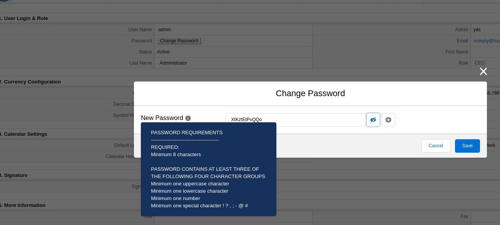
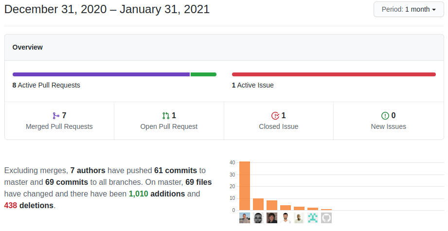

We start the year slowly but with a nice set of changes and bug fixes. Looking forward to our next integration...  Enjoy!

===

 ! Features and Implementor/Developer enhancements

- add 'quiet' parameter to cron script.

For scheduled tasks to work in coreBOS we have to configure a cron in the operating system that calls vtigercron.php, something like this

``` script
2/5 * * * * cd /var/www/html/corebos; php vtigercron.php
```

This particular configuration calls the script every 5 minutes and results in many calls looking something like this

``` script
[INFO]: Workflow - not ready to run as the time to run again is not completed
[INFO]: RecurringInvoice - not ready to run as the time to run again is not completed
[INFO]: SendReminder - not ready to run as the time to run again is not completed
[INFO]: ScheduleReports - not ready to run as the time to run again is not completed
[INFO]: MailScanner - not ready to run as the time to run again is not completed
[INFO]: UpdateExchangeRate - not ready to run as the time to run again is not completed
[INFO]: cronWatcherService - not ready to run as the time to run again is not completed
[INFO]: StorageSpaceUsage - not ready to run as the time to run again is not completed
[INFO]: UnblockLoginUsers - not ready to run as the time to run again is not completed
```

since this is a background process, that output is sent as an email to the user executing the process (usually www-data). This rather useless message (it is just informing us that all those tasks haven't reached their execution time yet) accumulates rapidly filling the hard disk with a very big /var/mail/www-data file.

To avoid this situation we have added a `--quiet` parameter to the script so that the information messages are not emitted, only error messages will be emitted. So, from now on, we should configure our scheduled tasks like this

``` script
2/5 * * * * cd /var/www/html/corebos; php vtigercron.php --quiet
```

- add **corebos.filter.announcement** event to permit creating dynamic announcements. This event will be called with the announcement configured in the global variable and you will be able to launch any code to return a calculated announcement adapted to your needs.
- make small text announcements move slower
- Business Maps now have an execution information infrastructure that permits business maps to log information about their execution process and share that with the process using the map
- we use the new execution information log to report about Decision Table process in the **testMap** script
- Webservice Map now supports array values if returned by expression language
- field dependency Business Map function to copy values from one field to another: **fieldDep_CopyFieldValue**
- emit Cron Watcher notification if scheduled tasks have elapsed their time even if it is not running = cron service is not running
- Edit View cancel button closes window if there is nowhere to go back to
- format double/float numbers with user preferences in Reports
- Web Service: support 'productid' as ID from the product virtual module in inventory line related queries
- Web Service: set correct WSID on inventory line related query columns and add linetype
- Workflow Create task:
  - support for delayed Workflow create task
  - unset cbuuid field when creating a record of the same type so they don't end up with the same uuid
  - use trigger entity to evaluate expressions always, we were using the new entity when the modules were the same
- standardize Quotes related list on Accounts, Contacts, and Potentials
- new **is_attachmentid** function in utils to find if a number is an attachment ID
  - use is_attachmentid in Emails to check if a number is an attachment id
- change password screen functionality. Following [the recommendations we found here](https://cxl.com/blog/password-ux/) we adapted the change password screen



- Business Question enhancements were made to permit defining context variables for the execution of the question and exporting the results, making the user interface closer to an ad-hoc reporting UI.
  - Add missing $ sign on variable
  - Use PHPSQLParser result to recreate the SQL columns for easy processing
  - Add and decode variable passed to smarty template
  - Add functionality to store Question context Variable
  - Add UI Element for Question SQL columns and condition field
  - Added the script to replace the context variable in SQL Query
  - Disable Test SQL Button
  - Move the script for generating Builder Query to its own function
  - Hide Some modes in Builder when cbQuestion is SQL Query
  - Show Question context Variables

<span></span>

 ! coreBOS Standard Code Formatting, Security, Optimizations, and Tests

- coreBOS Standard Formatting and Optimizations
  - Inventory Details, PBXManager, Reports, Users: format, change quotes, and eliminate warnings
  - eliminate useless comments, unused variable and add a newline at the end of some scripts
  - use a constant string and direct return of result in PBXManager
  - document Field Access function header and change quotes to align with formatting standard
  - set correct List View initial value for reference field array and avoid searching for empty references
  - change Calendar variable name to avoid collision and overwrite the set of events to notify
- document utility function
- Unit Tests: keeps getting more and more assertions

<span></span>

 ! Others

- ignore errors on some REVISE based application configurable actions like Inventory status change
- Business Map validations:
  - add max and min occurs for element module and value in FieldInfo map
  - add optional elements for element module and value in Record Set map
- correct order to unlink relationship with payments
- replace line breaks (\n) with ODT line break tag (<text:line-break/>) to prevent errors in document generation
- set inventory line discount to 0 if no value is returned from autocomplete
- in partial invoices from sales orders, permits negative numbers on fields and correct remaining units calculation
- leave account/contact fields empty if they do not exist when capturing inventory lines using autocomplete functionality
- set default autocomplete limit to the same as the backend limit: 10
- trim sort order to make sure we can find it as an index of arrays when constructing List View query
- get the correct user for PBXManager notification depending on the extension called
- enhance QueryGenerator method to fill array if the element does not exist and use the method instead of direct access to the array
- workflow aggregation with conditions on relation fields were missing the join with that table
- workflow reload tasks for each entity in scheduler loop, needed now that we execute the tasks directly to flush the previous entity information

<span></span>



**<span style="font-size:large">Thanks for reading.</span>**
