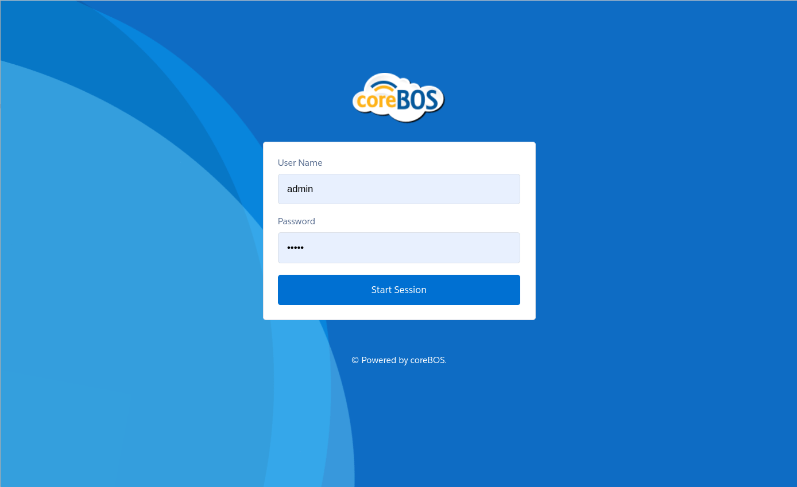
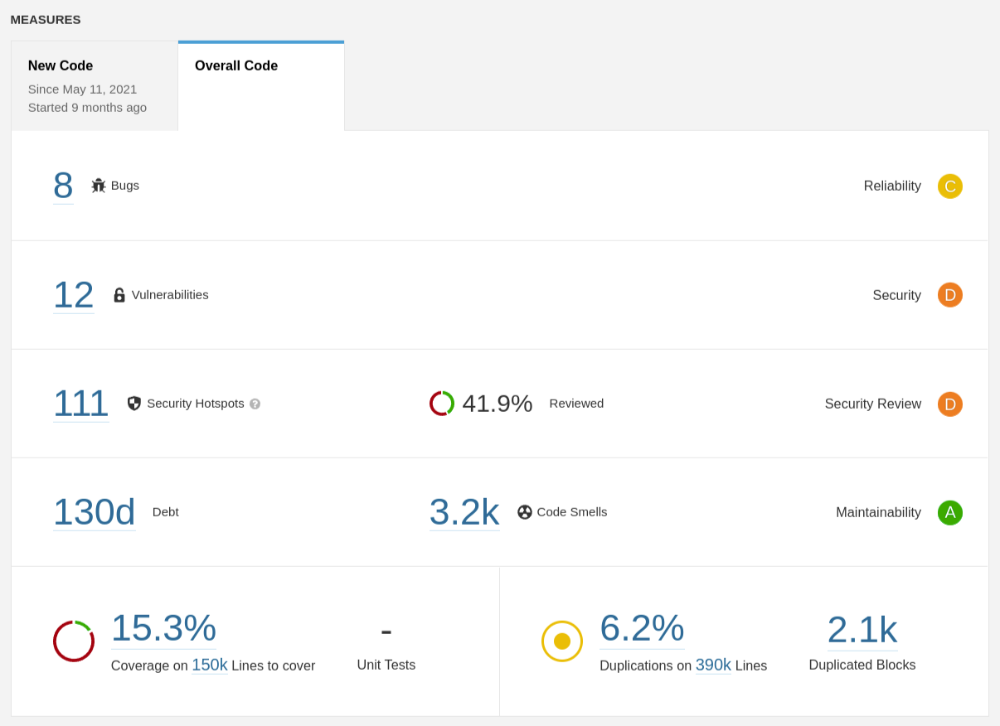
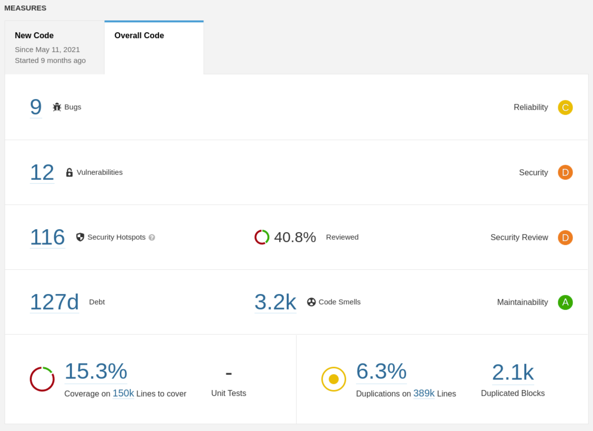
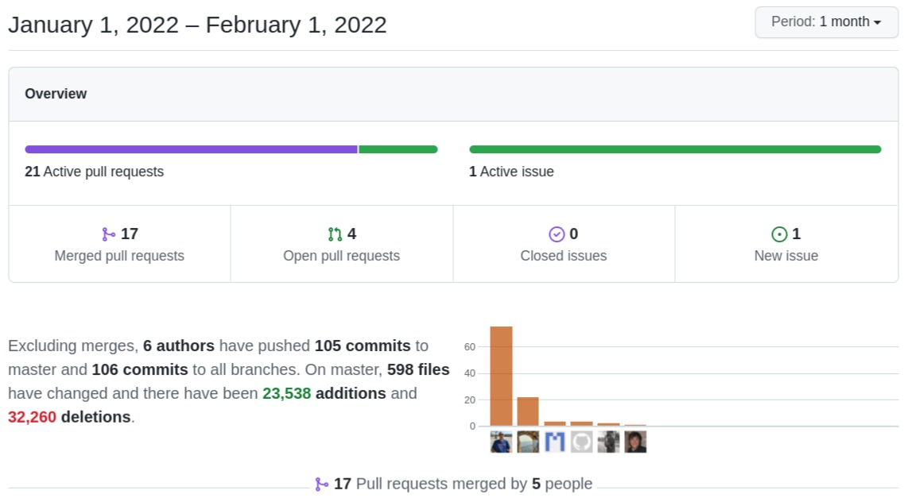

Very interesting month! We do a lot of security and bug fixes, we make a fundamental change in the workflow queuing system, enhance the Pivot view, finally support Field Dependency in the Detail View along with a whole bunch of other changes. Fantastic!

===

 ! Features and Implementor/Developer enhancements

- convert vtiger CRM queue to coreBOS queue. For some time now (years) we have been discussing the need to enhance and/or redesign the coreBOS workflow queue system. Almost all those discussions ended in the endless to-do list because of the size of the task until a few months ago when someone throwing ideas around landed on the suggestion of taking a simple path and substituting the vtiger CRM queue for the coreBOS queue. Based on the idea of moving the (very lacking) vtiger CRM queue to the more powerful coreBOS queue, and a PR made by Timothy, I finish eliminating the vtiger CRM queue. I will write more about this shortly.
- support optional loading of LDS CSS in the Application Message
- add module icon to application menu Business Map
- support Workflow execution decision map from Import Map
- new Login page Blue Waves

- Pivot Table enhancements. Thank you Denald!
  - add all available chart options
  - add Plotly and d3 libraries
  - show all records in ListView
  - set pivot width 100%
  - check for cbMap module permissions
- [upgrade coreBOS script](../upgradescript)
- Web Service
  - add more information/context to the error email
  - DataTransform **sanitizeReferencesForDB** and **sanitizeOwnerFieldsForDB**
  - **Webservice_Return_FormattedValues** permits us to indicate if we want results from the web service endpoints to be formatted using the connected user configuration options
  - trim strings as we do inside the application
- new Workflow **allrelatedarethesame** expression function
- Field Dependency Map Enhancements. Thanks Mohamed!
  - support map in DetailView finally!!
  - support field and labels Colorizer

 ! coreBOS Standard Code Formatting, Security, Optimizations, and Tests

We continue working with [Sonarqube](https://www.sonarqube.org/).

| Start of January | End of January |
| --------- | ------------ |
|  |  |

- coreBOS Standard Formatting: eliminate warnings eliminate useless code and comments, format code
- Continuous Integration: update dockerfile to work with the latest alpine and exclude some vendor directories
- Documentation:
  - function headers, and comments
  - non-stop wiki enhancements
- Optimizations
  - apply sonarqube directives and fix function headers in SMS Notifier
  - delete old vtiger CRM queue code and eliminate vtiger CRM references in Workflow
  - optimize javascript for loop. sonarqube
  - merge IF conditions and format code in Calendar, Reports, and GenDoc
  - jquery is loaded twice
  - SQL query with parameter for TUI grid and simplify SQL in ModTracker
  - eliminate unused variable and fix function header documentation in Workflow
  - clear imported record cache to increment import record limit significantly. This is **an important optimization**. I was importing 600K records into a coreBOS. I already knew that was too big an amount so I divided the imports into 100K batches. The first batches would fail shortly after 55K records. I started to look into why and found this optimization. Once applied I was able to import 100K records in one import. I didn't try with bigger amounts because I already had the batches done, but for sure we have made the **amount of records you can import significantly higher**.
  - refactor Pivot code
  - move Sharing Privileges Javascript out of the template and move two specific functions out of general.js
  - change array_merge for foreach in create and update Web Service endpoints
- Security
  - third party vendor execution bit
  - sanitize inputs/outputs
  - use pquery and eliminate unused method in Assets
  - sanitize inputs and use pquery to protect SQL injection in Calendar
  - use pquery, set default for switch and menu values in Menu extension
  - fix SQL injection variable vulnerability issue in Calendar4You
  - sanitize parameters in Home extension
  - use standard application error message to sanitize output in Reports
  - sanitize parameters in Search and Reports
  - sanitize document name in document Web Service API calls
- Updates
  - MySQL 8 support for empty dates
  - update console and cache libraries
  - include D3 Library for Pivot table view
  - update DOMPurify library to 2.3.5
- **Unit Tests:** keeps getting more and more assertions
  - move test translation strings from migration to backups
  - delete submodule which is now a normal repo
  - force GlobalVariable value per script (for unit testing)

 ! Others

- add error_reporting to HelperScripts install scripts
- clear discount when product is selected
- support advanced filter from URL in tuigrid listview
- Search enhancements
  - add search option for standard and advanced filter
  - add Select2 library component to make it possible to search in the picklist of fields
  - select first element from operators
  - remote timeout in filter
- Business Map: JSON encode output to avoid errors not being able to convert to string arrays
- set default values and enable fields before save in Calendar user settings
- fix CustomView by applying HTML entity for special characters
- add mandatory class properties to extensions
- do not convert compiled text if it's in UTF-8 encoding in GenDoc
- return GlobalVariable value instead of Business Map if BMap has been deleted
- support the use of 1/0 instead of yes/no for Import workflow attribute
- eliminate extra quote in discount label
- sanitize Leads web service fields before doing validations
- List View enhancements
  - allow less/greater than operators in advanced search
  - show all records in RecycleBin correctly and fix warnings for advanced filter
  - warning if searchtype is not advance
- Reports enhancements
  - correctly format numbers for Excel export
  - return an empty string when no value to process is given
  - set Generate filters for ad-hoc search condition changes
- SMS Notifier enhancements
  - support complex passwords in the settings page
  - update Skebby to REST and clean up the code
- show a better view of select in the first load of page
- correct support for multipicklist fields and format numbers to standard for validations
- Translations
  - Sharing Privileges translation issue that still comes vtiger CRM 5.4 (!)
  - Import: execute workflow
  - update pt_br.lang.php for Import
  - Listview: set correct translation

**Thanks for reading.**
