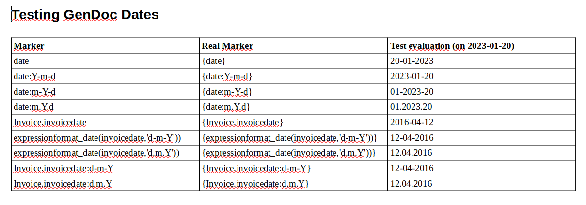
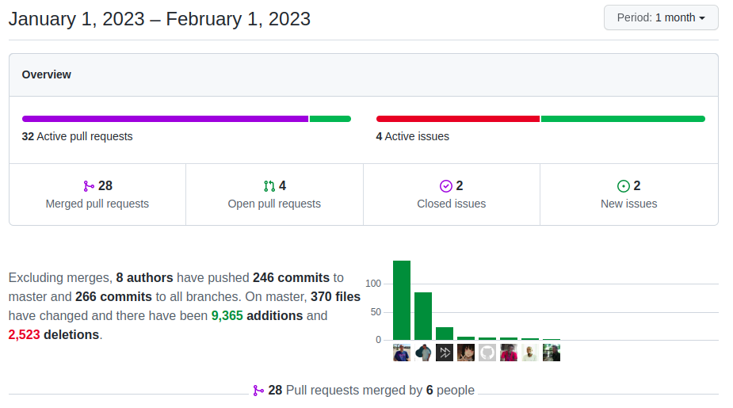

Twelve new global variables, a bunch of PHP 8.2 preparations, Wizard View, System Notifications, GenDoc, Workflow enhancements, Master Detail, Web Service new credentials access,... Wow!

===

 ! Features and Implementor/Developer enhancements

- Business Actions
  - support for new fields like width, height, and others when creating from code
  - add type for MasterDetail Button
  - dynamic labels by rendering field values in context: this permits us to use field names in the label like, `Change Status to $somestatusfield`
  - sort types picklist to make them easier to find
  - support error and success messages in Launch Workflow Button business action
- Calendar
  - add link type to notification task `moreaction` column
  - fill in contact when the related entity is selected
  - pending tasks widget: card and table output
- GenDoc:
  - format date fields directly and support dots in date marker format: you can now format any date field following its name with a colon and the desired format. You can even use dots for the formatting.

  - permit not adding template name to saved document
  - support `draw shapes` at top-level document
  - permit setting the name of the generated document using expression maps. you can use the context variables for expression evaluation: GDTemplateID, GDTemplateName, GDTemplateNumber. Use the `GenDoc_Attachment_Name` global variable.
  - support for UnoServer conversion. deprecating unoconv: `GenDoc_Convert_URL_UnoServer`
- Master Detail functionality
  - add support for Business Actions
  - hide/show master detail in detail view from map
  - support inline edit for uiypes 19 and 21
- Documents
  - adding modal preview
  - get folders document belongs to method: `getFolders()`
- System Notifications
  - return notification ID when adding notifications
  - truncate subject text
  - show only related records in the pending Tasks widget
  - support RECORD substitution
  - function to change status and convert fields to JSON so the implementor can easily set ID to change
- **Wizard**  wow!! great enhancement. Thanks [Denald](https://github.com/denaldhushi) and [Xhilda](https://github.com/xhildashazivari). We have to get some blog posts and videos about this!!
  - add FilterFromContext parameter
  - filter records in wizard related with the current record
  - filter steps from context values
  - init for FORM templates
  - open wizard everywhere in the app
  - select ids after clear filter
  - start setup forms in wizard
  - start supporting expressions in wizard
- `getFieldValuesFromSearch` return values based on user preferences
- add **Load Filter** option to Potentials related list in campaigns
- easily add buttons on the dependent list: powerful enhancement to the related list where we can add buttons through code
- add `aftersend` action to PHPMailer e-mail sending: `cbEventHandler::do_action('corebos.email.aftersend', $mail)`
- support URL elements in top level menu
- add code to support button to execute workflow in Mobile UI
- set callback function for ProcessInfo
- writeReportToCSVVariable parameter to get Reports as a response instead of output to screen
- support Application_ListView_Default_Sorting in TUIGrid
- implementing dropdown action buttons for TUIGrid
- merge uitype 2 into 1: they are the same, 2 is useless
- isTime support for seconds in Validations
- Web Service
  - authentication token-based access using the Credentials module and `corebos-authorization` header.
- Workflow: get a lot of attention this month!!
  - [support expression inside strings](https://github.com/tsolucio/corebos/pull/1477) **Fantastic time saver enhancement!!** Thank you [Malik](https://github.com/maliknajjar)
  - add Notification workflow task: set Notification ID in the context
  - `char` expression function
  - `uniqid` expression function
  - create Message records for all emails being sent
  - Generate Report return content in context
  - optional parameter to exclude or not the current record in the `exists` function. by default, `exists` excludes the current record from the search, You can now add it to the task and support the current record also
  - permit setting the name of the generated document using expression maps in GenerateDocument task
  - review and adjust background log messages for all tasks
  - sort the list of task names to make it easier to select them

 ! coreBOS Standard Code Formatting, Security, Optimizations, and Tests

- coreBOS Standard Formatting: eliminate warnings, eliminate useless code, variables, and comments. Format code. Clickhouse, GenDoc, GlobalVariables, Integrations, ListView, ModTracker, Settings, Styles, Tags, Utils, Web Service, QueryGenerator, Wizard, Workflow
- align BPM button with other elements
- add space between Campaign related list buttons
- adding borders for Detail View image fields
- Documentation:
  - function headers, and comments
  - curl client
  - Workflow: generate report task
  - non-stop wiki enhancements
- Security
  - update DOMPurify to 2.4.3
  - update Mautic Library to 3.1
  - apply system permissions to available image query in Slider
  - change inexistent function on Stripe exception
- Optimizations
  - validate for SQL injection
  - eliminate variable and warning in ExecuteFunctions
  - prepare to log sooner and avoid including already loaded script in index.php
  - eliminate unused joins from SignPDFDocument query
  - eliminate unused joins from Slider query
  - eliminate unused parameters in Tags
  - delete duplicate code in Calendar
  - Calendar: move action construction to function
  - Calendar: move action Smarty assignment to separate function
  - change obsolete FONT HTML to SPAN
  - update composer.json with missing symfony libraries and update them
  - write pquery function correctly
  - convert login session sequence to function
  - change deprecated fetchUserProfileId for getUserProfile
- PHP
  - change deprecated PHP function utf8_decode
  - class properties for PHP 8.2 in general application, events, Home/WebService, vtlib, Users/Workflow
  - String Interpolation Deprecated for PHP 8.2 in Tags/Faker
- **Unit Tests:** keeps getting more and more assertions.

 ! Global Variables

- **Application_Menu_Show:** hide or show the main menu
- **Application_Toolbar_Show:** hide or show the Toolbar menu'
- **Application_Header_Buttons_Position:** Percentage of header space to leave for title before placing the buttons. By default, buttons will be aligned to the right.
- **Application_ListView_Mass_Edit_Show:** hide or show the mass edit button
- **Application_ListView_Mass_Delete_Show:** hide or show the mass delete button
- **MasterDetail_OpenRecordNewTab:** Open the entry in a new tab or redirect
- **Application_Menu_Search_Active:** hide or show the type search menu
- **Application_Hide_Related_List:** hide or show the more information tab in detail view
- **GenDoc_Attachment_Name:** When merging a GenDoc workflow email attachment, the name used for the attachment will be the Entity Name field (Name) or the Entity Number field (Number) concatenated with the template name. If set to Expression, the result of the related business map will be used.
- **GenDoc_Convert_URL_UnoServer:** URL to the [UNOSERVER conversion server](https://github.com/lynxtaa/unoserver-web)
- **Workflow_Email_GenDoc_Save_Document:** Enable or disable creating a new document in storage and Documents module each time you send an email with a GenDoc template.
- **GenDoc_Confirm_Actions and GenDoc_Confirm_ActionFor:** A comma-separated list of GenDoc actions to ask user confirmation for, additionally you can set a CSV of templates you want to ask confirmation for

 ! Others

- AutoComplete: better purifying variables and correctly finding date fields
- apply missing EDITVIEWHTML and DETAILVIEWHTML actions to modified base files
- Calendar
  - FQN in pending task query
  - set the default time span to 15min for Pending Activities widget
  - set JSON fields to null if not given
  - support actiontype in the notification panel if given
- ClickHouse: avoid web service table duplication and overwrite of existing WS Tables. Inform of error
- CustomView: permit access to All filter to all users
- eliminate access to an inexistent property in Database abstraction layer
- correctly send query parameters to log file in Database abstraction layer
- FieldDependency:
  - map values lost after the first call of the function
  - use unique keys
- eliminate unbalanced HTML elements and whitespace in Header/Footer
- set database default value for Leads lastname and company to permit hiding them
- set correct variable for ListView document download count
- MasterDetail
  - current record id is missing in related panes
  - get ID of origin module
  - optimize dropdown view
- ModTracker List View was incorrect, has to redirect to settings, like index
- get the correct base module in getQueryByModuleField
- TUIGrid table header overlapping when columns names are too long
- avoid errors getting related Account/Contact from calendar record and in general
- add FILE fields information to the validation array
- SetOfFieldsWidget: get values based on user preferences
- use the correct property for Web Service toString conversion
- TreeView
  - add conditions for treeview grid
  - check if fieldinfo exists
  - duplicated function name
- Popup Filter
  - adding support for navigation in popup filter
  - force Popup Window to always open a new window
  - not keeping JSON filter results after quick create
- Workflow
  - avoid describe call on empty module in upsert
  - avoid error trying to add watermark to an inexistent image
  - correctly initialize variable crmids
  - eliminate warnings and apply latest Popup changes
  - eliminate warnings when creating and the ID does not exist yet
  - generate image code: correctly calculate image file size
  - initialize variable correctly, move function call outside loop
  - initialize variable outside loop, check if module field mapping can be used
  - load all fields in workflow update
  - review and translate watermark task
  - using global variable to retrieve the storage path
- Translations
  - Global Variables definitions, ES, Application_Menu_Show, Application_Toolbar_Show, Application_ListView_Mass_Edit_Show, Application_ListView_Mass_Delete_Show
  - GlobalVariable: menu and moreinfo tab
  - AutoNumber DE file
  - Business Map related list map, translate new maps
  - translate hardcoded strings in javascript
  - Mobile: add missing IT and HU translation files
  - Mobile: IT, new strings for execute workflow action
  - Slider translate hardcoded string
  - Wizard: ES, fix button labels
  - Workflow: change variable name to avoid conflict in translation array

**Thanks for reading.**
