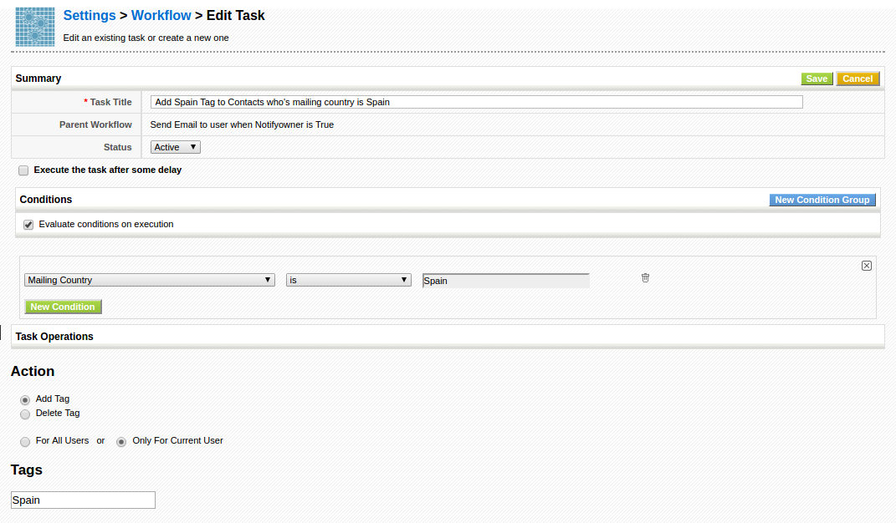
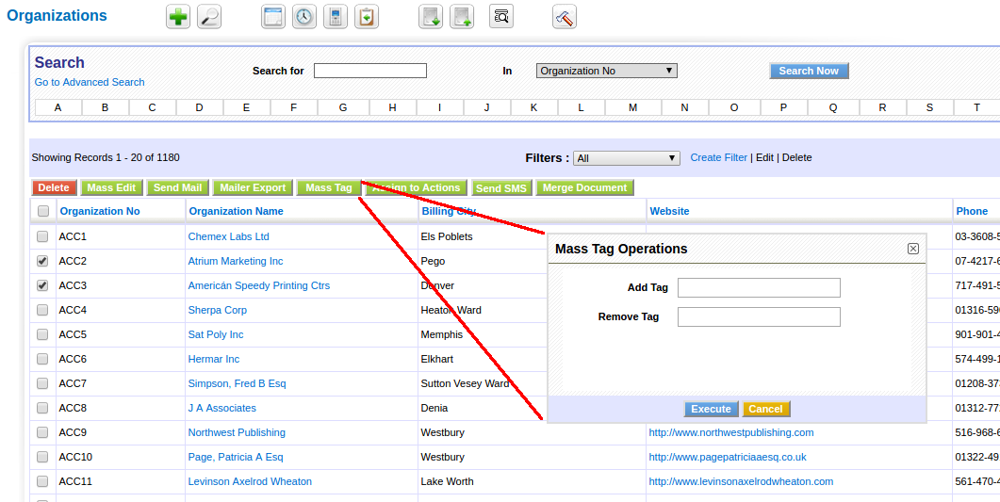

In July and August 2014 we were assuming control of the fork and still in the mind set of "**vtiger CRM 5.4 Long Time Support**". So, mostly we are starting to add functionality and fixing things that have always been broken.

### Development

I will detail a small list of some changes worth mentioning.

 ! coreBOS translator

**AT Consulting** contributes the [coreBOS translator project](../translation-extension-for)

 ! Tag cloud and tags enhancements

We understand how important tagging is. Personally I think this is a totally misunderstood feature of the application. When someone arrives to the CRM world and sees the tag cloud, the explanation they usually get is:

> Tag Clouds provide users the capability to build categories which are not limited to a single CRM module. These categories are independent from the categories defined at the master data of each CRM entry, usually the pick list entries.

In other words, you can group different records in the CRM by any single word criteria that you want. But there is much more to tagging than that. Twitter has proven that to us. One of the most powerful uses of tags is to create **segmentation lists**, you can relate all the contacts and accounts that have something in common easily and then use those tags to send emails or execute other marketing and transactional actions.

We have added support for tags in the workflow system, so you can add or delete tags based on conditions in the record dynamically as you work with the system. This is called [**Smart Lists**](https://knowledge.hubspot.com/lists-user-guide/how-to-create-a-list-of-your-contacts) in **HubSpot**.

We have also added a **Mass Tag** action on the list view of Accounts, Contacts and Leads.

And we have integrated these tags with our **Segmentation List** module and our **Mass Actions** extension so you can do all sorts of actions with the tagged records.

 ! Support for CORS and application/json post format

We create a lot of satellite applications around coreBOS, using the very powerful **Webservice** interface. We use all sorts of different development frameworks to create specific and targeted applications. Some of the more modern frameworks are based on Javascript and follow some strict standards to work with, mostly for security reasons. We have enhanced coreBOS so it works seamlessly with [AngularJS](https://angularjs.org/), [Polymer](https://www.polymer-project.org/) and others. We have also created open source development libraries for both:

- [coreBOS Webservice Library for AngularJS](https://github.com/tsolucio/coreBOSwsLibrary/tree/master/AngularJS).
- [coreBOS Webservice Library for Webcomponents with Polymer](https://github.com/tsolucio/coreBOSwsLibrary/tree/WebComponents/Polymer).

Among other libraries that we have created and maintain.

 ! Add payment module

We added [our payment module](http://corebos.org/documentation/doku.php?id=en:coreboscyp) that we had developed for vtiger CRM and add support for a generic **Payment Gateway** directly inside the application, using the [Omnipay Library](https://github.com/thephpleague/omnipay).

 ! Workflow expression and other enhancements

We continuously enhance the Workflow interface to make coreBOS easier to work with. These days we added support for:

- More expressions for conditions
- Relate Sales, which permits you to fill the accounts and contacts product list with products sold to them on invoices
- Tag Task (see above)
- [evalworkflow script](http://corebos.org/documentation/doku.php?id=en:devel:helperscripts#evalwfphp) a VERY powerful workflow debugging tool

Among other fixes and adjustments.

 ! Detect filter error and not break application

This is one of those fixes that should have been added years ago. In certain filter configurations it is possible to define an incorrect set of conditions. Not so much as per the selecting of the conditions but more in the line of deleting fields or permission restrictions after the filter was created. In this case, vtiger CRM returned an error and obligated you to log out and **NEVER** select that filter again, not even if you wanted to delete it!

 ! Filter meta variables: user and dates

[Meta variables for special fields: Current User and blank date](http://corebos.org/documentation/doku.php?id=en:using_filters#meta_variables_for_special_fields)

 ! Block dependent picklists to avoid inconsistencies

If one or more picklists have dependencies they will not be editable in the inline, individual field edit on Detail View in order to avoid selecting combinations of values that are not permitted.

 ! Some others:

 - Better Tax management
 - Custom field support on FAQ
 - Eliminate warnings and code cleanup (this one is a constant every month, even today still)
 - Translation and special characters support
 - Security and speed

**Thanks for reading.**

