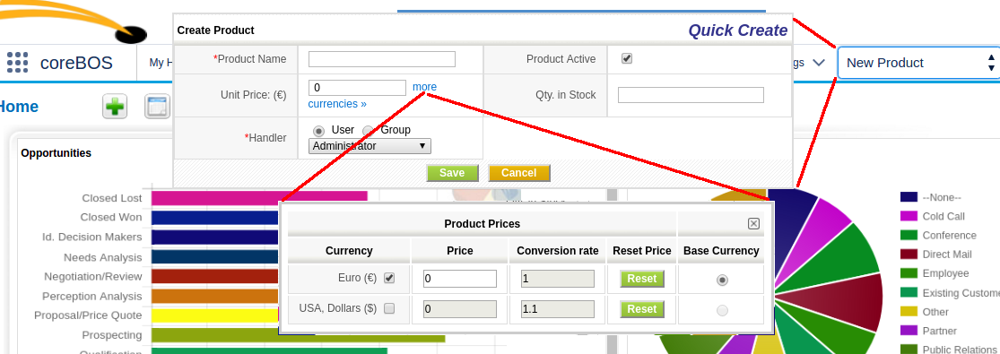
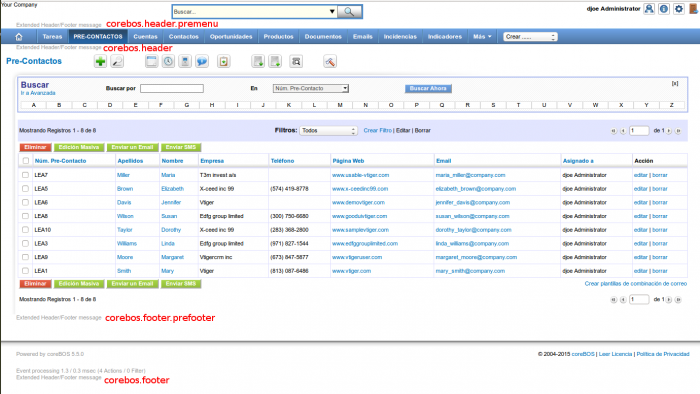

In July 2015 we add new events and global variables to make the application easier to customize and more flexible while we keep enhancing and fixing issues, but the important development of this month is the **import and export functionality on Inventory modules**.

===

 ! Workflows
 - **Support Documents Module**.
 - **Send emails to group of users** with the **groupEmailList** meta variables which return the list of emails of all users in a group.
 - **Support multi-picklist fields**.

 

 ! Global Variables

 - **Lead_Convert_TransferToAccount**: If set to the string "true", Accounts will be selected as the destination to transfer related information when converting a Lead. By default the information will be transferred to the Contact.
 - **Application_Show_Copy_Address**: This variable activates or deactivates the "Copy Address" functionality present on Accounts, Contacts and Inventory modules. Useful when one of the addresses is hidden due to business requirements.
 - **SalesOrder_StatusOnInvoiceSave**: When saving an Invoice related to a SalesOrder, the status of the salesorder will be set to the value contained in this variable. The special value "DoNotChange" will deactivate this functionality and no change will be done.
 - **Quote_StatusOnSalesOrderSave**: When saving a Sales Order related to a Quote, the status of the quote will be set to the value contained in this variable. The special value "DoNotChange" will deactivate this functionality and no change will be done.

[plugin:youtube](https://www.youtube.com/watch?noprocess=1&v=fqXdqGilFS0&list=PL0oN2FI_W55yF8FVjLjV4YEe8ibvSxK1p)

 ! Multicurrecncy support in Products Quick Create screen

 ! Generic Javascript API Access to backend: Execute Function

[You can read about it in the documentation wiki](http://corebos.org/documentation/doku.php?noprocess=1&id=en:devel:executefunctions)

 ! coreBOS Events and Hooks

[Read about hooks here](http://corebos.org/documentation/doku.php?noprocess=1&id=en:devel:corebos_hooks)

 - Hooks for PRE-Menu and PRE-Footer actions

 - Events for user access auditing
  - corebos.audit.authenticate
  - corebos.audit.login
  - corebos.audit.login.attempt
  - corebos.audit.logout
  - corebos.audit.action

 

 ! Import and Export of Inventory Modules

[Importing Data in Inventory Modules](http://corebos.org/documentation/doku.php?noprocess=1&id=en:import_inventory_module)

 ! Convert vendors to a normal module

As we tend to standardize the base module code we also modify the application standard modules to make them use this base so they all have the same functionality and directly inherit the new functionality.

This month we clean up and standardize the vendors module giving it support for import, export, deduplication, and sharing privileges, among others.

 ! Some others:

 - Autocomplete backend functionality for application javascript and external webservice.
 - Reorder tabs in Calendar to set "related to" first
 - Tax information fix to show correct amounts
 - MailConverter enhancements to correctly mark email as seen or not
 - Better product stock control on invoice and purchase order by centralizing all on events and workflows
 - Fix error in HelpDesk export of Product and "Related to" fields
 - Webservice enhancment to support webservice ID in product lines and some fixes in query language
 - Tooltip everywhere project adds them on Calendar
 - Developer cache for module fields
 - New field types 1613 and 3313 which are a picklist and multipicklist of installed modules. You can see these in use on the Global Variable and Business Maps modules
 - Add Vendors related to Contacts so we can select vendors from contacts
 - Eliminate warnings, notice, MySQL strict and code cleanup (this one is a constant every month, even today).
 - Security OWASP and optimizations
 - Translation. Notice warnings, eliminate unused code, cleanup

**Thanks for reading.**

