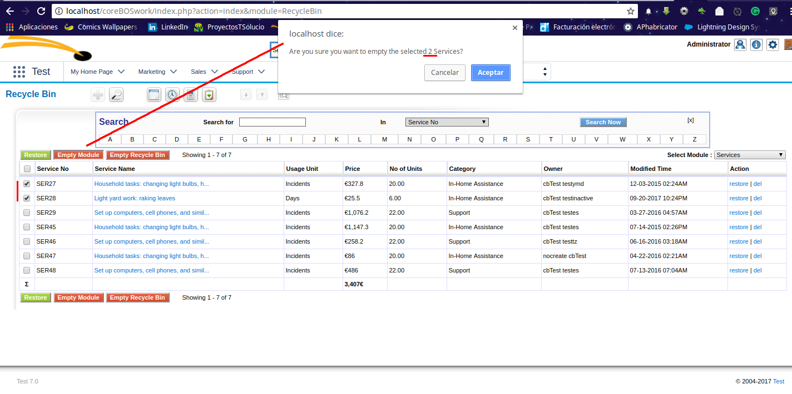
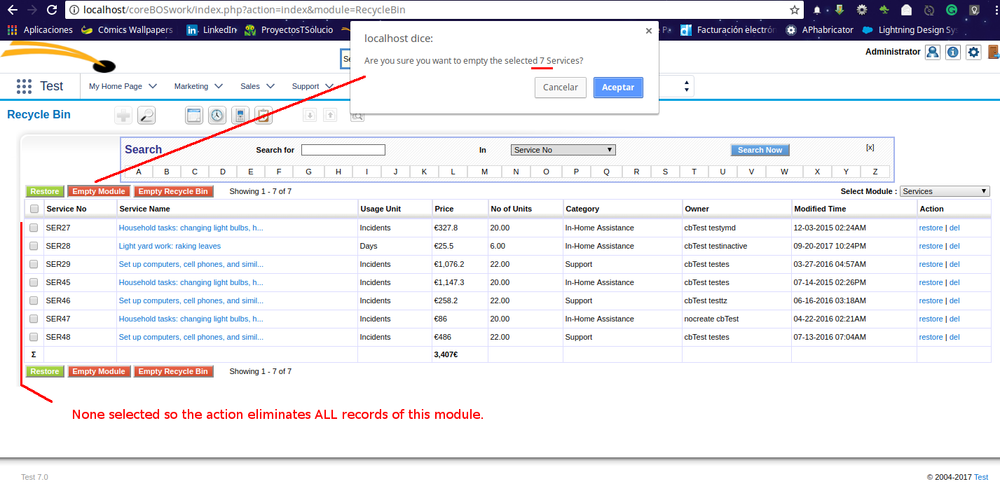
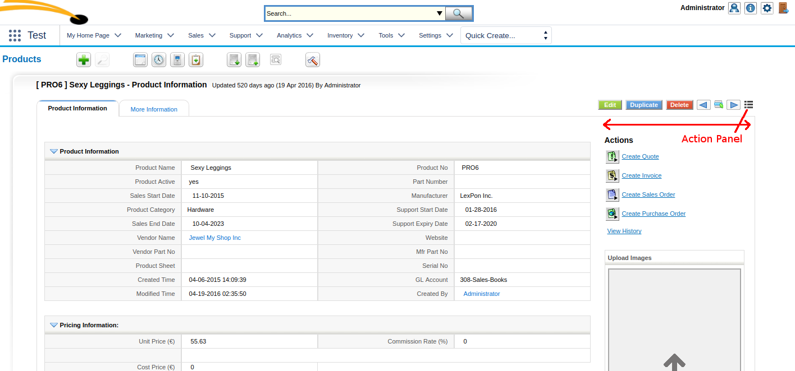
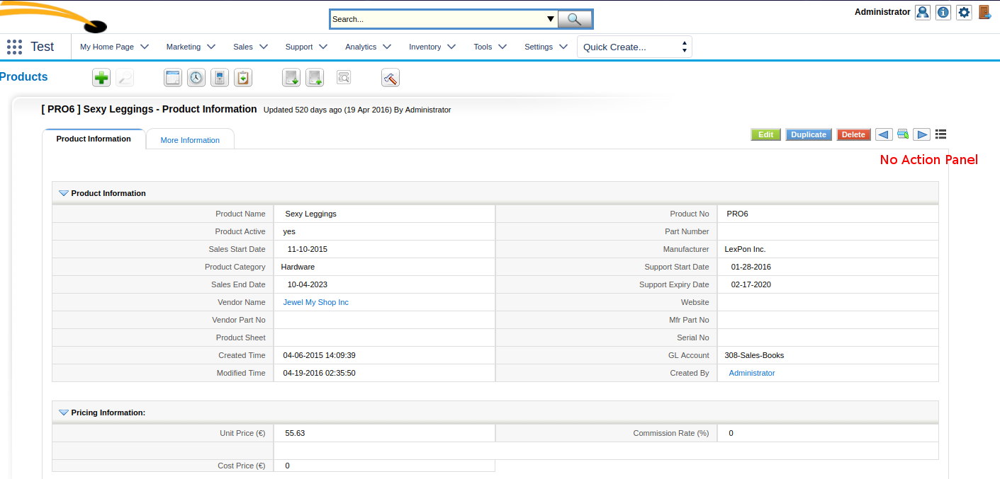
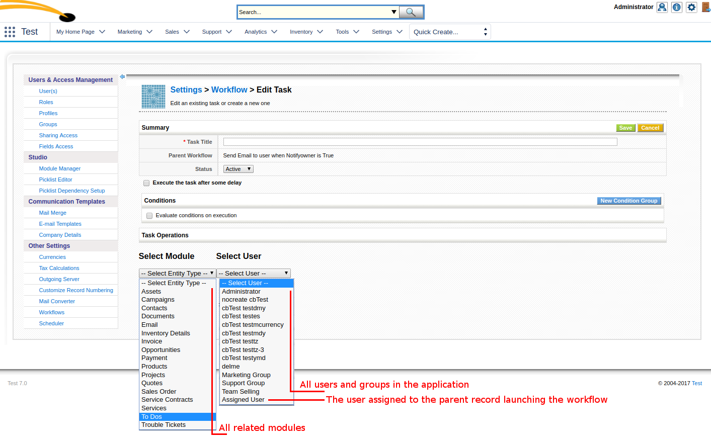

Various new features in usability, configuration, and functionality along with a very useful scheduled task watcher make for another incredibly productive month.

===

 ! Emails

 - List view and standardize module (permissions)
 - Support on workflows
 - Support for module image path in email templates. Using the template variable name of the image field followed by "fullpath" you can get the complete path to the image. Suppose that you have added an image field on Accounts called "accountlogo", if you add this variable to your email template:
 
 ```
 $Accounts_accountlogo_fullpath$
 ```
you will get the full path to the image which can be used inside an img HTML element.

<br/>

 ! Webservice

 - **getRecordImages** Allows a webservice client to retrieve the information of the image attachments associated with a record, which can then be used with the build/HelperScripts/getImageData.php script to obtain the image
 - Show advanced user fields global variable to access more information of the user.

<br/>

 ! Recycle Bin empty selected module option

We can now completely trash selected items or all the records in a module.





<br/>

 ! Cron Watcher service

A new scheduled tasks arrives this month to act as a watcher for the other scheduled tasks.

This feature wakes up every few minutes and checks if any of the other scheduled tasks has been running for too long. If that is the case it will send an email to the first admin user it can find and all emails defined in the CronTasks_cronWatcher_mailto global variable, so we can get on top of it as soon as possible.

The time that any scheduled task can be running is defined by the **CronTasks_cronWatcher_TimeThreshold** global variable. Any task running longer than the value of this variable will trigger the alert.

 ! Hide and Show action panel

We add the possibility to dynamically hide or show the right action panel. The new icon you can see in the next screenshot permits you to toggle this functionality.

Additionally, we add the **Application_DetailView_ActionPanel_Open global** variable which permits you to set the default value for this panel on each module for each user.





<br/>

 ! Developer enhancements

 - **getModuleWebseriviceID** API call permits developers to retrieve the webservice ID of a module in the browser.
 - Add [custom permissions hooks](http://corebos.org/documentation/doku.php?noprocess=1&id=en:devel:corebos_permission_hooks) which serve the purpose of modifying the existing permission system with custom programming. Using these hooks we will be able to completely override the existing permission decision or construct upon them to enhance the decision of showing or editing a set of records without having to modify the base code to do it.

<br/>

 ! Global Variables

 - **CronTasks_cronWatcher_mailto**
 - **Application_DetailView_ActionPanel_Open**
 - **Calendar_Show_Group_Events**

<br/>

 ! Assign related records workflow task

With this task, we will be able to assign all records in a related module to any user or group in the system. The special meta variable "Assigned User" will assign all records to the same user as the record launching the workflow.



 ! Some others:

 - Duplicate record business map now duplicates relations
 - Record Set business map now returns selected set per module if needed (getRecordSetModules)
 - Quick create popup screen is now draggable
 - Security eliminate user hash and squash some SQL injection
 - vtiger CRM 6.5 migration script
 - Permit creating and editing on base folders in Reports
 - Support for the SQL Distinct directive in Query Generator
 - Database optimizations
 - Eliminate warnings, notice, MySQL strict and code cleanup (this one is a constant every month, even today).
 - Translation. Notice warnings, eliminate unused code, cleanup

**<span style="font-size:large">Thanks for reading.</span>**

